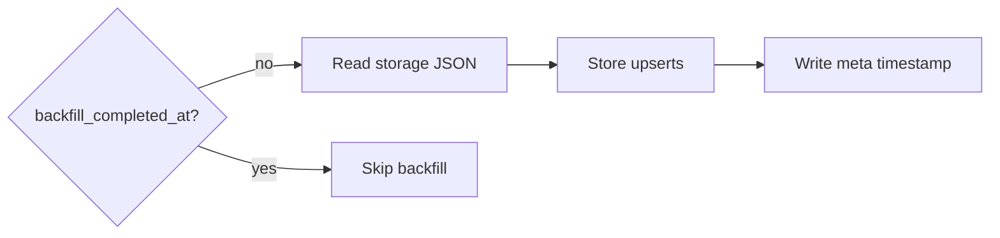

# One-time backfill

On plugin init, the backfill reads OpenCode storage files and imports sessions/messages created within the last 30 days. A meta key marks completion so the backfill only runs once unless the meta entry or DB is removed.

Invariants
- Backfill only runs when `meta.backfill_completed_at` is missing.
- Backfill sources live under `~/.local/share/opencode/storage/` (`session`, `message`, `part`).
- Sessions older than the 30-day cutoff are skipped.
- Start and completion emit toast notifications via `client.tui.showToast`.

Links: [sqlite](../storage/sqlite.md), [schemas](../data-model/schemas.md), [event-handling](../opencode/event-handling.md)

Example
```ts
const cutoff = Date.now() - 30 * 24 * 60 * 60 * 1000;
if ((session.time?.created ?? 0) < cutoff) return;
```

Diagram

