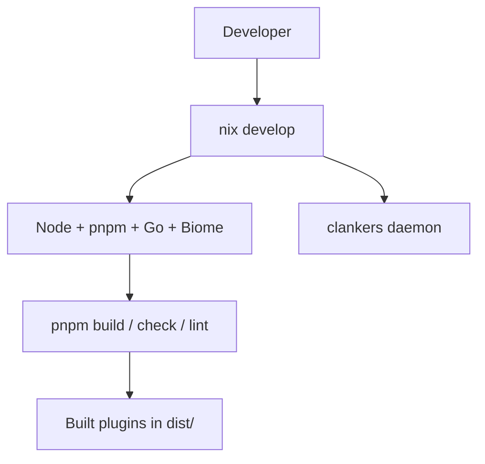

# Nix-First Development

**Nix is required for all development work in this repository.**

The project uses a Nix flake to provide reproducible builds, consistent tooling, and isolated development environments. No manual installation of Node.js, pnpm, Go, or other tools is required or supported.

## Why Nix-First?

- **Reproducibility**: Every developer uses identical tool versions
- **Isolation**: Project tools don't pollute the system
- **Single command setup**: `nix develop` provides everything
- **CI parity**: Local development matches CI exactly

## Getting Started

### 1. Install Nix

Follow the [official Nix installer](https://nixos.org/download/) with flakes enabled:

```bash
curl --proto '=https' --tlsv1.2 -sSf -L https://install.determinate.systems/nix | sh -s -- install
```

### 2. Enter Dev Shell

```bash
# Option A: Manual daemon control
nix develop

# Option B: Auto-started daemon + all plugins (recommended for active development)
nix develop .#with-all-plugins
```

### 3. Build Packages (via Nix)

For one-off builds, use nix directly (no dev shell needed):

```bash
# Daemon for current system
nix build .#clankers

# Cross-compiled daemons
nix build .#clankers-linux-amd64
nix build .#clankers-linux-arm64
nix build .#clankers-darwin-amd64
nix build .#clankers-darwin-arm64
nix build .#clankers-windows-amd64

# TypeScript plugins
nix build .#clankers-opencode
nix build .#clankers-claude-code
nix build .#clankers-cursor
```

Results appear in `./result/`:
- Daemon binary: `./result/bin/clankers`
- Plugin files: `./result/dist/`, `./result/src/`, `./result/package.json`

### 4. Dev Shell Commands

**Without entering shell (one-off commands):**
```bash
nix develop -c pnpm install
nix develop -c pnpm check
nix develop -c pnpm lint
nix develop -c pnpm format
nix develop -c pnpm build
nix develop -c pnpm build:opencode
nix develop -c pnpm test
```

**Inside the shell (iterative development):**
```bash
nix develop    # or nix develop .#with-all-plugins

pnpm install   # Install dependencies
pnpm check     # TypeScript type check
pnpm lint      # Biome lint
pnpm format    # Biome format
pnpm build     # Build all apps
pnpm test      # Run all tests
```

## Running Tests

**Preferred (via Nix):**
```bash
nix flake check    # Runs all checks: lint, typecheck, go-tests, integration
```

**Inside dev shell:**
```bash
nix develop
pnpm test          # Go + TypeScript tests
pnpm test:go       # Go tests only
pnpm test:ts       # TypeScript tests only
```

## Available Dev Shells

| Shell | Description | Use Case |
|-------|-------------|----------|
| `default` | Node 24, pnpm, Go, SQLite, Biome, daemon | Manual control, minimal |
| `with-all-plugins` | Everything + auto-daemon + plugin builds | Active development |

## What Nix Provides

The flake includes:
- Node.js 24 (TypeScript runtime)
- pnpm (workspace package manager)
- Go 1.25+ (daemon compilation)
- SQLite (database CLI)
- Biome (formatting and linting)
- TypeScript LSP
- Pre-built `clankers` daemon binary

## CI Integration

All CI workflows use `nix flake check` to ensure consistency between local development and CI:

```bash
nix flake check              # Run all checks
nix build .#clankers         # Build daemon
nix build .#clankers-opencode # Build OpenCode plugin
```

## Troubleshooting

**Nix not found**: Install Nix with the Determinate Systems installer (handles macOS + Linux).

**Flake evaluation slow**: The first `nix develop` downloads dependencies. Subsequent runs are fast.

**Daemon already running**: The `with-all-plugins` shell handles this automatically. For manual shells, check for existing socket files.

## Non-Nix End Users

End users who only want to run the plugin (not develop it) can install the daemon via:

```bash
# Install script (downloads from GitHub Releases)
curl -fsSL https://raw.githubusercontent.com/dxta-dev/clankers/main/scripts/install-daemon.sh | sh

# Or via Nix profile
nix profile install github:dxta-dev/clankers#clankers
```

See [daemon/install](../daemon/install.md) for end-user installation options.

Links: [dev-environment](../dev-environment.md), [build/overview](overview.md), [build/testing](testing.md)

Example
```bash
$ nix develop .#with-all-plugins
Clankers dev shell (with all plugins + daemon) loaded
  Node: v24.12.0
  pnpm: 10.28.0
  Go:   go1.25.5

$ pnpm check
$ pnpm lint
$ pnpm build:opencode
```

Diagram

