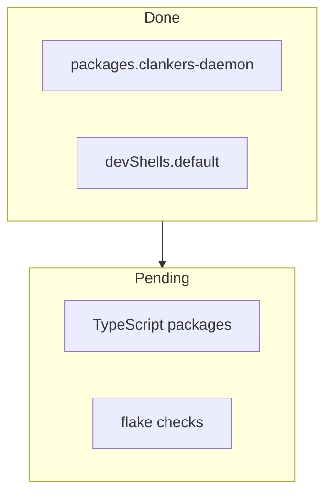

# Build System Overview

The project uses a hybrid build system: pnpm for TypeScript workspace management,
Go toolchain for the daemon, and Nix for reproducible environments.

## Current State

### Nix Flake

`flake.nix` provides:
- `packages.clankers-daemon` - Go binary built with `buildGoModule`
- `devShells.default` - development environment

```bash
# Build daemon
nix build .#clankers-daemon

# Enter dev shell
nix develop
```

### Go Daemon

Location: `packages/daemon/`

| File | Purpose |
|------|---------|
| go.mod | Module definition: `github.com/dxta-dev/clankers-daemon` |
| go.sum | Dependencies for Nix vendorHash |
| cmd/clankers-daemon/main.go | Entry point |

Dependencies:
- `modernc.org/sqlite` - Pure Go SQLite (no CGO)
- `github.com/sourcegraph/jsonrpc2` - JSON-RPC server

Build commands:
```bash
# Nix (reproducible)
nix build .#clankers-daemon

# Go (development)
CGO_ENABLED=0 go build -o clankers-daemon ./cmd/clankers-daemon
```

### TypeScript Apps

Three plugin apps in `apps/`:

| App | Package Name | Purpose |
|-----|--------------|---------|
| opencode-plugin | @dxta-dev/clankers-opencode | OpenCode editor plugin |
| claude-code-plugin | @dxta-dev/clankers-claude-code | Claude Code plugin |
| cursor-plugin | @dxta-dev/clankers-cursor | Cursor editor plugin |

Shared package in `packages/`:
- `packages/core` - shared schemas, RPC client, aggregation

Build commands:
```bash
pnpm build              # all apps
pnpm build:opencode     # single app
pnpm build:claude
pnpm build:cursor
```

### Workspace Scripts

From root `package.json`:

| Script | Command |
|--------|---------|
| build | `pnpm --filter "./apps/**" build` |
| check | `tsc --noEmit` |
| lint | `biome lint .` |
| format | `biome format --write .` |

## Next Steps

See [nix-build-system plan](../plans/nix-build-system.md) for remaining work:

- Phase 2: TypeScript package derivations (`nix build .#clankers-opencode`)
- Phase 3: Checks (`nix flake check` for lint, typecheck)
- Phase 4: Integration tests



Links: [dev-environment](../dev-environment.md), [daemon](../daemon/architecture.md), [nix-build-system](../plans/nix-build-system.md)
