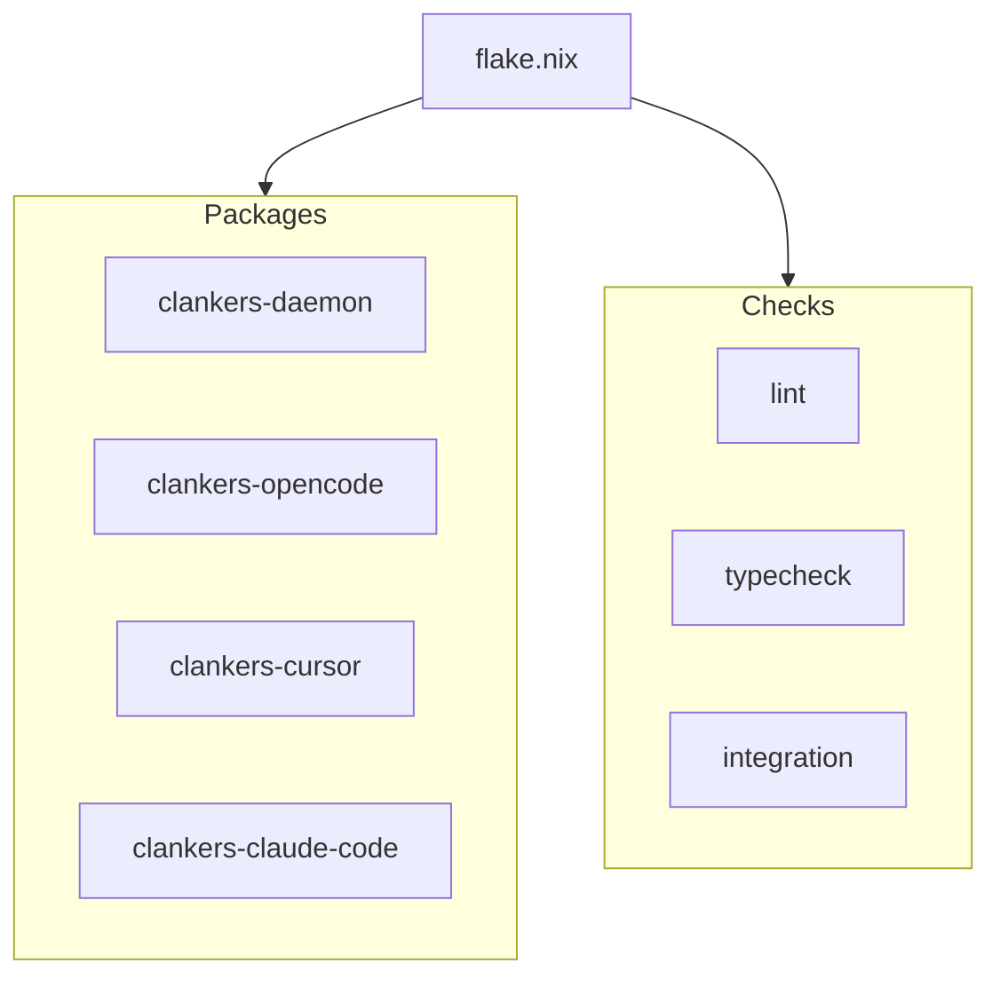

# Build System Overview

The project uses Nix flakes for reproducible builds. TypeScript apps use pnpm
for workspace management, while the Go daemon builds with `buildGoModule`.

## Nix Flake

`flake.nix` provides packages, checks, and dev shells for all supported systems.

### Packages

| Package | Description |
|---------|-------------|
| `clankers-daemon` | Go binary (SQLite + JSON-RPC server) |
| `clankers-opencode` | OpenCode editor plugin |
| `clankers-cursor` | Cursor editor plugin |
| `clankers-claude-code` | Claude Code plugin |

```bash
# Build daemon
nix build .#clankers-daemon

# Build TypeScript app
nix build .#clankers-opencode
```

### Checks

| Check | Description |
|-------|-------------|
| `lint` | Biome lint check |
| `typecheck` | TypeScript type check |
| `integration` | Daemon + RPC client integration test |

```bash
# Run all checks
nix flake check
```

### Dev Shell

```bash
nix develop
```

Provides: Node 24, pnpm, Go, SQLite, Biome, TypeScript LSP.

## Go Daemon

Location: `packages/daemon/`

Dependencies:
- `modernc.org/sqlite` - Pure Go SQLite (no CGO)
- `github.com/sourcegraph/jsonrpc2` - JSON-RPC server

Nix builds with `CGO_ENABLED=0` for static binary.

```nix
clankers-daemon = pkgs.buildGoModule {
  pname = "clankers-daemon";
  src = ./packages/daemon;
  vendorHash = "sha256-L8CHwPOjwE+DOJ1OWi0/V+tYrB2ev3iN9VU7i8WmCN0=";
  env.CGO_ENABLED = 0;
};
```

## TypeScript Apps

Uses `fetchPnpmDeps` for reproducible node_modules, `pnpmConfigHook` for setup.
A shared `mkTsApp` helper creates consistent derivations.

```nix
pnpmDeps = pkgs.fetchPnpmDeps {
  pname = "clankers-workspace";
  src = ./.;
  hash = "sha256-szJy9JkSlOYT7aCa3mfrXajbHDWpTZcQkzQdj7eiW8Q=";
  fetcherVersion = 3;
};
```

Build output includes `dist/`, `src/`, and `package.json` for npm publishing.

### Workspace Scripts

| Script | Command |
|--------|---------|
| build | `pnpm --filter "./apps/**" build` |
| check | `tsc --noEmit` |
| lint | `biome lint .` |
| format | `biome format --write .` |



Links: [dev-environment](../dev-environment.md), [daemon](../daemon/architecture.md),
[testing](testing.md), [ci](../ci/overview.md)
