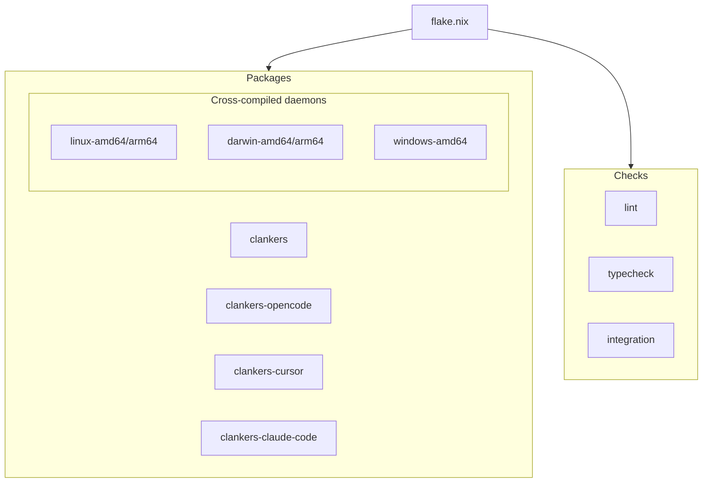

# Build System Overview

The project uses Nix flakes for reproducible builds. TypeScript apps use pnpm
for workspace management, while the Go daemon builds with `buildGoModule`.

## Nix Flake

`flake.nix` provides packages, checks, and dev shells for all supported systems.

### Packages

| Package | Description |
|---------|-------------|
| `clankers` | Go daemon for current system |
| `clankers-linux-amd64` | Cross-compiled for Linux x86_64 |
| `clankers-linux-arm64` | Cross-compiled for Linux ARM64 |
| `clankers-darwin-amd64` | Cross-compiled for macOS x86_64 |
| `clankers-darwin-arm64` | Cross-compiled for macOS ARM64 |
| `clankers-windows-amd64` | Cross-compiled for Windows x86_64 |
| `clankers-opencode` | OpenCode editor plugin |
| `clankers-cursor` | Cursor editor plugin |
| `clankers-claude-code` | Claude Code plugin |

```bash
# Build daemon for current system
nix build .#clankers

# Build daemon for specific platform (cross-compilation)
nix build .#clankers-darwin-arm64
nix build .#clankers-windows-amd64

# Build TypeScript app
nix build .#clankers-opencode
```

### Checks

| Check | Description |
|-------|-------------|
| `lint` | Biome lint check |
| `typecheck` | TypeScript type check |
| `integration` | Daemon + RPC client integration test |

```bash
# Run all checks
nix flake check
```

### Dev Shell

```bash
nix develop
```

Provides: Node 24, pnpm, Go, SQLite, Biome, TypeScript LSP.

## Go Daemon

Location: `packages/cli/`

Dependencies:
- `modernc.org/sqlite` - Pure Go SQLite (no CGO)
- `github.com/sourcegraph/jsonrpc2` - JSON-RPC server

Nix builds with size optimizations for static binaries:
- `CGO_ENABLED=0` - Pure Go, no C dependencies
- `-ldflags="-s -w"` - Strip debug symbols and DWARF info
- `-trimpath` - Remove file paths for reproducibility

```nix
clankers = pkgs.buildGoModule {
  pname = "clankers";
  src = ./packages/cli;
  vendorHash = "sha256-...";
  ldflags = [ "-s" "-w" ];
  flags = [ "-trimpath" ];
  env.CGO_ENABLED = 0;
};
```

### Cross-Compilation

Cross-compiled binaries use a `mkDaemonCross` helper that sets `GOOS`/`GOARCH`
environment variables during the build phase. Since the daemon uses pure Go
(no CGO), cross-compilation works from any host system.

| Target | Binary Name | Format |
|--------|-------------|--------|
| linux-amd64 | `clankers` | ELF 64-bit x86_64 |
| linux-arm64 | `clankers` | ELF 64-bit ARM64 |
| darwin-amd64 | `clankers` | Mach-O 64-bit x86_64 |
| darwin-arm64 | `clankers` | Mach-O 64-bit arm64 |
| windows-amd64 | `clankers.exe` | PE32+ x86_64 |

Cross-compiled builds disable `strip` and `patchELF` fixup phases since these
tools don't understand foreign binary formats.

## TypeScript Apps

Uses `fetchPnpmDeps` for reproducible node_modules, `pnpmConfigHook` for setup.
A shared `mkTsApp` helper creates consistent derivations.

```nix
pnpmDeps = pkgs.fetchPnpmDeps {
  pname = "clankers-workspace";
  src = ./.;
  hash = "sha256-DLqQOmfunGEXRL60I+nlMTe2H7mLnA+nnzuRFKfbtRY=";
  fetcherVersion = 3;
};
```

Build output includes `dist/`, `src/`, and `package.json` for npm publishing.

### Workspace Scripts

| Script | Command |
|--------|---------|
| build | `pnpm --filter "./apps/**" build` |
| check | `tsc --noEmit` |
| lint | `biome lint .` |
| format | `biome format --write .` |



Links: [dev-environment](../dev-environment.md), [daemon](../daemon/architecture.md),
[testing](testing.md), [ci](../ci/overview.md)
