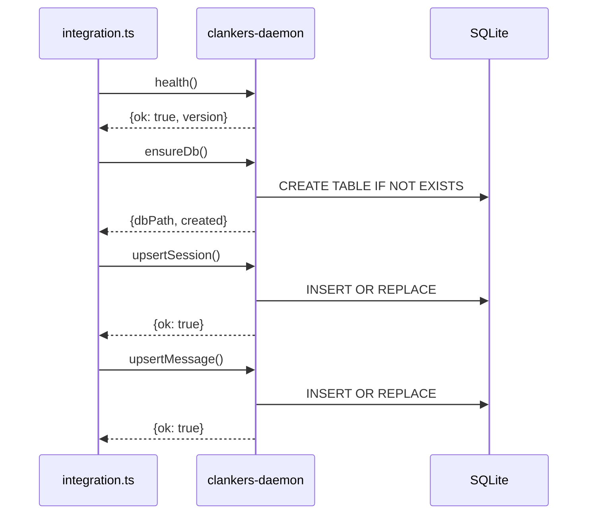

# Integration Testing

The integration test validates daemon + RPC client communication in an isolated
environment. It runs as part of `nix flake check`.

## Test Coverage

| Test | Validates |
|------|-----------|
| Health check | Daemon responds with `ok: true` and version |
| ensureDb | Database creation/verification works |
| Round-trip | upsertSession + upsertMessage succeed |

## Test Isolation

Tests run with isolated paths to avoid affecting real data:

```bash
export CLANKERS_SOCKET_PATH="$TEST_DIR/clankers.sock"
export CLANKERS_DB_PATH="$TEST_DIR/clankers.db"
```

Cleanup trap ensures daemon is killed and temp files removed on exit.

## Running Tests

### Via Nix (CI)

```bash
nix flake check
```

Runs lint, typecheck, and integration as separate checks.

### Locally

```bash
./tests/run-integration.sh
```

Requires daemon binary available (either via `nix build .#clankers-daemon -o result-daemon`
or in PATH).

## Test Implementation

Test file: `tests/integration.ts`

Uses the existing RPC client from `packages/core/src/rpc-client.ts` via relative
import. Runs with `tsx` (TypeScript execution).

```ts
import { createRpcClient } from "../packages/core/src/rpc-client.js";

const rpc = createRpcClient({
  clientName: "integration-test",
  clientVersion: "0.1.0",
});

await rpc.health();
await rpc.ensureDb();
await rpc.upsertSession({ id: "test-session", ... });
await rpc.upsertMessage({ id: "test-message", sessionId: "test-session", ... });
```

## Nix Check Definition

```nix
integration = pkgs.stdenvNoCC.mkDerivation {
  name = "clankers-integration";
  nativeBuildInputs = [ pkgs.nodejs_24 pkgs.pnpm pkgs.pnpmConfigHook daemon ];
  inherit pnpmDeps;
  
  buildPhase = ''
    TEST_DIR=$(mktemp -d)
    export CLANKERS_SOCKET_PATH="$TEST_DIR/clankers.sock"
    export CLANKERS_DB_PATH="$TEST_DIR/clankers.db"
    
    clankers-daemon &
    # wait for socket...
    pnpm exec tsx tests/integration.ts
    # cleanup...
  '';
};
```



Links: [build overview](overview.md), [daemon](../daemon/architecture.md),
[rpc-client](../daemon/architecture.md#rpc-protocol)
