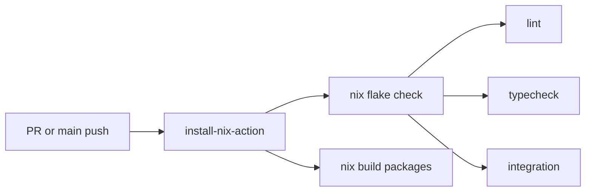

# CI Overview

CI uses Nix for reproducible builds. All checks run via `nix flake check`.

## Workflow

```yaml
- uses: cachix/install-nix-action@v27
- run: nix flake check
- run: nix build .#clankers
- run: nix build .#clankers-opencode
- run: nix build .#clankers-cursor
- run: nix build .#clankers-claude-code
```

## Checks

| Check | Description |
|-------|-------------|
| `lint` | Biome lint (no pnpm deps needed) |
| `typecheck` | `pnpm check` with workspace deps |
| `integration` | Daemon + RPC client round-trip test |

All checks run in parallel when possible.

## Invariants

- CI runs on pull requests and pushes to `main`
- Uses Nix for reproducible environment (same as local dev)
- Does not publish or deploy artifacts
- Cachix integration not yet added (builds from scratch each run)

## Benefits

- CI uses exact same environment as local dev
- No version drift between local and CI
- Single command runs all validation: `nix flake check`



Links: [build overview](../build/overview.md), [testing](../build/testing.md)
