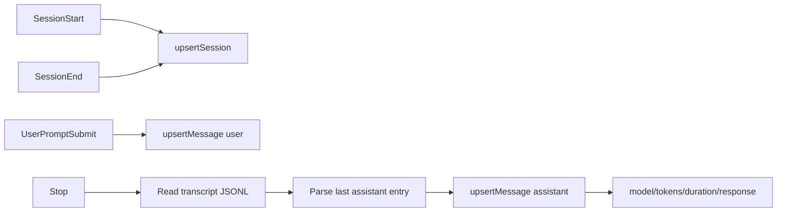

# Claude data mapping

This document captures how Claude Code hook payloads map into session/message rows.

Invariants
- Claude Code sessions are created from `SessionStart` and finalized by `SessionEnd`.
- The Stop hook event does NOT include model/tokens/duration fields; metadata is extracted from the transcript file.
- Partial upserts overwrite all columns, so missing fields in later hooks can null out earlier values.
- The plugin normalizes camelCase and snake_case hook keys for tokens, duration, cost, and model.

## Session mapping

`SessionStart` carries the earliest model hint and sets `createdAt`. The plugin uses `title = "Untitled Session"` initially and later replaces it with a trimmed first-user prompt when available.

`SessionEnd` is used for `updated_at`, token totals, and cost; the plugin carries forward title/model/createdAt from in-memory state to avoid overwriting them.

Claude metadata persisted on session end:
- `permission_mode` captured on `SessionStart` and carried through `SessionEnd`.
- `message_count` and `tool_call_count` captured from `SessionEnd`.
- `status` set to `"ended"` and `ended_at` set at `SessionEnd` time.

## Message mapping

`UserPromptSubmit` writes a user message with text and `created_at`.

`Stop` writes the assistant message. The hook event only contains `session_id`, `transcript_path`, `cwd`, and `stop_hook_active`. To extract metadata, the plugin reads the transcript JSONL file and parses the last assistant message entry to get:
- `model` from `message.model`
- `promptTokens` from `message.usage.input_tokens` + cache tokens
- `completionTokens` from `message.usage.output_tokens`
- `response` from `message.content[].text` (filtered to text blocks only)
- `durationMs` calculated from user message timestamp to assistant message timestamp
- `createdAt` from the user message timestamp

Links: [data gaps](../data-model/data-gaps.md), [plugin system](plugin-system.md), [schemas](../data-model/schemas.md)

Example
```ts
// Stop hook does NOT include metadata - extract from transcript
const transcript = await extractMetadataFromTranscript(data.transcript_path);

const message: MessagePayload = {
	id: messageId,
	sessionId,
	role: "assistant",
	textContent: transcript.response ?? "",
	model: transcript.model,
	promptTokens: transcript.promptTokens,
	completionTokens: transcript.completionTokens,
	durationMs: transcript.durationMs,
	createdAt: transcript.createdAt,
	completedAt: Date.now(),
};
```

Diagram

