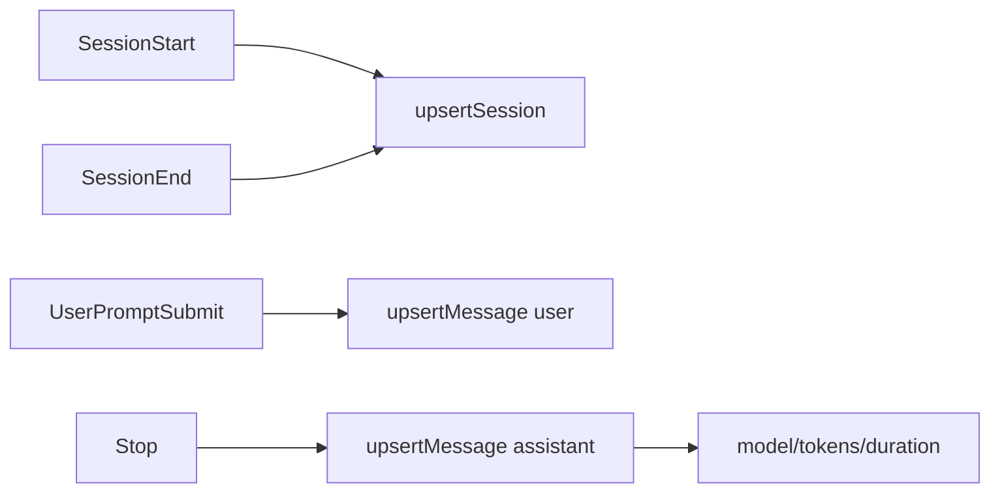

# Claude data mapping

This document captures how Claude Code hook payloads map into session/message rows, including current gaps and overwrite behavior.

Invariants
- Claude Code sessions are created from `SessionStart` and finalized by `SessionEnd`.
- Message metadata for model/tokens/duration is only available from `Stop` events.
- Partial upserts overwrite all columns, so missing fields in later hooks can null out earlier values.

## Session mapping

`SessionStart` is the only hook that carries a model hint today, and it does not include a title. The plugin currently uses a fixed title and does not set `createdAt`, so `created_at` stays NULL unless explicitly filled.

`SessionEnd` is used for `updated_at`, token totals, and cost. Because `SessionEnd` omits title/model/createdAt, those fields can be overwritten to NULL/default if not carried forward in the payload.

## Message mapping

`UserPromptSubmit` writes a user message with text and `created_at`.

`Stop` writes the assistant message and is the only source of `model`, `tokenUsage`, and `durationMs`. If those fields are absent or use a different key shape, `model`, `prompt_tokens`, `completion_tokens`, and `duration_ms` will be NULL/0 in the database.

Links: [data gaps](../data-model/data-gaps.md), [plugin system](plugin-system.md), [schemas](../data-model/schemas.md)

Example
```ts
// Stop hook payloads are the only source of model/tokens/duration.
const message: MessagePayload = {
	id: messageId,
	sessionId,
	role: "assistant",
	textContent: data.response || "",
	model: data.model,
	promptTokens: data.tokenUsage?.input,
	completionTokens: data.tokenUsage?.output,
	durationMs: data.durationMs,
	completedAt: Date.now(),
};
```

Diagram

