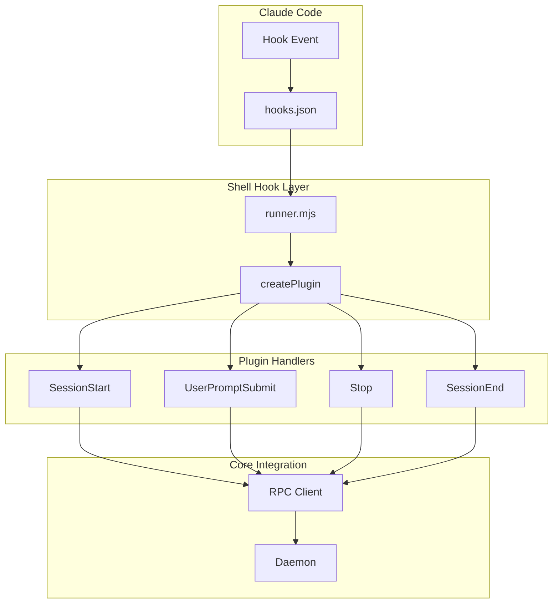

# Claude Code Plugin System

Claude Code uses a programmatic plugin pattern distinct from OpenCode's event-based system. Plugins export a `createPlugin()` function that returns hook handlers for session lifecycle events.

## Plugin Types

Claude Code supports multiple plugin patterns:

| Pattern | Use Case | Configuration |
|---------|----------|---------------|
| **Programmatic** | TypeScript/JavaScript plugins with full API access | Export `createPlugin()` function |
| **Hook-based** | Shell scripts triggered by events | `hooks/hooks.json` |
| **Skill-based** | Custom slash commands | `skills/<name>/SKILL.md` |
| **Agent-based** | Specialized subagents | `agents/<name>.md` |

For clankers, we use the **programmatic pattern** for direct RPC client integration.

## Plugin Structure

Claude Code plugins use **shell-based hooks** that receive event data via stdin. The clankers plugin uses a Node.js runner script that bridges shell hooks to TypeScript handlers.



### Required Files

```
my-plugin/
├── .claude-plugin/
│   └── plugin.json          # Plugin manifest (required)
├── hooks/
│   ├── hooks.json           # Shell hook configuration (required for hooks)
│   └── runner.mjs           # Node.js script to bridge to TypeScript
├── dist/
│   └── index.js             # Bundled plugin (esbuild output)
├── src/
│   ├── index.ts             # Main entry, exports createPlugin()
│   ├── schemas.ts           # Zod validation schemas
│   └── types.ts             # TypeScript interfaces
└── package.json
```

### hooks/hooks.json

Claude Code executes shell commands for each hook event. Use `${CLAUDE_PLUGIN_ROOT}` for paths:

```json
{
  "description": "Sync Claude Code sessions to clankers daemon",
  "hooks": {
    "SessionStart": [
      {
        "hooks": [
          {
            "type": "command",
            "command": "node ${CLAUDE_PLUGIN_ROOT}/hooks/runner.mjs SessionStart"
          }
        ]
      }
    ]
  }
}
```

### hooks/runner.mjs

Bridges shell stdin to TypeScript plugin:

```javascript
#!/usr/bin/env node
import { createPlugin } from '../dist/index.js';

const hookName = process.argv[2];
let inputData = '';

process.stdin.setEncoding('utf8');
process.stdin.on('data', (chunk) => inputData += chunk);
process.stdin.on('end', async () => {
  const event = JSON.parse(inputData);
  const plugin = createPlugin();
  await plugin?.[hookName]?.(event);
  process.exit(0);
});
```

### Plugin Manifest

The `.claude-plugin/plugin.json` is required:

```json
{
  "name": "clankers",
  "description": "Sync Claude Code sessions to clankers daemon",
  "version": "0.1.0",
  "author": {
    "name": "dxta-dev"
  }
}
```

**Critical**: The `.claude-plugin/` directory contains ONLY `plugin.json`. All other directories (commands/, agents/, skills/, hooks/) must be at the plugin root, NOT inside `.claude-plugin/`.

## createPlugin Function

The entry point must export a `createPlugin` function:

```typescript
export function createPlugin(): ClaudeCodeHooks | null {
  const rpc = createRpcClient({
    clientName: "claude-code-plugin",
    clientVersion: "0.1.0"
  });

  // Connection state with async initialization
  let connectionState: boolean | null = null;
  let connectionPromise: Promise<boolean> | null = null;

  // Start health check immediately (non-blocking)
  connectionPromise = rpc.health()
    .then((health) => {
      connectionState = health.ok;
      return connectionState;
    })
    .catch(() => {
      connectionState = false;
      return false;
    });

  // Hooks must await connection before processing
  async function waitForConnection(): Promise<boolean> {
    if (connectionState !== null) return connectionState;
    if (connectionPromise) return connectionPromise;
    return false;
  }

  return {
    SessionStart: async (event) => {
      const connected = await waitForConnection();
      if (!connected) return;
      // Process event...
    },
    // ... other hooks follow same pattern
  };
}

export default createPlugin;
```

**Important**: Hooks must `await waitForConnection()` to avoid race conditions. The daemon connection is async, so early events would be dropped without this pattern.

## Available Hooks

| Hook | When Fired | Input Data | Priority |
|------|------------|------------|----------|
| `SessionStart` | Session begins/resumes | session_id, cwd, model, source | Essential |
| `UserPromptSubmit` | User sends message | session_id, prompt | Essential |
| `Stop` | Claude finishes responding | session_id, response, tokenUsage, durationMs | Essential |
| `SessionEnd` | Session terminates | session_id, reason, messageCount, costEstimate | Essential |
| `PostToolUse` | After tool execution | session_id, tool_name, tool_input, result | Optional |
| `SubagentStart` | Subagent spawned | session_id, agent_id, agent_type | Optional |
| `SubagentStop` | Subagent finished | session_id, agent_id | Optional |

### Hook Event Schemas

**Note**: `permission_mode` is documented but NOT sent by Claude Code in practice. All schemas make it optional.

```typescript
// SessionStart - actual event from Claude Code
interface SessionStartEvent {
  session_id: string;
  transcript_path: string;
  cwd: string;
  permission_mode?: string;  // Optional - not sent by Claude
  hook_event_name: "SessionStart";
  source: "startup" | "resume" | "clear" | "compact";
  model?: string;
}

// UserPromptSubmit
interface UserPromptEvent {
  session_id: string;
  transcript_path: string;
  cwd: string;
  permission_mode?: string;  // Optional - not sent by Claude
  hook_event_name: "UserPromptSubmit";
  prompt: string;
}

// Stop
interface StopEvent {
  session_id: string;
  transcript_path: string;
  cwd: string;
  permission_mode?: string;  // Optional - not sent by Claude
  hook_event_name: "Stop";
  response?: string;
  tokenUsage?: { input: number; output: number };
  durationMs?: number;
  model?: string;
  stop_hook_active?: boolean;  // True if already continuing from stop hook
}

// SessionEnd
interface SessionEndEvent {
  session_id: string;
  transcript_path: string;
  cwd: string;
  permission_mode?: string;  // Optional - not sent by Claude
  hook_event_name: "SessionEnd";
  reason: "clear" | "logout" | "prompt_input_exit" | "other";
  messageCount?: number;
  toolCallCount?: number;
  totalTokenUsage?: { input: number; output: number };
  costEstimate?: number;
}
```

## Project-Level Configuration

Claude Code supports project-level configuration via the `.claude/` directory:

### Configuration Scopes

Scope hierarchy (most specific wins): `managed > local > project > user`

| Scope | Location | Shared? | Use For |
|-------|----------|---------|---------|
| User | `~/.claude/settings.json` | No | Personal defaults |
| Project | `.claude/settings.json` | Yes | Team-shared settings |
| Local | `.claude/settings.local.json` | No | Personal overrides, secrets |
| Managed | System path | Yes | Enterprise policies |

### Directory Structure

```
project-root/
├── .claude/
│   ├── settings.json            # Committed team settings
│   ├── settings.local.json      # Git-ignored personal settings
│   └── plugins/                 # Optional: plugin symlinks
│       └── my-plugin -> /path/to/plugin
├── src/
├── package.json
└── .gitignore
```

### settings.json (Committed)

```json
{
  "permissions": {
    "allow": [
      "Read (./src/**)",
      "Bash (npm test)"
    ],
    "deny": [
      "Read (.env)"
    ]
  },
  "environment": {
    "NODE_ENV": "development"
  },
  "hooks": {
    "PostToolUse": [
      {
        "matcher": "Write|Edit",
        "hooks": [
          {
            "type": "command",
            "command": "npm run lint:fix"
          }
        ]
      }
    ]
  }
}
```

### settings.local.json (Git-ignored)

```json
{
  "permissions": {
    "allow": [
      "Bash (docker *)"
    ]
  },
  "environment": {
    "API_KEY": "personal-api-key"
  }
}
```

### .gitignore

```
# Claude Code
.claude/settings.local.json

# Clankers dev data
.clankers-dev/
```

## Loading Plugins

### Development: --plugin-dir

For local development, use the `--plugin-dir` flag:

```bash
# Load plugin from directory
claude --plugin-dir ./apps/claude-code-plugin

# Load multiple plugins
claude --plugin-dir ./plugin-one --plugin-dir ./plugin-two
```

The plugin directory must contain `.claude-plugin/plugin.json`.

### Installation: plugin install

For distribution, plugins are installed via:

```bash
# From marketplace
claude plugin install clankers

# Specific scope
claude plugin install clankers --scope project

# Local path (after development)
claude plugin install ./apps/claude-code-plugin
```

Installed plugins are referenced in settings:

```json
{
  "plugins": {
    "clankers": {
      "enabled": true
    }
  }
}
```

## Local Development Workflow

### Step 1: Create Plugin Structure

```bash
mkdir -p apps/claude-code-plugin/.claude-plugin
mkdir -p apps/claude-code-plugin/src

# Create manifest
cat > apps/claude-code-plugin/.claude-plugin/plugin.json << 'EOF'
{
  "name": "clankers",
  "description": "Sync Claude Code sessions to clankers daemon",
  "version": "0.1.0"
}
EOF
```

### Step 2: Implement createPlugin

```typescript
// src/index.ts
import { createRpcClient } from "@dxta-dev/clankers-core";
import { z } from "zod";

const SessionStartSchema = z.object({
  session_id: z.string(),
  cwd: z.string(),
  source: z.enum(["startup", "resume", "clear", "compact"]),
  model: z.string().optional(),
});

export function createPlugin() {
  const rpc = createRpcClient({
    clientName: "claude-code-plugin",
    clientVersion: "0.1.0"
  });
  
  return {
    SessionStart: async (event) => {
      const parsed = SessionStartSchema.safeParse(event);
      if (!parsed.success) return;
      
      await rpc.upsertSession({
        id: parsed.data.session_id,
        projectPath: parsed.data.cwd,
        model: parsed.data.model,
      });
    },
    // ... other hooks
  };
}

export default createPlugin;
```

### Step 3: Build Plugin

```bash
pnpm --filter @dxta-dev/clankers-claude-code build
```

### Step 4: Test with Claude Code

```bash
# Terminal 1: Start daemon
clankers daemon &

# Terminal 2: Run Claude Code with plugin
claude --plugin-dir ./apps/claude-code-plugin
```

### Step 5: Verify

Inside Claude Code:
```
/plugin list          # Should show clankers
/help                 # Should show plugin commands if any
```

Check database:
```bash
sqlite3 .clankers-dev/clankers.db "SELECT * FROM sessions;"
```

## Nix DevShell Integration

The flake provides a single dev shell that builds Claude + OpenCode plugins and
auto-starts the daemon:

```bash
nix develop .#with-all-plugins
```

## Key Differences from OpenCode

| Aspect | OpenCode | Claude Code |
|--------|----------|-------------|
| **Plugin Pattern** | Event-based stream | Hook-based callbacks |
| **Entry Point** | Export `Plugin` object | Export `createPlugin()` function |
| **Event Source** | `client.event()` | Hook handlers (SessionStart, etc.) |
| **Config Location** | `.opencode/config.json` | `.claude/settings.json` + `settings.local.json` |
| **Plugin Loading** | `plugin: ["./path"]` in config | `--plugin-dir ./path` CLI flag |
| **Test Command** | Built into client | `claude --plugin-dir ./path` |
| **Session Events** | `session.created`, `session.updated` | `SessionStart`, `SessionEnd` |
| **Message Events** | `message.updated`, `message.part.updated` | `UserPromptSubmit`, `Stop` |

## Common Pitfalls

### 1. Wrong Directory Structure

**Wrong**:
```
my-plugin/
└── .claude-plugin/
    ├── plugin.json
    └── hooks/          # ❌ Hooks inside .claude-plugin/
```

**Correct**:
```
my-plugin/
├── .claude-plugin/
│   └── plugin.json     # ✅ Only manifest here
├── hooks/              # ✅ At root level
│   └── hooks.json
└── src/
    └── index.ts
```

### 2. Missing createPlugin Export

Plugins must export `createPlugin` as named export AND default export:

```typescript
export function createPlugin() { /* ... */ }
export default createPlugin;  // Required!
```

### 3. Hook Event Name Case

Hook names are case-sensitive:
- ✅ `SessionStart`
- ❌ `sessionStart`
- ❌ `sessionstart`

### 4. Plugin Caching

Claude Code copies plugins to a cache directory. External file references (like `../shared-utils`) won't work after installation. Use `${CLAUDE_PLUGIN_ROOT}` environment variable for paths.

### 5. Connection Race Condition

If daemon connection is checked async but hooks return early when not connected, early events are silently dropped. Always await connection:

```typescript
// ❌ Wrong: events dropped during async health check
let connected = false;
rpc.health().then(() => { connected = true; });
// SessionStart fires before connected=true

// ✅ Correct: await connection before processing
const connected = await waitForConnection();
if (!connected) return;
```

### 6. Async Handler Errors

Unhandled errors in hook handlers can crash the plugin. Always wrap in try-catch:

```typescript
SessionStart: async (event) => {
  try {
    await rpc.upsertSession({ /* ... */ });
  } catch (err) {
    console.error("[clankers] Failed to sync session:", err);
  }
}
```

### 7. Missing session fields on SessionEnd

Claude Code `SessionEnd` does not include title/model/createdAt. If you upsert only the `SessionEnd` payload, those fields can be overwritten to NULL/defaults. Carry forward values from earlier hooks when building the final session payload.

## Advanced: Hook Output

Hooks can return structured output to control Claude Code behavior:

### Blocking Tools (PreToolUse)

```typescript
PreToolUse: async (event) => {
  if (shouldBlock(event)) {
    // Return JSON to stdout
    console.log(JSON.stringify({
      hookSpecificOutput: {
        hookEventName: "PreToolUse",
        permissionDecision: "deny",
        permissionDecisionReason: "Operation not allowed"
      }
    }));
  }
}
```

### Adding Context (SessionStart)

```typescript
SessionStart: async (event) => {
  console.log(JSON.stringify({
    hookSpecificOutput: {
      hookEventName: "SessionStart",
      additionalContext: "Project uses pnpm for package management"
    }
  }));
}
```

## Testing and Debugging

### Debug Mode

```bash
claude --debug --plugin-dir ./my-plugin
```

Shows:
- Plugin loading details
- Hook registration
- Execution flow

### Manual Hook Testing

Test hook handlers in isolation:

```typescript
// test-hook.ts
import { createPlugin } from "./index.js";

const plugin = createPlugin();

// Simulate SessionStart
plugin.SessionStart?.({
  session_id: "test-123",
  transcript_path: "/tmp/test.json",
  cwd: "/home/user/project",
  permission_mode: "default",
  hook_event_name: "SessionStart",
  source: "startup",
  model: "claude-sonnet-4-20250514"
});
```

### Log Locations

- Plugin errors: Console output (visible with `--debug`)
- Daemon logs: stderr (use `--log-level=debug`)
- Database: `clankers.db` (inspect with sqlite3)

## Resources

- [Claude Code Plugin Docs](https://code.claude.com/docs/en/plugins)
- [Hooks Reference](https://code.claude.com/docs/en/hooks)
- [Plugin Reference](https://code.claude.com/docs/en/plugins-reference)
- [Wayne Sutton's Reference Implementation](https://github.com/waynesutton/claude-code-sync)
