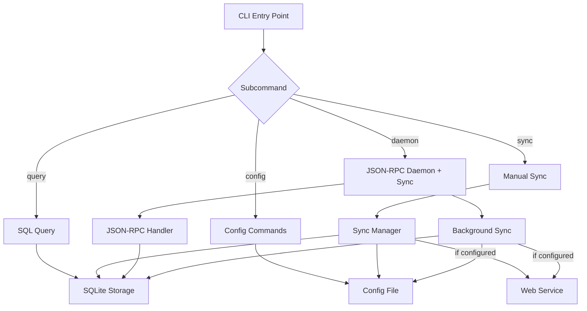

# CLI Architecture

The clankers CLI provides both daemon mode and interactive commands for local database querying and cloud sync. **Requires explicit subcommand** - this is a breaking change from previous versions.

## Commands

| Command | Purpose |
|---------|---------|
| `clankers daemon` | Run the JSON-RPC daemon and background sync |
| `clankers config set <key> <value>` | Set configuration value |
| `clankers config get <key>` | Get configuration value |
| `clankers config list` | List all configuration |
| `clankers config profiles list` | List available profiles |
| `clankers config profiles use <name>` | Switch active profile |
| `clankers query <sql>` | Execute SQL queries against local database |
| `clankers sync now` | Force immediate sync |
| `clankers sync status` | Show sync status |
| `clankers sync pending` | View pending changes |

## Architecture



## Breaking Change: Explicit Daemon Command

**Previous behavior**: `clankers` (no args) → start daemon
**New behavior**: `clankers` (no args) → show help/error, must use `clankers daemon`

```bash
# OLD (no longer works)
$ clankers
[daemon starts]

# NEW (required)
$ clankers daemon
[daemon starts]

$ clankers
Error: No subcommand specified. Use 'clankers daemon' to start daemon.
```

## Configuration System

Configuration stored in JSON file at platform-specific location:
- macOS: `~/Library/Application Support/clankers/config.json`
- Linux: `~/.config/clankers/config.json` (XDG)
- Windows: `%APPDATA%/clankers/config.json`

### Config Commands

```bash
# Set values
clankers config set endpoint https://my-server.com
clankers config set sync_enabled true

# Get values
clankers config get endpoint

# List all
clankers config list

# Unset/remove
clankers config unset endpoint
```

### Config File Format

```json
{
  "profiles": {
    "default": {
      "endpoint": "https://my-server.com",
      "sync_enabled": true,
      "sync_interval": 30,
      "auth": "none"
    },
    "work": {
      "endpoint": "https://work-server.com",
      "sync_enabled": false,
      "auth": "none"
    }
  },
  "active_profile": "default"
}
```

## Profile Management

Profiles are created and managed through the **web interface**. CLI can only switch between existing profiles:

```bash
# List available profiles (created via web)
clankers config profiles list
# default
# work
# personal

# Switch active profile
clankers config profiles use work
# Switched to profile: work

# Verify
clankers sync status
# Profile: work
# Endpoint: https://work-server.com
```

## Sync Activation

Sync is **disabled by default** and only activates when:

1. **Endpoint configured**: `clankers config set endpoint <url>`
2. **Sync enabled**: `clankers config set sync_enabled true` (or env var)
3. **Daemon running**: `clankers daemon`

Uses **periodic polling** (every 30s) to check for changes.

## Query Command

```bash
# Execute SQL query
clankers query "SELECT * FROM sessions LIMIT 10"

# JSON output
clankers query "SELECT * FROM messages" --format json

# Write operation (requires flag)
clankers query "UPDATE sessions SET title = 'X' WHERE id = 'y'" --write
```

**Output formats**: `table` (default), `json`

## Output Formats

| Command | Default | Options |
|---------|---------|---------|
| `query` | table | table, json |
| `sync status` | text | text, json |
| `config list` | text | text, json |

## Environment Variables

| Variable | Purpose |
|----------|---------|
| `CLANKERS_ENDPOINT` | Override endpoint URL |
| `CLANKERS_SYNC_ENABLED` | Master sync toggle (true/false) |
| `CLANKERS_PROFILE` | Override active profile |
| `CLANKERS_DATA_PATH` | Override data directory |
| `CLANKERS_DB_PATH` | Override database path |

## Configuration Precedence

1. Environment variables (highest)
2. Active profile config
3. Default values (lowest)

Links: [auth](auth.md), [sync](sync.md), [queries](queries.md), [daemon](../daemon/architecture.md), [web-service](../web-service/overview.md)
