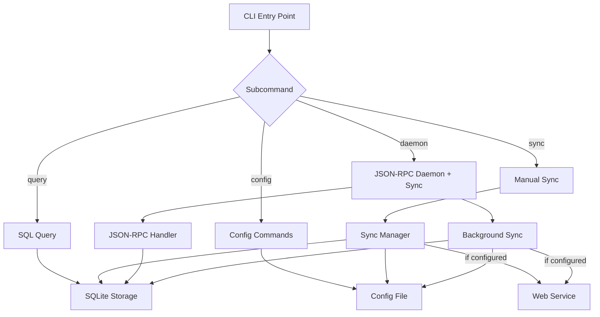

# CLI Architecture

The clankers CLI provides both daemon mode and interactive commands for local database querying and cloud sync. **Requires explicit subcommand** - this is a breaking change from previous versions.

## Implementation Status

| Phase | Status | Files |
|-------|--------|-------|
| Config Package | ✅ Complete | `internal/config/config.go` |
| CLI Structure (cobra) | ✅ Complete | `internal/cli/root.go`, `internal/cli/config.go`, `internal/cli/daemon.go` |
| Config Commands | ✅ Complete | `config set`, `config get`, `config list`, `config profiles` |
| Daemon Command | ✅ Complete | `clankers daemon` with all flags |
| Query Command | ✅ Complete | `internal/cli/query.go` |
| Sync Command | ⏳ Future | Phase 4 |

## Commands

| Command | Purpose |
|---------|---------|
| `clankers daemon` | Run the JSON-RPC daemon and background sync |
| `clankers config set <key> <value>` | Set configuration value |
| `clankers config get <key>` | Get configuration value |
| `clankers config list` | List all configuration |
| `clankers config profiles list` | List available profiles |
| `clankers config profiles use <name>` | Switch active profile |
| `clankers query <sql>` | Execute SQL queries against local database |
| `clankers sync now` | Force immediate sync |
| `clankers sync status` | Show sync status |
| `clankers sync pending` | View pending changes |

## Architecture



## Breaking Change: Explicit Daemon Command

**Previous behavior**: `clankers` (no args) → start daemon
**New behavior**: `clankers` (no args) → show help/error, must use `clankers daemon`

```bash
# OLD (no longer works)
$ clankers
[daemon starts]

# NEW (required)
$ clankers daemon
[daemon starts]

$ clankers
Error: No subcommand specified. Use 'clankers daemon' to start daemon.
```

## Configuration System

Configuration stored in JSON file at platform-specific location:
- macOS: `~/Library/Application Support/clankers/config.json`
- Linux: `~/.config/clankers/config.json` (XDG)
- Windows: `%APPDATA%/clankers/config.json`

### Config Commands

```bash
# Set values
clankers config set endpoint https://my-server.com
clankers config set sync_enabled true

# Get values
clankers config get endpoint

# List all
clankers config list

# Unset/remove
clankers config unset endpoint
```

### Config File Format

```json
{
  "profiles": {
    "default": {
      "endpoint": "https://my-server.com",
      "sync_enabled": true,
      "sync_interval": 30,
      "auth": "none"
    },
    "work": {
      "endpoint": "https://work-server.com",
      "sync_enabled": false,
      "auth": "none"
    }
  },
  "active_profile": "default"
}
```

## Profile Management

Profiles are created and managed through the **web interface**. CLI can only switch between existing profiles:

```bash
# List available profiles (created via web)
clankers config profiles list
# default
# work
# personal

# Switch active profile
clankers config profiles use work
# Switched to profile: work

# Verify
clankers sync status
# Profile: work
# Endpoint: https://work-server.com
```

## Sync Activation

Sync is **disabled by default** and only activates when:

1. **Endpoint configured**: `clankers config set endpoint <url>`
2. **Sync enabled**: `clankers config set sync_enabled true` (or env var)
3. **Daemon running**: `clankers daemon`

Uses **periodic polling** (every 30s) to check for changes.

## Query Command

```bash
# Execute SQL query
clankers query "SELECT * FROM sessions LIMIT 10"

# JSON output
clankers query "SELECT * FROM messages" --format json

# Write operations are blocked
clankers query "DELETE FROM sessions"
```

**Output formats**: `table` (default), `json`
**Write support**: not supported (no `--write` flag)

## Output Formats

| Command | Default | Options |
|---------|---------|---------|
| `query` | table | table, json |
| `sync status` | text | text, json |
| `config list` | text | text, json |

## Environment Variables

| Variable | Purpose |
|----------|---------|
| `CLANKERS_ENDPOINT` | Override endpoint URL |
| `CLANKERS_SYNC_ENABLED` | Master sync toggle (true/false) |
| `CLANKERS_PROFILE` | Override active profile |
| `CLANKERS_DATA_PATH` | Override data directory |
| `CLANKERS_DB_PATH` | Override database path |

## Configuration Precedence

1. Environment variables (highest)
2. Active profile config
3. Default values (lowest)

## Implementation Details

### Config Package (`internal/config/config.go`)

Core types and API:

```go
type Profile struct {
    Endpoint     string `json:"endpoint,omitempty"`
    SyncEnabled  bool   `json:"sync_enabled"`
    SyncInterval int    `json:"sync_interval"` // seconds
    AuthMode     string `json:"auth"`          // "none" for Phase 1
}

type Config struct {
    Profiles      map[string]Profile `json:"profiles"`
    ActiveProfile string             `json:"active_profile"`
}

// Key methods:
func Load() (*Config, error)                          // Load from disk or return default
func (c *Config) Save() error                         // Persist to disk
func (c *Config) GetActiveProfile() Profile           // Get current profile
func (c *Config) SetActiveProfile(name string) error  // Switch profile
func (c *Config) GetProfileValue(key string) (string, error)
func (c *Config) SetProfileValue(key, value string) error
```

**Default values:**
- `SyncEnabled`: false
- `SyncInterval`: 30 seconds
- `AuthMode`: "none"

**Env var overrides applied on Load():**
- `CLANKERS_ENDPOINT` → overrides profile.Endpoint
- `CLANKERS_SYNC_ENABLED` → overrides profile.SyncEnabled

### CLI Package (`internal/cli/`)

Uses [spf13/cobra](https://github.com/spf13/cobra) for command structure.

**File organization:**
- `root.go` - Root command, global flags, subcommand registration
- `config.go` - All config subcommands (set, get, list, profiles)
- `daemon.go` - Daemon subcommand (daemon startup, socket handling, JSON-RPC)

**Root command behavior:**
```go
RunE: func(cmd *cobra.Command, args []string) error {
    // No subcommand specified - show help and error
    cmd.Help()
    fmt.Fprintln(os.Stderr, "Error: No subcommand specified...")
    return fmt.Errorf("no subcommand specified")
},
```

**Config command structure:**
```
config
├── set <key> <value>
├── get <key>
├── list [--format json]
└── profiles
    ├── list [--format json]
    └── use <name>
```

**Daemon command:**
```bash
clankers daemon                    # Start daemon with defaults
clankers daemon --socket /path     # Custom socket path
clankers daemon --data-root /path  # Custom data directory
clankers daemon --db-path /path    # Custom database path
clankers daemon --log-level debug  # Set log level
```

The daemon command includes all the original daemon startup logic:
- Database initialization (`storage.EnsureDb`, `storage.Open`)
- Unix socket (macOS/Linux) or TCP (Windows) listener setup
- JSON-RPC connection handling with `serveConn()`
- Signal handling for graceful shutdown (SIGINT, SIGTERM)
- Log filtering for common connection errors

### Config File Location

Platform-specific paths via `internal/paths/paths.go`:
- **macOS**: `~/Library/Application Support/clankers/clankers.json`
- **Linux**: `~/.local/share/clankers/clankers.json` (XDG)
- **Windows**: `%APPDATA%/clankers/clankers.json`

Links: [config-system](config-system.md), [auth](auth.md), [sync](sync.md), [queries](queries.md), [daemon](../daemon/architecture.md), [web-service](../web-service/overview.md)
