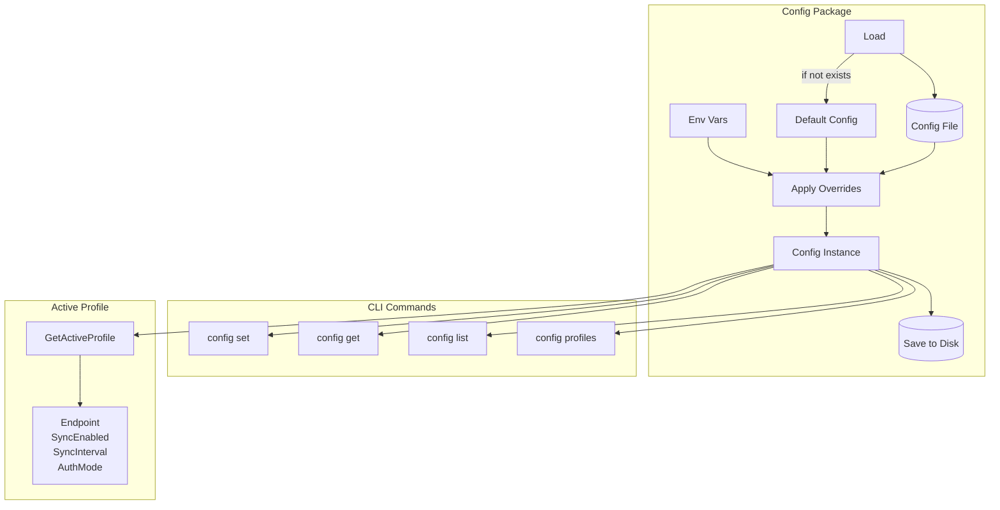

# Config System

The config system provides profile-based configuration management for the clankers daemon and CLI.

## Architecture



## Data Model

### Profile

```go
type Profile struct {
    Endpoint     string `json:"endpoint,omitempty"`
    SyncEnabled  bool   `json:"sync_enabled"`
    SyncInterval int    `json:"sync_interval"`
    AuthMode     string `json:"auth"`
}
```

**Default Profile Values:**

| Field | Default | Description |
|-------|---------|-------------|
| Endpoint | `""` | Web service URL for sync |
| SyncEnabled | `false` | Whether sync is active |
| SyncInterval | `30` | Polling interval in seconds |
| AuthMode | `"none"` | Authentication mode (none/token/workos) |

### Config

```go
type Config struct {
    Profiles      map[string]Profile `json:"profiles"`
    ActiveProfile string             `json:"active_profile"`
}
```

**Default Config:**
- Creates "default" profile with default values
- Sets ActiveProfile to "default"

## API Reference

### Loading and Saving

```go
// Load from disk or return default if not exists
// Applies env var overrides automatically
func Load() (*Config, error)

// Save current state to disk (pretty-printed JSON)
func (c *Config) Save() error
```

### Profile Access

```go
// Get the currently active profile
func (c *Config) GetActiveProfile() Profile

// Switch to a different profile
func (c *Config) SetActiveProfile(name string) error
```

### Key/Value Operations

```go
// Get a value by key from active profile
// Keys: endpoint, sync_enabled, sync_interval, auth
func (c *Config) GetProfileValue(key string) (string, error)

// Set a value by key on active profile
func (c *Config) SetProfileValue(key, value string) error
```

### Profile Management

```go
// Create a new profile (copies defaults)
func (c *Config) CreateProfile(name string) error

// Delete a profile (cannot delete "default")
func (c *Config) DeleteProfile(name string) error
```

## Environment Variable Overrides

Applied automatically on `Load()` to the active profile:

| Variable | Type | Affected Field |
|----------|------|----------------|
| `CLANKERS_ENDPOINT` | string | `profile.Endpoint` |
| `CLANKERS_SYNC_ENABLED` | bool | `profile.SyncEnabled` |

**Example:**
```bash
# Override endpoint for this session only
CLANKERS_ENDPOINT=https://staging.example.com clankers sync status
```

## Config File Format

Pretty-printed JSON stored at platform-specific location:

```json
{
  "profiles": {
    "default": {
      "endpoint": "https://api.clankers.dev",
      "sync_enabled": true,
      "sync_interval": 30,
      "auth": "none"
    },
    "work": {
      "endpoint": "",
      "sync_enabled": false,
      "sync_interval": 30,
      "auth": "none"
    }
  },
  "active_profile": "default"
}
```

## CLI Usage

### Set Configuration

```bash
clankers config set endpoint https://api.example.com
clankers config set sync_enabled true
clankers config set sync_interval 60
```

### Get Configuration

```bash
clankers config get endpoint
# https://api.example.com
```

### List Configuration

```bash
# Text format (default)
clankers config list
# Profile: default
#   endpoint:       https://api.example.com
#   sync_enabled:   true
#   sync_interval:  30 seconds
#   auth:           none

# JSON format
clankers config list -f json
# {"profile":"default","endpoint":"...","sync_enabled":true,...}
```

### Profile Management

```bash
# List profiles
clankers config profiles list
# * default (active)
#   work

# Switch profile
clankers config profiles use work
# Switched to profile: work
```

## Error Handling

| Operation | Error Case | Behavior |
|-----------|------------|----------|
| `Load()` | File doesn't exist | Return default config |
| `Load()` | Invalid JSON | Return error |
| `Save()` | Directory doesn't exist | Create directories |
| `SetActiveProfile()` | Profile doesn't exist | Return error |
| `SetProfileValue()` | Invalid key | Return error |
| `SetProfileValue()` | Invalid boolean | Return error |
| `SetProfileValue()` | Invalid integer | Return error |
| `DeleteProfile()` | Deleting "default" | Return error |

## Integration Points

### Daemon Mode

The daemon reads config on startup to determine:
- Whether to start background sync
- Sync endpoint URL
- Sync polling interval

### CLI Commands

All config-modifying commands:
1. Load current config
2. Modify in memory
3. Save to disk
4. Report result to user

Links: [cli/architecture](architecture.md), [daemon](../daemon/architecture.md), [storage/paths](../storage/paths.md)
