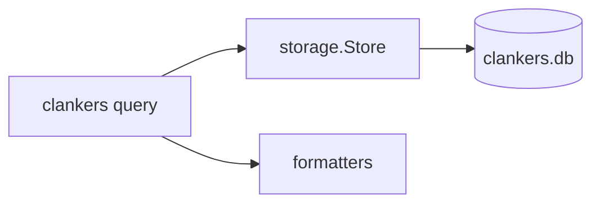

# CLI Queries

The clankers CLI provides read-only SQL query capabilities against the local SQLite database for debugging, analysis, and data exploration.

## Query Command

```bash
# Execute a query
clankers query "SELECT * FROM sessions ORDER BY created_at DESC LIMIT 10"

# Use table formatting (default)
clankers query "SELECT id, title, model FROM sessions" --format table

# Output as JSON
clankers query "SELECT * FROM messages" --format json
```

## Safety Controls

The query command is read-only. It blocks write operations and only allows SELECT or WITH statements. `--write` is not supported and will not be added.

### Read-Only Guard

Blocked keywords include:
- INSERT, UPDATE, DELETE, DROP, CREATE, ALTER, TRUNCATE
- REPLACE, MERGE, UPSERT
- ATTACH, DETACH, REINDEX, VACUUM
- PRAGMA, BEGIN, COMMIT, ROLLBACK, SAVEPOINT, RELEASE

Example error:

```bash
$ clankers query "DELETE FROM sessions"
Error: write operations are not allowed from the CLI: DELETE statements are blocked
```

### Error Guidance

When SQLite returns a column/table/syntax error, the CLI provides suggestions:
- Missing column: lists available columns and suggests similar names.
- Missing table: lists available tables (`sessions`, `messages`).
- Syntax errors: hints for common typos (selec/fromm/wher).

## Output Formats

### Table (default)

Columns are capped at 50 characters; long values are truncated with `...`.

```
┌─────────────────┬──────────────────────┬─────────────┐
│ ID              │ Title                │ Created At  │
├─────────────────┼──────────────────────┼─────────────┤
│ session-001     │ API Design           │ 2026-01-29  │
│ session-002     │ Bug Investigation    │ 2026-01-28  │
└─────────────────┴──────────────────────┴─────────────┘
```

### JSON

```json
[
  {
    "id": "session-001",
    "title": "API Design",
    "created_at": "2026-01-29T10:30:00Z"
  }
]
```

## Common Queries

## Analytics Query Catalog (Documented)

These queries are documented for manual use via `clankers query`. No new CLI command exists yet.

### Tool error rate by tool name

```bash
clankers query "SELECT tool_name,
       COUNT(*) as total,
       SUM(CASE WHEN success = 0 THEN 1 ELSE 0 END) as failures,
       ROUND(100.0 * SUM(CASE WHEN success = 0 THEN 1 ELSE 0 END) / COUNT(*), 2) as error_rate
FROM tools
GROUP BY tool_name
ORDER BY error_rate DESC"
```

### Most frequently edited files

```bash
clankers query "SELECT file_path, COUNT(*) as edits
FROM file_operations
WHERE operation_type = 'edited'
GROUP BY file_path
ORDER BY edits DESC
LIMIT 20"
```

### Session tool volume (high activity sessions)

```bash
clankers query "SELECT s.id, s.title, COUNT(t.id) as tool_count
FROM sessions s
JOIN tools t ON s.id = t.session_id
GROUP BY s.id
ORDER BY tool_count DESC
LIMIT 20"
```

### Compaction frequency by session

```bash
clankers query "SELECT session_id, COUNT(*) as compaction_count
FROM compaction_events
GROUP BY session_id
ORDER BY compaction_count DESC"
```

### List recent sessions

```bash
clankers query "SELECT id, title, model, provider, created_at
FROM sessions
ORDER BY created_at DESC
LIMIT 20"
```

### Message count per session

```bash
clankers query "SELECT s.title, COUNT(m.id) as message_count
FROM sessions s
LEFT JOIN messages m ON s.id = m.session_id
GROUP BY s.id
ORDER BY message_count DESC"
```

### Token usage analysis

```bash
clankers query "SELECT
  model,
  SUM(prompt_tokens) as total_prompt,
  SUM(completion_tokens) as total_completion,
  SUM(cost) as total_cost
FROM sessions
GROUP BY model"
```

### Find messages by content

```bash
clankers query "SELECT m.id, m.role, s.title, m.text_content
FROM messages m
JOIN sessions s ON m.session_id = s.id
WHERE m.text_content LIKE '%error%'"
```

Diagram


Links: [cli architecture](architecture.md), [storage](../storage/sqlite.md), [test catalog](test-catalog.md)
