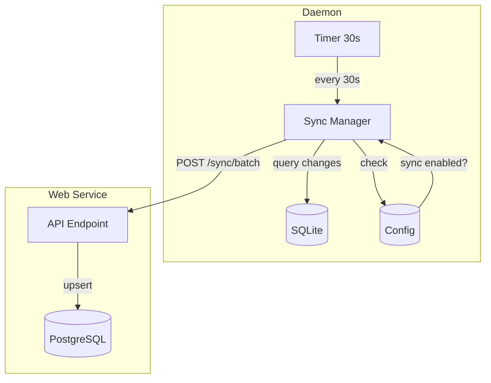

# Cloud Sync

The clankers daemon can automatically sync local SQLite data to a configured web service endpoint. **Sync is disabled by default** and only activates after you set an endpoint URL.

## Enabling Sync

Sync is enabled by configuring an endpoint:

```bash
# Enable sync by setting endpoint
clankers config set endpoint https://my-clankers-server.com

# Verify sync is enabled
clankers sync status
```

## Disabling Sync

Sync can be disabled via config or environment variable:

### Via Config

```bash
# Disable sync but keep endpoint
clankers config set sync_enabled false

# Remove endpoint (also disables sync)
clankers config unset endpoint
```

### Via Environment Variable

```bash
# Disable sync via env var (highest priority)
export CLANKERS_SYNC_ENABLED=false
clankers daemon
```

## Sync Mechanism

Sync uses **periodic polling** (not database triggers or RPC hooks):



### Polling Logic

1. Every 30 seconds, sync manager checks configuration
2. If sync enabled and endpoint configured:
   - Query records modified since last sync
   - Send batch to web service
   - Update last_sync timestamp on success
3. On failure, retry with exponential backoff

## Configuration

```bash
# Enable sync
clankers config set endpoint https://my-server.com

# Show status
clankers sync status
# Output:
# Profile: default
# Endpoint: https://my-server.com
# Sync: Enabled (last sync: never)
# Status: Ready
```

## Sync Status

```bash
$ clankers sync status
Profile: default
Endpoint: https://my-server.com
Sync: Enabled (last sync: 5 minutes ago)
Records pending: 3 sessions, 12 messages
Status: Synced
```

## Default Values

```go
// Default: sync is disabled
const DefaultSyncEnabled = false

// Default: no endpoint
const DefaultEndpoint = ""

// Polling interval
const DefaultSyncInterval = 30 * time.Second

// Batch size
const DefaultSyncBatchSize = 100
```

## Environment Variables

| Variable | Default | Description |
|----------|---------|-------------|
| `CLANKERS_SYNC_ENABLED` | `false` | **Master switch** - must be `true` to enable |
| `CLANKERS_ENDPOINT` | - | Sync endpoint URL |
| `CLANKERS_SYNC_INTERVAL` | `30` | Polling interval in seconds |
| `CLANKERS_SYNC_BATCH_SIZE` | `100` | Records per batch |

**Note:** Even if endpoint is configured, `CLANKERS_SYNC_ENABLED=false` will disable sync.

## Configuration File

```json
{
  "profiles": {
    "default": {
      "sync_enabled": true,
      "endpoint": "https://my-server.com",
      "auth": "none",
      "sync_interval": 30
    }
  },
  "active_profile": "default"
}
```

## Manual Sync Commands

When sync is enabled:

```bash
# Force immediate sync (skip polling interval)
clankers sync now

# View pending changes
clankers sync pending

# Reset sync state (full re-sync on next poll)
clankers sync reset
```

## Offline Behavior

When sync is enabled but endpoint unavailable:

1. **Queue locally**: Track changed records since last successful sync
2. **Retry with backoff**: Exponential backoff on failures (15s, 30s, 60s, 5min max)
3. **Resume on connection**: Sync all queued changes when endpoint returns
4. **No data loss**: Local database is always authoritative

## Data Privacy

- **Disabled by default**: No data leaves your machine unless you enable sync
- **User controls endpoint**: You choose where data is sent
- **Encryption in transit**: HTTPS/TLS recommended for endpoint
- **No local deletion**: Sync doesn't delete local data

## API Endpoints

### POST /sync/batch

Request:
```json
{
  "sessions": [...],
  "messages": [...],
  "sync_timestamp": "2026-01-29T14:30:00Z"
}
```

Response:
```json
{
  "sessions_synced": 23,
  "messages_synced": 156,
  "sync_timestamp": "2026-01-29T14:35:00Z"
}
```

**Phase 1**: No authentication headers required

Links: [auth](auth.md), [cli architecture](architecture.md), [web-service](../web-service/overview.md)
