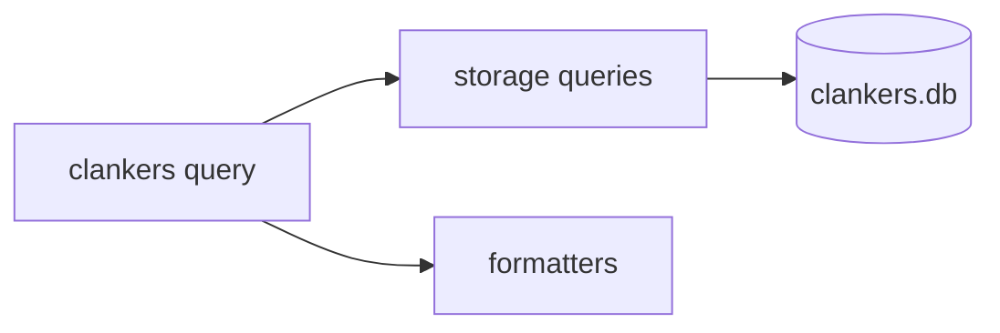

# Test Catalog for Clankers CLI

**Generated:** 2026-01-30  
**Updated:** 2026-01-30  
**Scope:** Phase 1 CLI Implementation + Phase 2 Query Command

## Implementation Status

✅ **Phase 1 Go Unit Tests Complete** - 25 tests implemented across config, paths, and storage packages.  
✅ **Nix Flake Check Integrated** - Run `nix flake check` to execute all Go unit tests.  
✅ **Phase 2 Query Tests Implemented** - Storage query + formatter tests added.

### Running Tests

```bash
# Run all Go unit tests (native)
cd packages/cli && go test ./internal/...

# Run as part of nix flake check
nix flake check

# Build/run specific check
nix build .#checks.x86_64-linux.go-tests
```

---

## Manual Tests Executed

The following tests were manually executed to validate the CLI implementation:

| ID | Test Description | Type | Automatable |
|----|-----------------|------|-------------|
| TC-001 | No subcommand shows error and help | Integration | ✅ Yes |
| TC-002 | Root `--help` displays all commands | Integration | ✅ Yes |
| TC-003 | Daemon `--help` shows all flags | Integration | ✅ Yes |
| TC-004 | `config set` stores values correctly | Integration | ✅ Yes |
| TC-005 | `config get` retrieves values correctly | Integration | ✅ Yes |
| TC-006 | `config list` displays human-readable format | Integration | ✅ Yes |
| TC-007 | `config list --format json` outputs valid JSON | Integration | ✅ Yes |
| TC-008 | `config profiles list/use` work correctly | Integration | ✅ Yes |
| TC-009 | Config changes persist across invocations | Integration | ✅ Yes |
| TC-010 | Daemon starts, listens, graceful shutdown | Integration | ✅ Yes |
| TC-011 | Daemon respects custom `--data-root` flag | Integration | ✅ Yes |
| TC-012 | Global `--config` flag is respected | Integration | ✅ Yes |

---

## Planned Manual Tests (Phase 2 Query Command)

| ID | Test Description | Type | Automatable |
|----|-----------------|------|-------------|
| TC-020 | `query` returns table output for basic SELECT | Integration | ✅ Yes |
| TC-021 | `query --format json` outputs valid JSON | Integration | ✅ Yes |
| TC-022 | `query` blocks INSERT/UPDATE/DELETE | Integration | ✅ Yes |
| TC-023 | `query` returns friendly column suggestions | Integration | ❌ No |
| TC-024 | `query` returns table list on missing table | Integration | ❌ No |
| TC-025 | `query` returns typo hints for bad SQL | Integration | ❌ No |

---

## Recommended Unit Tests (Go)

Unit tests in `packages/cli/internal/config/config_test.go`:

| Test Name | Description | Priority | Status |
|-----------|-------------|----------|--------|
| `TestDefaultConfig` | Verify DefaultConfig() returns expected values | High | ✅ Done |
| `TestDefaultProfile` | Verify DefaultProfile() returns expected values | Medium | ✅ Done |
| `TestLoadNonExistent` | Load() returns default config when file doesn't exist | High | ✅ Done |
| `TestLoadExisting` | Load() correctly parses existing config file | High | ✅ Done |
| `TestLoadCustomPath` | Load(customPath) uses custom path | High | ✅ Done |
| `TestSave` | Save() writes config to correct path | High | ✅ Done |
| `TestSaveCustomPath` | Save() uses stored custom path | High | ✅ Done |
| `TestGetProfileValue` | GetProfileValue returns correct values for all keys | Medium | ✅ Done |
| `TestSetProfileValue` | SetProfileValue updates values correctly | Medium | ✅ Done |
| `TestSetActiveProfile` | SetActiveProfile switches profiles | Medium | ✅ Done |
| `TestSetActiveProfileInvalid` | SetActiveProfile errors on non-existent profile | Medium | ✅ Done |
| `TestCreateProfile` | CreateProfile adds new profile | Low | ✅ Done |
| `TestDeleteProfile` | DeleteProfile removes profile (not default) | Low | ✅ Done |
| `TestApplyEnvOverrides` | Environment variables override config values | Medium | ✅ Done |
| `TestApplyEnvOverridesInvalidBool` | Invalid env bool doesn't change value | Medium | ✅ Done |

Unit tests in `packages/cli/internal/paths/paths_test.go`:

| Test Name | Description | Priority | Status |
|-----------|-------------|----------|--------|
| `TestGetDataRoot` | Returns correct path per OS | Medium | ✅ Done |
| `TestGetDbPath` | Respects CLANKERS_DB_PATH env var | Medium | ✅ Done |
| `TestGetConfigPath` | Returns correct config path | Medium | ✅ Done |
| `TestGetSocketPath` | Returns correct socket path per OS | Medium | ✅ Done |

Unit tests in `packages/cli/internal/storage/storage_test.go`:

| Test Name | Description | Priority | Status |
|-----------|-------------|----------|--------|
| `TestEnsureDb` | Creates DB if not exists | High | ✅ Done |
| `TestEnsureDbExists` | Returns false if DB already exists | Medium | ✅ Done |
| `TestOpen` | Opens database successfully | High | ✅ Done |
| `TestClose` | Closes database without error | Medium | ✅ Done |
| `TestStoreUpsertSession` | UpsertSession inserts/updates sessions | High | ✅ Done |
| `TestStoreUpsertMessage` | UpsertMessage inserts/updates messages | High | ✅ Done |
| `TestGetSessions` | Returns sessions with optional limit | High | ✅ Done |
| `TestGetSessionByID` | Returns session with messages or not found | High | ✅ Done |
| `TestGetMessages` | Returns messages for a session | Medium | ✅ Done |
| `TestExecuteQuery` | Runs SELECT and returns results | High | ✅ Done |
| `TestExecuteQueryBlocksWrites` | Blocks write keywords | High | ✅ Done |
| `TestGetTableSchema` | Returns PRAGMA table_info columns | Medium | ✅ Done |
| `TestSuggestColumnNames` | Suggests similar columns | Low | ✅ Done |

Unit tests in `packages/cli/internal/formatters/formatters_test.go`:

| Test Name | Description | Priority | Status |
|-----------|-------------|----------|--------|
| `TestTableFormatter` | Formats table output with truncation | High | ✅ Done |
| `TestTableFormatterEmpty` | Handles empty results cleanly | Medium | ✅ Done |
| `TestJSONFormatter` | Outputs pretty JSON | Medium | ✅ Done |
| `TestNewFormatter` | Errors on unknown format | High | ✅ Done |

---

## Recommended Integration Tests (Nix/NixOS)

Integration tests should be added as a Nix derivation that builds and tests the CLI:

| Test Name | Description | Priority |
|-----------|-------------|----------|
| `test-cli-help` | Verify `clankers --help` output | High |
| `test-cli-no-subcommand` | Verify error on no subcommand | High |
| `test-daemon-help` | Verify `clankers daemon --help` | Medium |
| `test-config-set-get` | Test config set/get roundtrip | High |
| `test-config-persistence` | Config survives process restart | High |
| `test-config-json-format` | JSON output is valid | Medium |
| `test-config-custom-path` | `--config` flag works | High |
| `test-profiles` | Profile switching works | Medium |
| `test-daemon-startup` | Daemon starts and accepts signals | High |
| `test-daemon-custom-data-root` | `--data-root` flag creates directory | Medium |
| `test-cross-platform` | Build works on Linux/macOS/Windows | Medium |

### Nix Test Structure

```nix
# packages/cli/tests/cli-integration.nix
{ pkgs, clankers }:

pkgs.runCommand "clankers-cli-integration" {}
  ''
    # Test 1: Help works
    ${clankers}/bin/clankers --help | grep -q "daemon"
    
    # Test 2: No subcommand = error
    ${clankers}/bin/clankers 2>&1 && exit 1 || true
    
    # Test 3: Config operations
    export CLANKERS_DATA_PATH=$(mktemp -d)
    ${clankers}/bin/clankers config set endpoint https://test.com
    ${clankers}/bin/clankers config get endpoint | grep -q "https://test.com"
    
    # Test 4: Custom config path
    ${clankers}/bin/clankers --config /tmp/test.json config set endpoint https://custom.com
    test -f /tmp/test.json
    
    touch $out
  ''
```

---

## Test Priority Matrix

| Component | Unit Tests | Integration Tests | Total |
|-----------|-----------|-------------------|-------|
| config | 15 | 5 | 20 |
| paths | 4 | 0 | 4 |
| storage | 13 | 0 | 13 |
| formatters | 4 | 0 | 4 |
| cli/commands | 0 | 18 | 18 |
| daemon | 0 | 3 | 3 |
| **Total** | **36** | **26** | **62** |

*Note: Added 3 bonus tests - `TestApplyEnvOverridesInvalidBool`, `TestStoreUpsertSession`, `TestStoreUpsertMessage`*

---

## Implementation Order

### Phase 1A: Critical Unit Tests (config package)
1. `TestLoadNonExistent`
2. `TestLoadExisting`
3. `TestSave`
4. `TestLoadCustomPath` / `TestSaveCustomPath`
5. `TestGetProfileValue` / `TestSetProfileValue`

### Phase 1B: CLI Integration Tests (Nix)
1. `test-cli-help`
2. `test-cli-no-subcommand`
3. `test-config-set-get`
4. `test-config-custom-path`
5. `test-daemon-startup`

### Phase 2: Query Command Tests ✅ Done (unit tests only)
- Storage query helpers (7 tests)
- Formatter package (4 tests)
- Query command manual test sweep (6 cases) ⏳ Pending

### Phase 3: Extended Integration Tests
- Cross-platform builds
- Full daemon lifecycle
- Profile management
- JSON format validation

---

## Notes

- Unit tests should use `t.TempDir()` for temporary files
- Integration tests should run in isolated environments (Nix sandbox)
- Config tests should not depend on actual `$HOME` or XDG paths
- Daemon tests need to handle process lifecycle properly

Diagram


---

## Related Files

- `packages/cli/internal/config/config.go` - Config logic
- `packages/cli/internal/paths/paths.go` - Path resolution
- `packages/cli/internal/storage/storage.go` - Database operations
- `packages/cli/internal/cli/*.go` - CLI commands

---

## Plugin Tests

### Claude Code Plugin Unit Tests

Unit tests in `apps/claude-code-plugin/tests/schemas.test.ts`:

| Test Name | Description | Priority | Status |
|-----------|-------------|----------|--------|
| `PreToolUseSchema - validates valid event` | Validates complete PreToolUse events | High | ✅ Done |
| `PreToolUseSchema - requires mandatory fields` | Ensures session_id, tool_name, tool_use_id required | High | ✅ Done |
| `PreToolUseSchema - permission_mode optional` | Verifies permission_mode is not required | Medium | ✅ Done |
| `PreToolUseSchema - validates hook_event_name` | Only accepts "PreToolUse" | High | ✅ Done |
| `PreToolUseSchema - handles various tools` | Works with Bash, Read, Write, Edit, etc. | Medium | ✅ Done |
| `PreToolUseSchema - handles MCP tools` | Supports mcp__* tool names | Medium | ✅ Done |
| `PostToolUseSchema - validates valid event` | Validates complete PostToolUse events | High | ✅ Done |
| `PostToolUseSchema - requires tool_response` | Ensures tool_response is required | High | ✅ Done |
| `PostToolUseSchema - handles complex responses` | Works with nested objects/arrays | Medium | ✅ Done |
| `PostToolUseFailureSchema - validates valid event` | Validates failure events | High | ✅ Done |
| `PostToolUseFailureSchema - requires error field` | Ensures error message is required | High | ✅ Done |
| `PostToolUseFailureSchema - is_interrupt optional` | Handles user interruption flag | Medium | ✅ Done |

### Recommended Integration Tests (Plugin-Level)

| Test Name | Description | Priority |
|-----------|-------------|----------|
| `test-pretooluse-hook` | PreToolUse stages tool in memory | High |
| `test-posttooluse-hook` | PostToolUse completes and upserts tool | High |
| `test-posttoolusefailure-hook` | PostToolUseFailure records errors | High |
| `test-tool-file-path-extraction` | File paths extracted from Read/Write/Edit | Medium |
| `test-tool-output-truncation` | Large outputs truncated at 10KB | Medium |
| `test-tool-id-generation` | Tool IDs use session_id + tool_use_id | High |
| `test-tool-linking-to-session` | Tools reference correct session | High |
| `test-async-hook-execution` | Hooks don't block Claude Code | Medium |

---

## Links

- [Test Results](../tmp/test-plan-cli-phase1-results.md)
- [Test Plan](../tmp/test-plan-cli-phase1.md)
- [CLI Architecture](./architecture.md)
- [Config System](./config-system.md)
