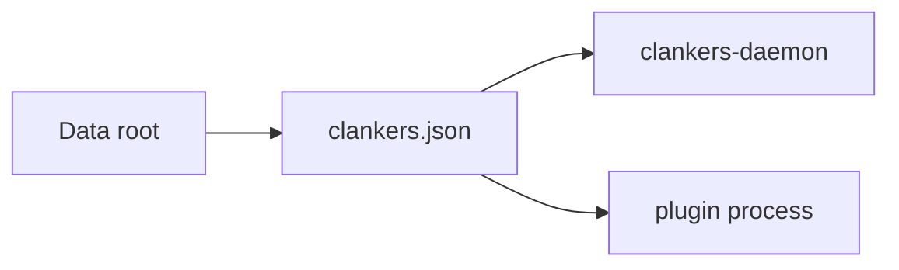

# Config Overview

Clankers uses a shared `clankers.json` file as the cross-component configuration
surface for plugins and the daemon. The file is located in the same data root
directory as `clankers.db` and is resolved using the same OS-specific path rules
described in [storage/paths](../storage/paths.md).

Invariants
- The config file name is `clankers.json`.
- The config lives under the Clankers data directory (`<data root>/clankers.json`).
- A `schemaVersion` field is required to support future migrations.
- The daemon and plugins must tolerate missing or empty config files.

Minimal schema (documented)
```json
{
  "$schema": "https://json-schema.org/draft/2020-12/schema",
  "title": "Clankers Config",
  "type": "object",
  "additionalProperties": false,
  "required": ["schemaVersion"],
  "properties": {
    "schemaVersion": { "type": "string", "const": "v1" },
    "daemon": { "type": "object", "additionalProperties": true },
    "plugin": { "type": "object", "additionalProperties": true }
  }
}
```

Example config
```json
{
  "schemaVersion": "v1",
  "daemon": {},
  "plugin": {}
}
```

Links: [storage/paths](../storage/paths.md), [daemon](../daemon/architecture.md), [summary](../summary.md)

Diagram

