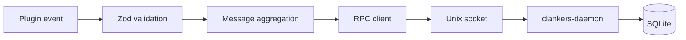

# Daemon architecture

The clankers-daemon is a Go binary that owns all SQLite operations. It uses `modernc.org/sqlite` (pure Go, no CGO) for database access. Plugins communicate with it over JSON-RPC 2.0 via a Unix socket (or named pipe on Windows).

Invariants
- The daemon resolves paths using the same rules as the JS implementation (see `storage/paths.md`).
- The daemon creates the database and runs migrations on startup via `ensureDb`.
- Plugins validate payloads with Zod, aggregate message parts, then call the daemon over RPC.
- All SQLite writes go through the daemon.
- The daemon enables WAL mode and foreign key enforcement on every database open.

Socket location
- Linux/macOS: `$CLANKERS_DATA_PATH/clankers/dxta-clankers.sock` or `~/.local/share/clankers/dxta-clankers.sock`
- Windows: `\\.\pipe\dxta-clankers`
- Override via `CLANKERS_SOCKET_PATH`

RPC methods
- `health` -> `{ ok: boolean, version: string }`
- `ensureDb` -> `{ dbPath: string, created: boolean }`
- `getDbPath` -> `{ dbPath: string }`
- `upsertSession` -> `{ ok: boolean }`
- `upsertMessage` -> `{ ok: boolean }`

Request envelope
```json
{
  "schemaVersion": "v1",
  "client": { "name": "opencode-plugin", "version": "0.1.0" },
  "session": { ... }
}
```

Links: [summary](../summary.md), [sqlite](../storage/sqlite.md), [paths](../storage/paths.md), [plugins](../opencode/plugins.md)

Example
```ts
import { createRpcClient } from "@dxta-dev/clankers-core";

const rpc = createRpcClient({ clientName: "opencode-plugin", clientVersion: "0.1.0" });
await rpc.upsertSession({ id: "session-123", title: "My Session" });
```

Diagram

