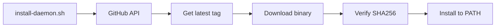

# Daemon Installation

The `clankers-daemon` binary can be installed via shell scripts or Nix.

## Shell Scripts

Scripts download pre-built binaries from GitHub Releases, verify checksums, and
install to a user-local directory.

### Linux/macOS

```bash
curl -fsSL https://raw.githubusercontent.com/dxta-dev/clankers/main/scripts/install-daemon.sh | sh
```

### Windows (PowerShell)

```powershell
irm https://raw.githubusercontent.com/dxta-dev/clankers/main/scripts/install-daemon.ps1 | iex
```

## Environment Variables

| Variable | Description | Default |
|----------|-------------|---------|
| `CLANKERS_VERSION` | Version to install | latest |
| `CLANKERS_INSTALL_DIR` | Override install location | `~/.local/bin` (Unix), `%LOCALAPPDATA%\clankers\bin` (Windows) |
| `GITHUB_TOKEN` | Optional, for higher API rate limits | - |

## Version Selection

```bash
# Via argument (sh only)
curl -fsSL ... | sh -s -- v0.1.0

# Via environment variable (both sh and PowerShell)
CLANKERS_VERSION=v0.1.0 curl -fsSL ... | sh
$env:CLANKERS_VERSION = "v0.1.0"; irm ... | iex
```

## Install Locations

| Platform | Default Path |
|----------|--------------|
| Linux | `~/.local/bin/clankers-daemon` |
| macOS | `~/.local/bin/clankers-daemon` |
| Windows | `%LOCALAPPDATA%\clankers\bin\clankers-daemon.exe` |

If `~/.local/bin` doesn't exist, falls back to `~/bin`.

## Nix Installation

For Nix users, install directly from the flake:

```bash
# Ad-hoc run
nix run github:dxta-dev/clankers#clankers-daemon

# Profile install
nix profile install github:dxta-dev/clankers#clankers-daemon

# In flake.nix inputs
{
  inputs.clankers.url = "github:dxta-dev/clankers";
}
```

## Script Behavior

1. Detect OS and architecture
2. Fetch latest version from GitHub API (unless `CLANKERS_VERSION` is set)
3. Download binary and checksums from GitHub Releases
4. Verify SHA256 checksum
5. Install to target directory
6. Print PATH hint if directory not in PATH

## Supported Platforms

| OS | Architecture | Binary |
|----|--------------|--------|
| Linux | x86_64 | `linux-amd64-clankers-daemon` |
| Linux | ARM64 | `linux-arm64-clankers-daemon` |
| macOS | x86_64 | `darwin-amd64-clankers-daemon` |
| macOS | ARM64 | `darwin-arm64-clankers-daemon` |
| Windows | x86_64 | `windows-amd64-clankers-daemon.exe` |

Links: [architecture](architecture.md), [daemon-release](../release/daemon-release.md), [npm-packaging](../plans/npm-packaging.md)

Diagram

