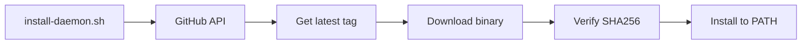

# Daemon Installation

The `clankers-daemon` binary can be installed via shell scripts or Nix.

## Shell Scripts

Scripts download pre-built binaries from GitHub Releases, verify checksums, and
install to a user-local directory.

### Linux/macOS

```bash
curl -fsSL https://raw.githubusercontent.com/dxta-dev/clankers/main/scripts/install-daemon.sh | sh
```

### Windows (PowerShell)

```powershell
irm https://raw.githubusercontent.com/dxta-dev/clankers/main/scripts/install-daemon.ps1 | iex
```

## Environment Variables

| Variable | Description | Default |
|----------|-------------|---------|
| `CLANKERS_VERSION` | Version to install | latest |
| `CLANKERS_INSTALL_DIR` | Override install location | `~/.local/bin` (Unix), `%LOCALAPPDATA%\clankers\bin` (Windows) |
| `GITHUB_TOKEN` | Optional, for higher API rate limits | - |

## Version Selection

```bash
# Via argument (sh only)
curl -fsSL ... | sh -s -- v0.1.0

# Via environment variable (both sh and PowerShell)
CLANKERS_VERSION=v0.1.0 curl -fsSL ... | sh
$env:CLANKERS_VERSION = "v0.1.0"; irm ... | iex
```

## Install Locations

| Platform | Default Path |
|----------|--------------|
| Linux | `~/.local/bin/clankers-daemon` |
| macOS | `~/.local/bin/clankers-daemon` |
| Windows | `%LOCALAPPDATA%\clankers\bin\clankers-daemon.exe` |

If `~/.local/bin` doesn't exist, falls back to `~/bin`.

## Nix Installation

For Nix/NixOS users, several installation methods are available.

### Ad-hoc Usage

```bash
# Run directly without installing
nix run github:dxta-dev/clankers#clankers-daemon

# Install to profile
nix profile install github:dxta-dev/clankers#clankers-daemon
```

### Flake Input with Overlay

Add to your `flake.nix` to make `clankers-daemon` available in `pkgs`:

```nix
{
  inputs = {
    nixpkgs.url = "github:NixOS/nixpkgs/nixos-unstable";
    clankers.url = "github:dxta-dev/clankers";
  };

  outputs = { self, nixpkgs, clankers }: {
    nixosConfigurations.myhost = nixpkgs.lib.nixosSystem {
      system = "x86_64-linux";
      modules = [
        # Apply the overlay to add clankers packages to nixpkgs
        ({ pkgs, ... }: {
          nixpkgs.overlays = [ clankers.overlays.default ];
        })

        # Use the NixOS module for service management
        clankers.nixosModules.default

        # Your configuration
        ({ config, pkgs, ... }: {
          # Now pkgs.clankers-daemon is available
          environment.systemPackages = [ pkgs.clankers-daemon ];

          # Or enable the systemd service
          services.clankers-daemon.enable = true;
        })
      ];
    };
  };
}
```

### Local Development (from this repo)

When working in the clankers repository:

```bash
# Enter dev shell with all dependencies
nix develop

# Build and run the daemon
nix run .#clankers-daemon

# Install locally
nix profile install .#clankers-daemon
```

### NixOS Module Options

When using `clankers.nixosModules.default`, the following options are available:

| Option | Type | Default | Description |
|--------|------|---------|-------------|
| `services.clankers-daemon.enable` | bool | `false` | Enable the daemon service |
| `services.clankers-daemon.package` | package | `pkgs.clankers-daemon` | Package to use |
| `services.clankers-daemon.dataRoot` | str | `"%S/clankers"` | Data directory (`%S` = `/var/lib`) |
| `services.clankers-daemon.dbPath` | str/null | `null` | Explicit DB path (optional) |
| `services.clankers-daemon.socketPath` | str/null | `null` | Explicit socket path (optional) |
| `services.clankers-daemon.logLevel` | enum | `"info"` | Log level: debug, info, warn, error |
| `services.clankers-daemon.user` | str | `"clankers"` | Service user |
| `services.clankers-daemon.group` | str | `"clankers"` | Service group |

### NixOS Configuration Example

```nix
{ config, pkgs, ... }: {
  # Enable the daemon as a systemd service
  services.clankers-daemon = {
    enable = true;
    logLevel = "debug";
    dataRoot = "/var/lib/clankers";
  };

  # Also make it available in user PATH
  environment.systemPackages = [ pkgs.clankers-daemon ];
}
```

## Development Environment

For local development, the flake provides several ways to auto-start the daemon.

### Dev Shell with Auto-Start (Simplest)

Use the `with-daemon` shell which automatically starts the daemon when you enter and stops it when you exit:

```bash
# From the clankers repo
nix develop .#with-daemon

# Daemon starts automatically with debug logging
# Data stored in ./.clankers-dev/
# Daemon stops automatically when you exit the shell
```

### Dev Shell (Manual Control)

Use the default shell for manual control:

```bash
nix develop

# Shell shows daemon status
# Start manually: clankers-daemon &
# Or with options: clankers-daemon --log-level=debug &
```

Environment variables are pre-configured:
- `CLANKERS_DATA_PATH=./.clankers-dev`
- `CLANKERS_SOCKET_PATH=./.clankers-dev/dxta-clankers.sock`
- `CLANKERS_DB_PATH=./.clankers-dev/clankers.db`

### Local Path Flake (For Active Development)

When actively changing daemon code, use the local flake directly:

```nix
{
  inputs.clankers.url = "path:/home/davidabram/repos/dxta-clankers";
  # ...
}
```

Any changes to the daemon source will be reflected on next `nix run` or `home-manager switch`.

## Script Behavior

1. Detect OS and architecture
2. Fetch latest version from GitHub API (unless `CLANKERS_VERSION` is set)
3. Download binary and checksums from GitHub Releases
4. Verify SHA256 checksum
5. Install to target directory
6. Print PATH hint if directory not in PATH

## Supported Platforms

| OS | Architecture | Binary |
|----|--------------|--------|
| Linux | x86_64 | `linux-amd64-clankers-daemon` |
| Linux | ARM64 | `linux-arm64-clankers-daemon` |
| macOS | x86_64 | `darwin-amd64-clankers-daemon` |
| macOS | ARM64 | `darwin-arm64-clankers-daemon` |
| Windows | x86_64 | `windows-amd64-clankers-daemon.exe` |

Links: [architecture](architecture.md), [daemon-release](../release/daemon-release.md), [npm-packaging](../plans/npm-packaging.md)

Diagram

