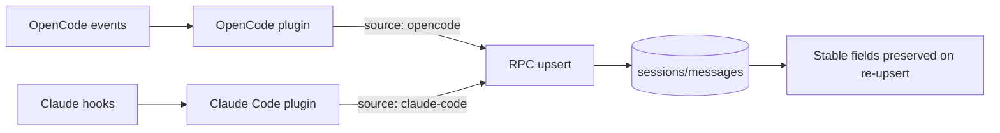

# Data gaps and edge cases

Clankers stores sessions and messages from OpenCode and Claude Code, but each source emits different fields and timings. As a result, some columns are intentionally nullable or defaulted, and later upserts can overwrite earlier values.

Invariants
- The daemon upserts preserve stable fields (`title`, `model`, `provider`, `source` for sessions; `text_content`, `source` for messages) when the incoming value is empty.
- `created_at` is immutable after first write; subsequent upserts do not overwrite it.
- Session defaults applied by the daemon: `title = "Untitled Session"`, `prompt_tokens = 0`, `completion_tokens = 0`, `cost = 0` when missing.
- Message defaults applied by the daemon: `prompt_tokens = 0`, `completion_tokens = 0` when missing.
- `source` column identifies the originating client: `"opencode"` or `"claude-code"`.

## Data availability by source

Sessions

| Field | OpenCode events | Claude Code hooks |
| --- | --- | --- |
| `title` | From `session.title` (defaults to "Untitled Session") | Seeded as "Untitled Session" on `SessionStart` then replaced by the first user prompt; carried forward on `SessionEnd` |
| `project_path` | `session.path.cwd` or `session.cwd` or `session.directory` | `SessionStart.cwd`, `SessionEnd.cwd` |
| `project_name` | Derived from `project_path` | Derived from `cwd` |
| `model` | `session.modelID` or `session.model.modelID` | `SessionStart.model`; carried forward on `SessionEnd` |
| `provider` | `session.providerID` or `session.model.providerID` | Hard-coded to `"anthropic"` |
| `prompt_tokens` | `session.tokens.input` or `session.usage.promptTokens` | Accumulated from `Stop` events or `SessionEnd.totalTokenUsage` |
| `completion_tokens` | `session.tokens.output` or `session.usage.completionTokens` | Accumulated from `Stop` events or `SessionEnd.totalTokenUsage` |
| `cost` | `session.cost` or `session.usage.cost` | `SessionEnd.costEstimate` |
| `created_at` | `session.time.created` | Set at `SessionStart` using local timestamp |
| `updated_at` | `session.time.updated` | `SessionEnd` uses `Date.now()` |

Messages

| Field | OpenCode events | Claude Code hooks |
| --- | --- | --- |
| `id` | `message.id` from event payload | Generated as `${sessionId}-${role}-${Date.now()}` |
| `session_id` | `message.sessionID` | `event.session_id` |
| `role` | Payload role or inferred from text | Fixed `user` or `assistant` |
| `text_content` | Aggregated from `message.part.updated` text parts | User: `UserPromptSubmit.prompt`; Assistant: parsed from transcript |
| `model` | `message.modelID` | Parsed from transcript `message.model` |
| `prompt_tokens` | `message.tokens.input` | Parsed from transcript `message.usage.input_tokens` + cache tokens |
| `completion_tokens` | `message.tokens.output` | Parsed from transcript `message.usage.output_tokens` |
| `duration_ms` | `message.time.completed - message.time.created` | Calculated from user→assistant timestamps in transcript |
| `created_at` | `message.time.created` | User: `Date.now()`; Assistant: user message timestamp from transcript |
| `completed_at` | `message.time.completed` | Assistant: `Date.now()`; User: not set |

## Edge cases and missing data

- ~~**No source attribution**: The DB schema has no `source`/`harness` column.~~ **RESOLVED**: `source` column added; plugins send `"opencode"` or `"claude-code"`.
- ~~**Partial upserts overwrite prior fields**: Later upserts replace all columns.~~ **RESOLVED**: Stable fields (`title`, `model`, `provider`, `source`, `created_at`) are preserved when the incoming value is empty.
- **OpenCode message aggregation requires both metadata and text parts**: If either `message.updated` or `message.part.updated` is missing, or the text part is empty/whitespace, the message is dropped.
- **OpenCode stores only text parts**: Non-text parts are ignored; if the client sends incremental text deltas, only the latest staged text is kept.
- **Claude metadata comes from transcript parsing**: The Stop hook event does NOT include model/tokens/duration fields. The plugin reads the transcript JSONL file to extract this data. If transcript parsing fails, these fields default to NULL/0.
- **Claude assistant content may be empty**: If transcript parsing fails or the assistant message has no text blocks, the response is stored as empty string.
- **Claude stop hook recursion**: `stop_hook_active` events are ignored, so assistant messages can be skipped if the hook re-enters.
- ~~**Generated message IDs can collide**: IDs use `Date.now()`.~~ **RESOLVED**: Claude Code plugin now uses monotonic counter (`${sessionId}-${role}-${count}`).
- **Claude token counts include cache tokens**: `prompt_tokens` is calculated as `input_tokens + cache_creation_input_tokens + cache_read_input_tokens` to reflect total input token usage.
- ~~**Tool usage not tracked**: No visibility into what tools AI uses.~~ **RESOLVED**: `tools` table added; OpenCode plugin captures `tool.execute.before/after` events; staging utilities handle before/after lifecycle.
- **Claude Code tool tracking not implemented**: PreToolUse/PostToolUse hooks need to be added to capture tool usage from Claude Code.

Links: [schemas](schemas.md), [sqlite](../storage/sqlite.md), [opencode event handling](../opencode/event-handling.md), [claude plugin system](../claude/plugin-system.md), [claude data mapping](../claude/data-mapping.md)

Example
```ts
// Claude Code: SessionEnd carries title/model/createdAt from session state
await rpc.upsertSession({
	id: sessionId,
	projectPath: data.cwd,
	projectName: getProjectName(data.cwd),
	provider: "anthropic",
	source: "claude-code",
	title: currentState.title,
	model: currentState.model,
	createdAt: currentState.createdAt,
	promptTokens: totalTokenUsage.input ?? currentState.promptTokens,
	completionTokens: totalTokenUsage.output ?? currentState.completionTokens,
	cost: resolvedCost,
	updatedAt: Date.now(),
});
```

Diagram

