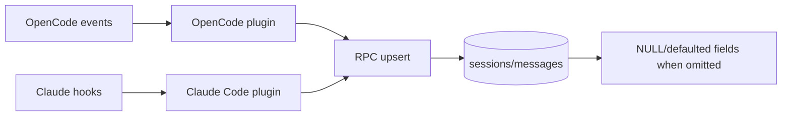

# Data gaps and edge cases

Clankers stores sessions and messages from OpenCode and Claude Code, but each source emits different fields and timings. As a result, some columns are intentionally nullable or defaulted, and later upserts can overwrite earlier values.

Invariants
- The daemon upserts overwrite all session/message columns with the incoming payload.
- Session defaults applied by the daemon: `title = "Untitled Session"`, `prompt_tokens = 0`, `completion_tokens = 0`, `cost = 0` when missing.
- Message defaults applied by the daemon: `prompt_tokens = 0`, `completion_tokens = 0` when missing.
- Source/harness is not stored in the schema; only `model`/`provider` hint at origin.

## Data availability by source

Sessions

| Field | OpenCode events | Claude Code hooks |
| --- | --- | --- |
| `title` | From `session.title` (defaults to "Untitled Session") | Set on `SessionStart`; omitted on `SessionEnd` so later upsert can overwrite with NULL/default |
| `project_path` | `session.path.cwd` or `session.cwd` or `session.directory` | `SessionStart.cwd`, `SessionEnd.cwd` |
| `project_name` | Derived from `project_path` | Derived from `cwd` |
| `model` | `session.modelID` or `session.model.modelID` | `SessionStart.model`; omitted on `SessionEnd` so later upsert can clear it |
| `provider` | `session.providerID` or `session.model.providerID` | Hard-coded to `"anthropic"` |
| `prompt_tokens` | `session.tokens.input` or `session.usage.promptTokens` | Accumulated from `Stop` events or `SessionEnd.totalTokenUsage` |
| `completion_tokens` | `session.tokens.output` or `session.usage.completionTokens` | Accumulated from `Stop` events or `SessionEnd.totalTokenUsage` |
| `cost` | `session.cost` or `session.usage.cost` | `SessionEnd.costEstimate` |
| `created_at` | `session.time.created` | Not set (NULL) |
| `updated_at` | `session.time.updated` | `SessionEnd` uses `Date.now()` |

Messages

| Field | OpenCode events | Claude Code hooks |
| --- | --- | --- |
| `id` | `message.id` from event payload | Generated as `${sessionId}-${role}-${Date.now()}` |
| `session_id` | `message.sessionID` | `event.session_id` |
| `role` | Payload role or inferred from text | Fixed `user` or `assistant` |
| `text_content` | Aggregated from `message.part.updated` text parts | `UserPromptSubmit.prompt` or `Stop.response || ""` |
| `model` | `message.modelID` | `Stop.model` (only if present in hook payload) |
| `prompt_tokens` | `message.tokens.input` | `Stop.tokenUsage.input` (only if present) |
| `completion_tokens` | `message.tokens.output` | `Stop.tokenUsage.output` (only if present) |
| `duration_ms` | `message.time.completed - message.time.created` | `Stop.durationMs` (only if present) |
| `created_at` | `message.time.created` | User: `Date.now()`; Assistant: not set |
| `completed_at` | `message.time.completed` | Assistant: `Date.now()`; User: not set |

## Edge cases and missing data

- **No source attribution**: The DB schema has no `source`/`harness` column. `provider`/`model` can hint at origin but are not reliable across clients.
- **Partial upserts overwrite prior fields**: Later upserts replace all columns. Any omitted fields become NULL or defaulted (0/"Untitled Session") in the stored row. This is why Claude `SessionEnd` can wipe title/model created during `SessionStart`.
- **OpenCode message aggregation requires both metadata and text parts**: If either `message.updated` or `message.part.updated` is missing, or the text part is empty/whitespace, the message is dropped.
- **OpenCode stores only text parts**: Non-text parts are ignored; if the client sends incremental text deltas, only the latest staged text is kept.
- **Claude assistant timestamps are incomplete**: `Stop` writes `completed_at` but not `created_at`, so assistant messages can have NULL `created_at`.
- **Claude token/model fields depend on payload shape**: The plugin reads camelCase fields (`tokenUsage`, `durationMs`, `model`). If Claude emits snake_case or different keys, these fields will remain NULL/0 unless mapped.
- **Claude assistant content may be empty**: `Stop.response` is optional; empty responses are stored as empty strings.
- **Claude stop hook recursion**: `stop_hook_active` events are ignored, so assistant messages can be skipped if the hook re-enters.
- **Generated message IDs can collide**: IDs use `Date.now()`; multiple messages in the same millisecond for the same session+role can collide and be dropped as duplicates.

Links: [schemas](schemas.md), [sqlite](../storage/sqlite.md), [opencode event handling](../opencode/event-handling.md), [claude plugin system](../claude/plugin-system.md), [claude data mapping](../claude/data-mapping.md)

Example
```ts
// Claude Code: SessionEnd omits title/model/createdAt
await rpc.upsertSession({
	id: sessionId,
	projectPath: data.cwd,
	projectName: getProjectName(data.cwd),
	provider: "anthropic",
	promptTokens: data.totalTokenUsage?.input,
	completionTokens: data.totalTokenUsage?.output,
	cost: data.costEstimate,
	updatedAt: Date.now(),
});
```

Diagram

