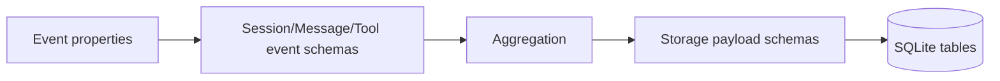

# Schemas

Zod schemas normalize event payloads and enforce the storage payload contract. Event schemas are permissive with `.loose()` to avoid dropping unknown fields, while storage payload schemas define the exact fields written to SQLite.

Invariants
- Event schemas accept optional fields and pass through unknown keys.
- Storage payloads require `id` and session/message linkage fields.
- `MessagePayloadSchema.role` and `MessagePayloadSchema.textContent` must be present before writing.
- `ToolPayloadSchema.toolName` and `ToolPayloadSchema.sessionId` must be present before writing.
- OpenCode session events may use `sessionID` or `id`; plugins must accept both and normalize to a single session id.
- OpenCode uses `messageID` (not `id`) for message identifiers in message-related events.
- OpenCode session data is delivered under `event.properties.info` for session events.
- OpenCode tool events use `tool.execute.before` and `tool.execute.after` events.
- `source` field identifies the originating client: `"opencode"` or `"claude-code"`. Plugins must always include this field in session/message upsert payloads.

Links: [summary](../summary.md), [practices](../practices.md), [sqlite](../storage/sqlite.md)

Example
```ts
const payload = MessagePayloadSchema.safeParse({
  id: "msg-1",
  sessionId: "sess-1",
  role: "assistant",
  textContent: "Here is the update",
  source: "opencode",
});

if (payload.success) {
  store.upsertMessage(payload.data);
}
```

Tool tracking example
```ts
const toolPayload = ToolPayloadSchema.safeParse({
  id: "tool-1",
  sessionId: "sess-1",
  toolName: "Read",
  toolInput: '{"file_path": "/tmp/test.txt"}',
  success: true,
  createdAt: Date.now(),
});

if (toolPayload.success) {
  store.upsertTool(toolPayload.data);
}
```

Diagram

