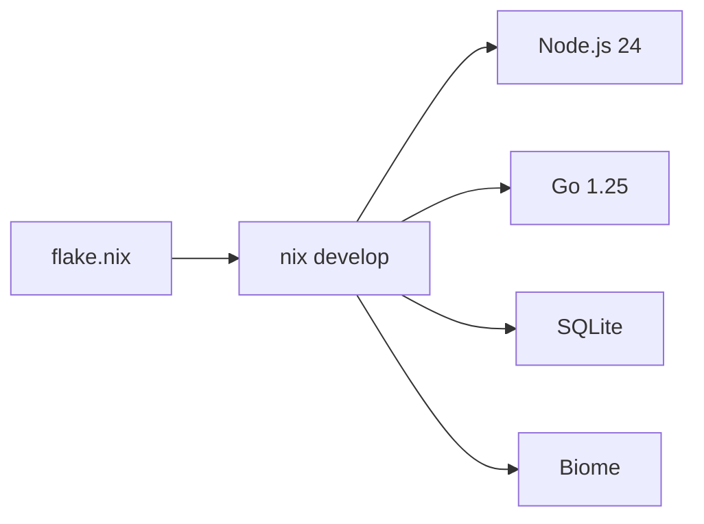

# Dev Environment

Nix flake provides a reproducible dev shell with all required tooling.

## Entry

```bash
nix develop          # enter shell
direnv allow         # or use direnv with .envrc
```

## Included Tools

| Tool       | Purpose                        |
|------------|--------------------------------|
| Node.js 24 | TypeScript runtime             |
| pnpm       | Workspace package manager      |
| Go         | clankers-daemon compilation    |
| SQLite     | Local database CLI             |
| Biome      | Formatting and linting         |
| TypeScript | Type checking and LSP          |

## Platform Support

The flake supports:
- x86_64-linux
- aarch64-linux
- x86_64-darwin
- aarch64-darwin

## Shell Hook

On entry, the shell displays versions of Node, pnpm, and Go.

Links: [summary](summary.md), [daemon](daemon/architecture.md)

Example
```bash
$ nix develop
Clankers dev shell loaded
  Node: v24.12.0
  pnpm: 10.28.0
  Go:   go1.25.5
```

Diagram

