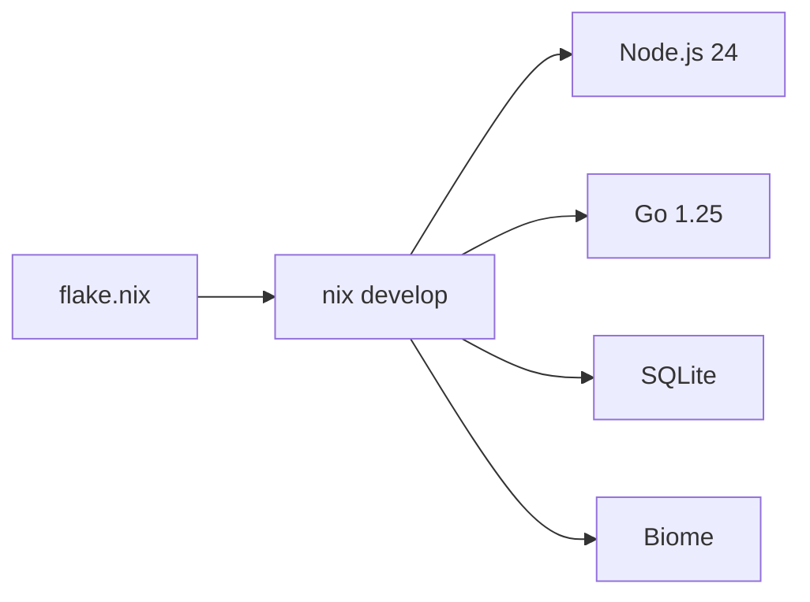

# Dev Environment

Nix flake provides a reproducible dev shell with all required tooling.

## Entry

```bash
nix develop          # enter shell
direnv allow         # or use direnv with .envrc
```

## Included Tools

| Tool       | Purpose                        |
|------------|--------------------------------|
| Node.js 24 | TypeScript runtime             |
| pnpm       | Workspace package manager      |
| Go         | clankers-daemon compilation    |
| SQLite     | Local database CLI             |
| Biome      | Formatting and linting         |
| TypeScript | Type checking and LSP          |

## Platform Support

The flake supports:
- x86_64-linux
- aarch64-linux
- x86_64-darwin
- aarch64-darwin

## Shell Hook

On entry, the shell displays versions of Node, pnpm, and Go.

## Installing the Daemon (End Users)

For users without Nix, standalone install scripts download the daemon from GitHub Releases:

```bash
# Linux/macOS - pipe from curl
curl -fsSL https://raw.githubusercontent.com/dxta-dev/clankers/main/scripts/install-daemon.sh | sh

# Specific version
curl -fsSL ... | sh -s -- v0.1.0

# With env vars
curl -fsSL ... | CLANKERS_INSTALL_DIR=/usr/local/bin sh

# Windows (PowerShell)
irm https://raw.githubusercontent.com/dxta-dev/clankers/main/scripts/install-daemon.ps1 | iex
```

Environment variables:
- `CLANKERS_VERSION` - Version to install (default: latest)
- `CLANKERS_INSTALL_DIR` - Override install location
- `GITHUB_TOKEN` - Optional, for higher API rate limits

Default install locations:
- Linux/macOS: `~/.local/bin` or `~/bin`
- Windows: `%LOCALAPPDATA%\clankers\bin`

Links: [summary](summary.md), [daemon](daemon/architecture.md), [daemon-release](release/daemon-release.md)

Example
```bash
$ nix develop
Clankers dev shell loaded
  Node: v24.12.0
  pnpm: 10.28.0
  Go:   go1.25.5
```

Diagram

