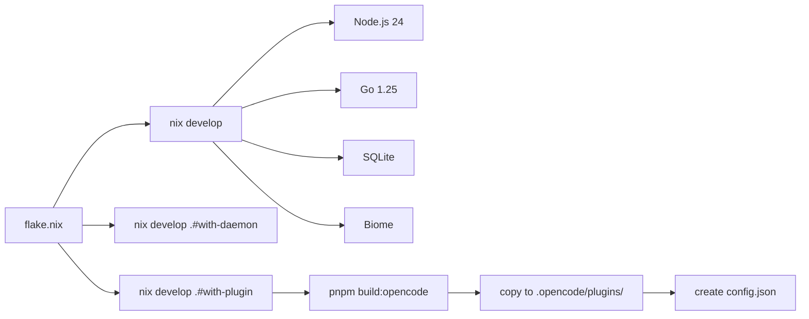

# Dev Environment

Nix flake provides a reproducible dev shell with all required tooling.

## Entry

```bash
nix develop                    # enter shell (manual daemon)
nix develop .#with-daemon      # enter shell with auto-started daemon
nix develop .#with-plugin      # enter shell with plugin built and ready
 direnv allow                   # or use direnv with .envrc
```

## Dev Shell Variants

| Shell | Description |
|-------|-------------|
| `default` | Manual daemon control |
| `with-daemon` | Auto-starts daemon on shell entry |
| `with-plugin` | Builds plugin, copies to `.opencode/plugins/`, creates config |

### with-plugin (Recommended for OpenCode Development)

The `with-plugin` shell automates the Method 2 setup (project-level plugin development):

```bash
nix develop .#with-plugin
```

On entry, it automatically:
1. Creates `.opencode/plugins/` directory
2. Builds the OpenCode plugin (`pnpm build:opencode`)
3. Copies the built plugin to `.opencode/plugins/clankers.js`
4. Creates `.opencode/config.json` if it doesn't exist
5. Sets up environment variables for the daemon

After entering, restart OpenCode in this directory to load the local plugin.

**Requirements:** Run `pnpm install` first if dependencies aren't installed.

## Path Configuration (Nix Shell)

**Important:** Dev shells use `$PWD` in `shellHook` to set paths. Do NOT use `${builtins.toString ./.}` as it resolves to the Nix store when the git tree is dirty, causing read-only filesystem errors.

```nix
# Correct - uses shellHook with $PWD
shellHook = ''
  export CLANKERS_DATA_PATH="$PWD/.clankers-dev"
  export CLANKERS_SOCKET_PATH="$PWD/.clankers-dev/dxta-clankers.sock"
  export CLANKERS_DB_PATH="$PWD/.clankers-dev/clankers.db"
'';

# Wrong - resolves to /nix/store/... when dirty
CLANKERS_DATA_PATH = "${builtins.toString ./.}/.clankers-dev";
```

The shell exports these environment variables:
- `CLANKERS_DATA_PATH` - Data directory (default: `$PWD/.clankers-dev`)
- `CLANKERS_SOCKET_PATH` - Unix socket path
- `CLANKERS_DB_PATH` - SQLite database path

## Included Tools

| Tool       | Purpose                        |
|------------|--------------------------------|
| Node.js 24 | TypeScript runtime             |
| pnpm       | Workspace package manager      |
| Go         | clankers-daemon compilation    |
| SQLite     | Local database CLI             |
| Biome      | Formatting and linting         |
| TypeScript | Type checking and LSP          |

## Platform Support

The flake supports:
- x86_64-linux
- aarch64-linux
- x86_64-darwin
- aarch64-darwin

## Shell Hook

On entry, the shell displays versions of Node, pnpm, and Go.

## Installing the Daemon (End Users)

For users without Nix, standalone install scripts download the daemon from GitHub Releases:

```bash
# Linux/macOS - pipe from curl
curl -fsSL https://raw.githubusercontent.com/dxta-dev/clankers/main/scripts/install-daemon.sh | sh

# Specific version
curl -fsSL ... | sh -s -- v0.1.0

# With env vars
curl -fsSL ... | CLANKERS_INSTALL_DIR=/usr/local/bin sh

# Windows (PowerShell)
irm https://raw.githubusercontent.com/dxta-dev/clankers/main/scripts/install-daemon.ps1 | iex
```

Environment variables:
- `CLANKERS_VERSION` - Version to install (default: latest)
- `CLANKERS_INSTALL_DIR` - Override install location
- `GITHUB_TOKEN` - Optional, for higher API rate limits

Default install locations:
- Linux/macOS: `~/.local/bin` or `~/bin`
- Windows: `%LOCALAPPDATA%\clankers\bin`

Links: [summary](summary.md), [daemon](daemon/architecture.md), [daemon-release](release/daemon-release.md)

Example
```bash
$ nix develop
Clankers dev shell loaded
  Node: v24.12.0
  pnpm: 10.28.0
  Go:   go1.25.5
```

Diagram

