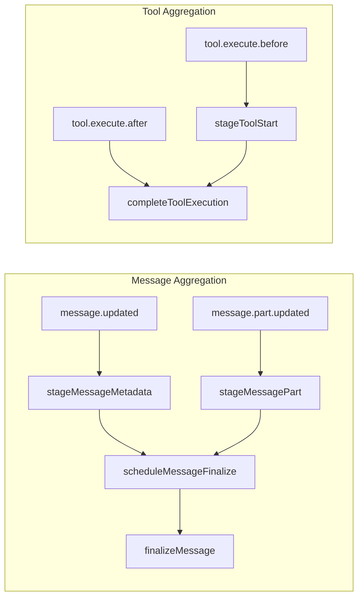

# Message and tool aggregation

Message metadata and message parts arrive separately, so the plugin stages them in memory and debounces writes. Finalization occurs once both metadata and text parts are present; it infers role if unknown and writes the completed payload downstream.

Tool executions also have a before/after lifecycle: `tool.execute.before` provides the input, and `tool.execute.after` provides the output and success status. The plugin stages tool starts and completes them when the after event arrives.

Invariants
- Only `text` parts are aggregated into `textContent`.
- A message is written once; `syncedMessages` guards against duplicates.
- Debounce window is `800ms` per message ID.
- Tools are staged on `tool.execute.before` and completed on `tool.execute.after`.
- Tool outputs are truncated at 10KB to prevent DB bloat.
- Stale tools (older than 5 minutes) are cleaned up automatically.
- File paths are extracted from tool input for file operations (Read, Write, Edit).

Links: [summary](../summary.md), [schemas](../data-model/schemas.md), [sqlite](../storage/sqlite.md)

Example - Message aggregation
```ts
stageMessageMetadata({ id: "msg-1", sessionID: "sess-1", role: "unknown" });
stageMessagePart({ type: "text", messageID: "msg-1", sessionID: "sess-1", text: "Hello" });

scheduleMessageFinalize("msg-1", ({ textContent }) => {
  console.log(textContent);
});
```

Example - Tool aggregation
```ts
// On tool.execute.before
stageToolStart("tool-1", {
  sessionId: "sess-1",
  toolName: "Read",
  toolInput: '{"file_path": "/tmp/test.txt"}',
  createdAt: Date.now(),
});

// On tool.execute.after
const tool = completeToolExecution("tool-1", {
  toolOutput: '{"content": "file contents"}',
  success: true,
  durationMs: 150,
});

if (tool) {
  await rpc.upsertTool(tool);
}
```

Diagram

