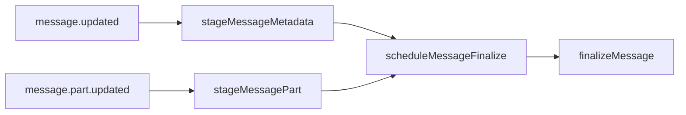

# Message aggregation

Message metadata and message parts arrive separately, so the plugin stages them in memory and debounces writes. Finalization occurs once both metadata and text parts are present; it infers role if unknown and writes the completed payload downstream.

Invariants
- Only `text` parts are aggregated into `textContent`.
- A message is written once; `syncedMessages` guards against duplicates.
- Debounce window is `800ms` per message ID.

Links: [summary](../summary.md), [schemas](../data-model/schemas.md), [sqlite](../storage/sqlite.md)

Example
```ts
stageMessageMetadata({ id: "msg-1", sessionID: "sess-1", role: "unknown" });
stageMessagePart({ type: "text", messageID: "msg-1", sessionID: "sess-1", text: "Hello" });

scheduleMessageFinalize("msg-1", ({ textContent }) => {
  console.log(textContent);
});
```

Diagram

