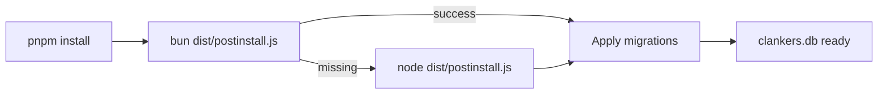

# Postinstall database setup

Each app package (OpenCode, Claude Code, Cursor) defines a `postinstall` script that runs `dist/postinstall.js` with Bun when available, otherwise with Node, to create the SQLite file and apply schema migrations in a harness-neutral app data directory before the plugin loads. The script uses a simple `bun ... || node ...` fallback that works in POSIX shells and Windows cmd, so Bun-only environments do not require Node to bootstrap. Build steps bundle `packages/core/scripts/postinstall.js` into each app's `dist/postinstall.js` for distribution alongside the main plugin bundle. Runtime code only opens the database and skips events if the file is missing.

Invariants
- Postinstall uses `@libsql/client` with standard Node APIs for Bun/Node compatibility.
- The script creates the database directory and applies `CREATE TABLE IF NOT EXISTS` migrations.
- Postinstall prefers Bun when present and falls back to Node otherwise.
- App packages execute `bun dist/postinstall.js || node dist/postinstall.js` to run the script once across POSIX and Windows.
- App build outputs include `dist/postinstall.js` bundled from `packages/core/scripts/postinstall.js`.
- `CLANKERS_DATA_PATH` overrides the data root used for DB and config.
- `CLANKERS_DB_PATH` overrides the database file location.
- A default `config.json` is created if missing.
- Runtime code does not create or migrate the database.

Links: [summary](../summary.md), [sqlite](../storage/sqlite.md), [paths](../storage/paths.md), [plugins](../opencode/plugins.md)

Example
```json
{
	"scripts": {
		"postinstall": "bun dist/postinstall.js || node dist/postinstall.js"
	}
}
```

Diagram

