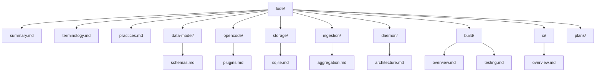

# Lode Map

- [summary](summary.md)
- [terminology](terminology.md)
- [practices](practices.md)
- [dev-environment](dev-environment.md)
- config/
  - [config/overview](config/overview.md)
- data-model/
  - [data-model/schemas](data-model/schemas.md)
- opencode/
  - [opencode/plugins](opencode/plugins.md)
  - [opencode/event-handling](opencode/event-handling.md)
- storage/
  - [storage/sqlite](storage/sqlite.md)
- [storage/paths](storage/paths.md)
- ingestion/
  - [ingestion/aggregation](ingestion/aggregation.md)
- daemon/
  - [daemon/architecture](daemon/architecture.md)
  - [daemon/install](daemon/install.md)
- build/
  - [build/overview](build/overview.md)
  - [build/testing](build/testing.md)
- plans/
  - [plans/npm-packaging](plans/npm-packaging.md)
  - [plans/fix-session-creation](plans/fix-session-creation.md)
  - [plans/claude-plugin](plans/claude-plugin.md)
- claude/
  - [claude/plugin-system](claude/plugin-system.md)
- release/
  - [release/npm-release](release/npm-release.md)
  - [release/daemon-release](release/daemon-release.md)
- ci/
  - [ci/overview](ci/overview.md)

Example
```ts
import { ClankersPlugin } from "@dxta-dev/clankers";
```

Diagram

