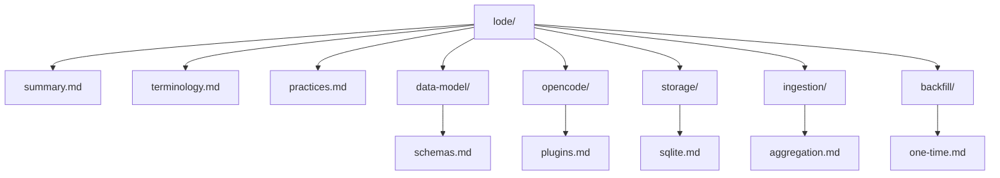

# Lode Map

- [summary](summary.md)
- [terminology](terminology.md)
- [practices](practices.md)
- data-model/
  - [data-model/schemas](data-model/schemas.md)
- opencode/
  - [opencode/plugins](opencode/plugins.md)
  - [opencode/event-handling](opencode/event-handling.md)
- storage/
  - [storage/sqlite](storage/sqlite.md)
- ingestion/
  - [ingestion/aggregation](ingestion/aggregation.md)
- backfill/
  - [backfill/one-time](backfill/one-time.md)
- release/
  - [release/npm-release](release/npm-release.md)

Example
```ts
import { ClankersPlugin } from "@dxta-dev/clankers";
```

Diagram

