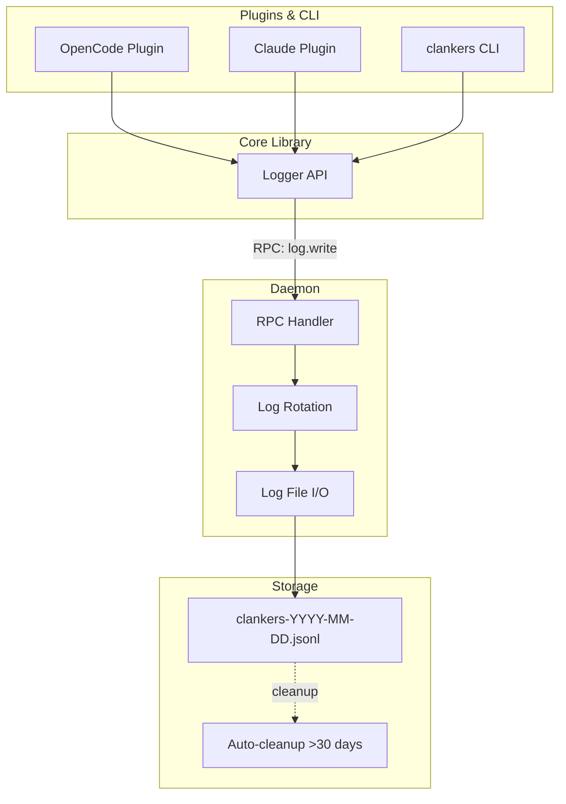

# Unified Logging System

Clankers uses a centralized, daemon-owned logging system where all components (plugins, CLI, daemon) write structured logs to the same destination via JSON-RPC.

## Architecture



## Design Principles

- **Single source of truth**: Daemon owns the log file, all writes go through it
- **Structured JSON Lines**: Machine-parseable, append-only, works with `jq`
- **Daily rotation**: Files named `clankers-YYYY-MM-DD.jsonl`
- **30-day retention**: Automatic cleanup of old log files
- **Async writes**: Fire-and-forget RPC calls from plugins
- **Environment overrides**: `CLANKERS_LOG_LEVEL` and `CLANKERS_LOG_PATH` for configuration

## Log Entry Schema

```json
{
  "timestamp": "2025-01-30T10:15:30.123Z",
  "level": "debug",
  "component": "opencode-plugin",
  "message": "Event received",
  "context": {
    "eventType": "session.created"
  }
}
```

| Field | Type | Description |
|-------|------|-------------|
| `timestamp` | ISO 8601 | UTC timestamp with millisecond precision |
| `level` | enum | One of: `debug`, `info`, `warn`, `error` |
| `component` | string | Source: `daemon`, `opencode-plugin`, `claude-plugin`, `cursor-plugin`, `cli` |
| `message` | string | Human-readable log message |
| `context` | object | Optional structured data (arbitrary key-value pairs) |

## RPC Method

New RPC method for log writing:

**Request:**
```json
{
  "jsonrpc": "2.0",
  "id": "req-42",
  "method": "log.write",
  "params": {
    "schemaVersion": "v1",
    "client": { "name": "opencode-plugin", "version": "0.1.0" },
    "entry": {
      "level": "info",
      "message": "Connected to daemon",
      "context": { "version": "0.1.0" }
    }
  }
}
```

**Response:**
```json
{ "jsonrpc": "2.0", "id": "req-42", "result": { "ok": true } }
```

**Characteristics:**
- Async from plugin perspective (fire-and-forget, no waiting for response)
- Level filtering happens in daemon (entries below threshold are silently dropped)
- Component is derived from client name in envelope

## TypeScript Logger API

The core library exposes a unified logger interface:

```typescript
import { createLogger } from "@dxta-dev/clankers-core";

const logger = createLogger({
  component: "opencode-plugin",
  minLevel: "info", // Respects CLANKERS_LOG_LEVEL env var
});

logger.debug("Detailed debugging info", { details: "..." });
logger.info("Connected to daemon", { version: "0.1.0" });
logger.warn("Validation failed", { error: "..." });
logger.error("Failed to upsert", { message: "..." });
```

### Environment Variable Resolution

1. `CLANKERS_LOG_LEVEL` - explicit override
2. `process.env.LOG_LEVEL` - fallback (if set)
3. Default: `info`

## Storage Layout

```
~/.local/share/clankers/           (Linux)
~/Library/Application Support/clankers/  (macOS)
%APPDATA%/clankers/                (Windows)
├── clankers.db                    # Main database
├── dxta-clankers.sock             # Unix socket
└── logs/
    ├── clankers-2025-01-28.jsonl  # Auto-cleanup after 30 days
    ├── clankers-2025-01-29.jsonl
    └── clankers-2025-01-30.jsonl  # Current day's log
```

## Components

### Daemon (`clankers-daemon`)
- Owns log file I/O
- Implements `log.write` RPC handler
- Filters entries below configured level
- Handles daily rotation
- Runs cleanup job on startup (remove >30 days)
- Uses same logger internally (component: `daemon`)

### Core Library (`@dxta-dev/clankers-core`)
- Exports `createLogger()` function
- Sends logs via `log.write` RPC
- Respects `CLANKERS_LOG_LEVEL` env var
- Provides level filtering client-side (optimization)

### Plugins
- OpenCode: Migrate from `client.app.log()` to new logger
- Claude: Migrate from `console.log()` to new logger
- Cursor: Use new logger when implemented

### CLI
- Commands use logger instead of `fmt.Printf`
- Respect `--log-level` flag

## Log Levels

| Level | Usage |
|-------|-------|
| `debug` | Detailed diagnostic info (event payloads, internal state) |
| `info` | Normal operations (daemon start, plugin connect, upserts) |
| `warn` | Recoverable issues (validation failures, transient errors) |
| `error` | Failures requiring attention (RPC errors, DB errors) |

## Filtering

Daemon filters entries below configured level:

```go
// If level is "info", these are dropped:
log.write({ level: "debug", ... })  // Dropped

// These are written:
log.write({ level: "info", ... })   // Written
log.write({ level: "warn", ... })   // Written
log.write({ level: "error", ... })  // Written
```

## Migration Path

1. **Phase 1**: Implement daemon logging infrastructure
2. **Phase 2**: Implement core logger API
3. **Phase 3**: Migrate OpenCode plugin (remove `client.app.log()` calls)
4. **Phase 4**: Migrate Claude plugin (remove `console.log()` calls)
5. **Phase 5**: Update CLI to use logger

## Links

- [paths](../storage/paths.md) - Data directory structure
- [daemon architecture](architecture.md) - Daemon RPC system
- [implementation plan](../plans/unified-logging.md) - Step-by-step implementation
