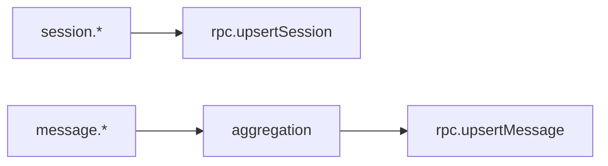

# Plugin event handling

The plugin subscribes to session and message events to persist OpenCode activity locally. Session events upsert sessions; message metadata and parts are aggregated before final write.

Invariants
- `session.created` is de-duplicated via an in-memory `syncedSessions` set.
- `session.updated` and `session.idle` always upsert the latest session data.
- Session event payloads arrive under `event.properties.info` and are normalized before validation.
- If session events omit `model`, the plugin backfills it from message metadata (`modelID`) during message finalize.
- `message.updated` and `message.part.updated` both feed the aggregation stage.
- Plugins assume the daemon owns database creation and only write via RPC.
- Events are skipped if the daemon is unreachable.
- OpenCode session identifiers can arrive as `sessionID` or `id`; normalize to a single session id before upsert.
- Debug logs emit the raw event type, parsed session fields, and session upsert payloads.
- Session validation failures are logged at `warn` with Zod error details.
- Tool events are normalized across payload shapes (`sessionId`/`sessionID`/`session_id`, `tool`/`toolName`/`tool_name`, `input`/`args`/`output.args`).
- Tool execution events use dedicated hooks (`tool.execute.before`/`tool.execute.after`) rather than the generic `event` handler.
- Tool events may omit `sessionId`; the plugin caches the latest session ID from `session.*` and `message.*` events to inject as fallback.
- `latestSessionId` is updated whenever a session or message event is processed, ensuring tool upserts always have a valid session reference.
- Tool events are processed silently; debug information is logged via the logger (not toast notifications).

Links: [plugins](plugins.md), [aggregation](../ingestion/aggregation.md), [sqlite](../storage/sqlite.md)

Example
```ts
if (event.type === "session.updated") {
  await client.app.log({
    service: "clankers",
    level: "debug",
    message: `Event received: ${event.type}`,
  });
  rpc.upsertSession({ id: session.sessionID, title: session.title ?? "Untitled" });
}

if (event.type === "tool.execute.after") {
  const toolName = event.properties?.toolName ?? event.properties?.tool ?? event.properties?.tool_name;
  const args = event.properties?.input ?? event.properties?.args ?? event.properties?.output?.args;
  if (toolName && args) {
    rpc.upsertTool({ id: `${sessionId}-${toolName}`, sessionId, toolName, toolInput: JSON.stringify(args), createdAt: Date.now() });
  }
}
```

Diagram

