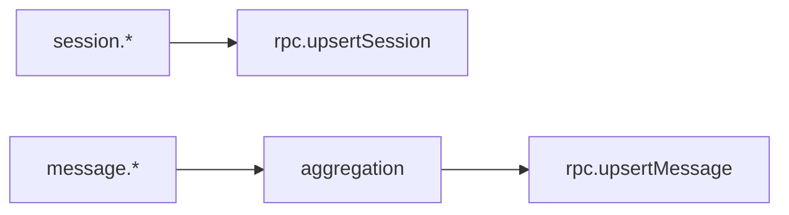

# Plugin event handling

The plugin subscribes to session and message events to persist OpenCode activity locally. Session events upsert sessions; message metadata and parts are aggregated before final write.

Invariants
- `session.created` is de-duplicated via an in-memory `syncedSessions` set.
- `session.updated` and `session.idle` always upsert the latest session data.
- `message.updated` and `message.part.updated` both feed the aggregation stage.
- Plugins assume the daemon owns database creation and only write via RPC.
- Events are skipped if the daemon is unreachable.
- OpenCode uses `sessionID` (not `id`) for session identifiers in all event payloads.

Links: [plugins](plugins.md), [aggregation](../ingestion/aggregation.md), [sqlite](../storage/sqlite.md)

Example
```ts
if (event.type === "session.updated") {
  rpc.upsertSession({ id: session.sessionID, title: session.title ?? "Untitled" });
}
```

Diagram

