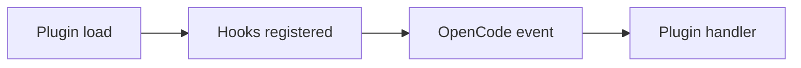

# OpenCode plugins

OpenCode plugins are JS/TS modules that export plugin functions returning hook handlers. Plugins load from project or global directories, or from npm via `opencode.json`. Local plugins can install dependencies by adding a `package.json` in the config directory.

We use `@opencode-ai/plugin` for TypeScript type definitions (`Plugin`) and helper utilities like `tool()` for custom tools. Pin `@opencode-ai/plugin` to version `1.1.30`. Use `client.tui.showToast` to surface user-facing notifications.

Invariants
- Plugins load from global config, project config, global plugin dir, then project plugin dir.
- npm plugins are installed via Bun and cached in `~/.cache/opencode/node_modules/`.
- Hook names match the documented event list (session, message, tool, etc.).

Links: [summary](../summary.md), [practices](../practices.md), [schemas](../data-model/schemas.md)

Example
```ts
import type { Plugin } from "@opencode-ai/plugin";

export const MyPlugin: Plugin = async ({ client }) => {
  await client.app.log({
    service: "my-plugin",
    level: "info",
    message: "Plugin initialized",
  });

  return {
    event: async ({ event }) => {
      if (event.type === "session.idle") {
        await client.app.log({
          service: "my-plugin",
          level: "debug",
          message: "Session idle",
        });
      }
    },
  };
};
```

Diagram

