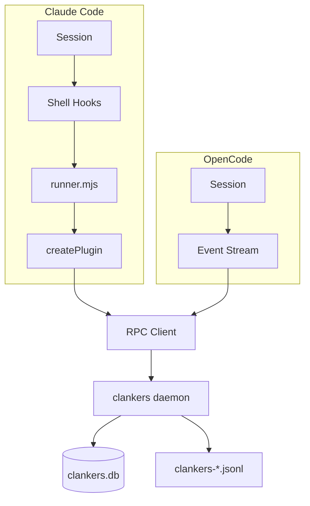

# .clankers-dev Audit Plan

Scope: validate persistence and logging for Claude Code + OpenCode sessions using only the dev data root at `.clankers-dev/`.

Invariants
- Only `.clankers-dev/clankers.db` is authoritative for this audit.
- Use `.clankers-dev/clankers-YYYY-MM-DD.jsonl` for logs; ignore `~/.local/share/*`.
- Mark gaps as **Not saved** (DB) or **Not logged** (logs).

## Current State (2026-01-31)

| Table | Count | Status |
|-------|-------|--------|
| sessions | 6 | ✅ Working (Claude + OpenCode) |
| messages | 20 | ✅ Working |
| tools | 43 | ✅ Fixed (was 0) |
| session_errors | 0 | ✅ No errors |

---

## Claude Code Plugin - Fixed

### Bug 1: Tool Persistence (Fixed)

**Root cause**: Shell hooks run in separate Node processes. In-memory staging fails:
- `PreToolUse` → `stageToolStart()` → process exits → data lost
- `PostToolUse` → `completeToolExecution()` → empty Map → returns null

**Fix** (`apps/claude-code-plugin/src/index.ts`):
- `PostToolUse` and `PostToolUseFailure` build complete `ToolPayload` directly
- No longer rely on cross-process staging

### Bug 2: Session Aggregates (Fixed)

**Root cause**: `SessionEnd` relied on in-memory `sessionState` which is empty due to process isolation. Result: `prompt_tokens`, `completion_tokens`, `message_count`, `tool_call_count` all 0.

**Fix**: Added `extractSessionAggregates()` function that parses transcript file:
- `messageCount` - count user/assistant entries
- `toolCallCount` - count tool result entries
- `totalPromptTokens` / `totalCompletionTokens` - summed from assistant messages
- `model`, `title`, `createdAt` - extracted from first messages

### Claude Code - Remaining

| Issue | Priority | Notes |
|-------|----------|-------|
| Debug logs filtered | Low | Uses `logger.debug()`, daemon set to info level |

---

## OpenCode Plugin - Issues Found

### Issue 1: SQLITE_BUSY Errors

**Symptom**: Warnings in logs:
```
"level":"warn","component":"opencode-plugin","message":"Failed to handle event"
"error":{"message":"RPC error -32603: database is locked (5) (SQLITE_BUSY)"}
```

**Root cause**: Database contention. Current SQLite config:
- `journal_mode`: delete (not WAL)
- `busy_timeout`: 0 (no retry)

**Potential fixes**:
1. Enable WAL mode: `PRAGMA journal_mode=WAL`
2. Set busy timeout: `PRAGMA busy_timeout=5000`
3. Add retry logic in daemon RPC handlers

### Issue 2: Missing Session Fields

**Symptom**: OpenCode sessions have `model: NULL` and some have `project_path: NULL`

```sql
-- OpenCode sessions with missing data:
ses_3eb32c849ffe16JwoR1yttnW1L | model: missing | project_path: ok
ses_3eb357594ffeVcE9DXFP4KdBhX | model: missing | project_path: missing
```

**Root cause**: OpenCode plugin may not be extracting/sending model info on session events.

---

## Verification Queries

```bash
# Check all table counts
sqlite3 ".clankers-dev/clankers.db" "
  select 'sessions' as tbl, count(*) from sessions
  union all select 'messages', count(*) from messages
  union all select 'tools', count(*) from tools
  union all select 'session_errors', count(*) from session_errors;"

# Check Claude tools are captured
sqlite3 ".clankers-dev/clankers.db" "
  select tool_name, count(*)
  from tools
  where session_id like 'eb3ba967%' or session_id like 'f49c8b29%'
  group by tool_name;"

# Check for errors in logs
rg '"level":"(error|warn)"' ".clankers-dev/clankers-*.jsonl" | tail -10
```

---

## Diagram



Links: [claude/plugin-system](../claude/plugin-system.md), [logging/current-state](../logging/current-state.md), [storage/paths](../storage/paths.md)
