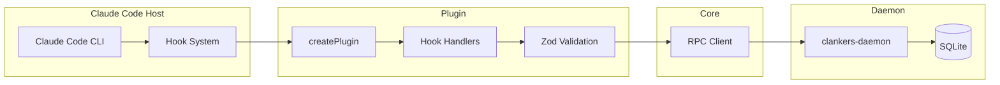
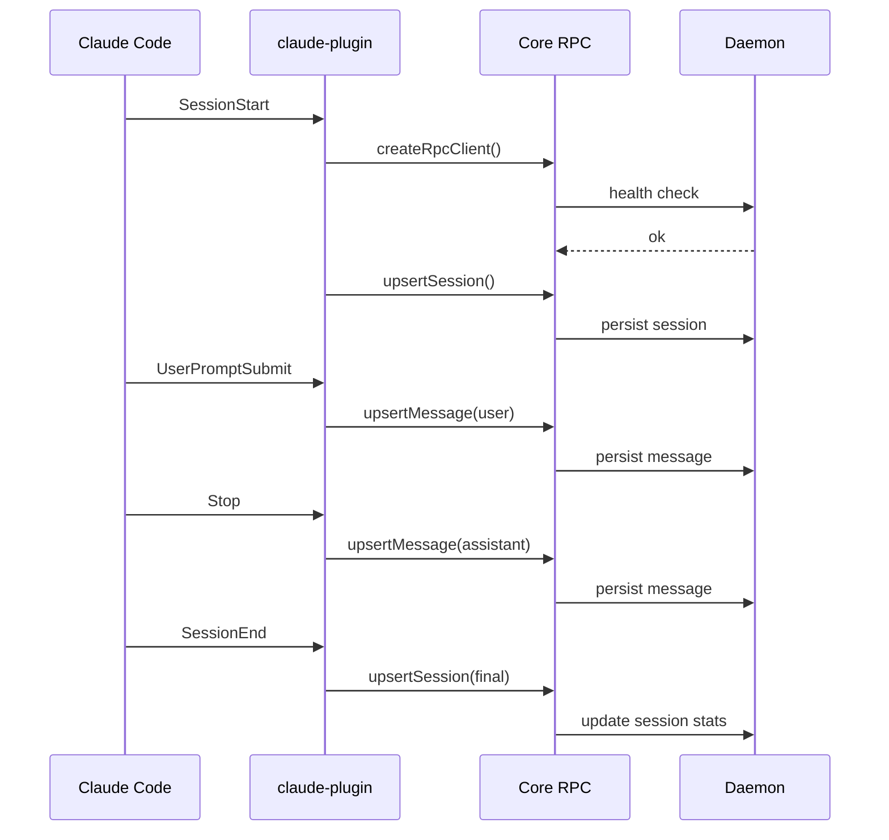

# Claude Code Plugin Implementation Plan

## Overview

This plan details the complete implementation of a programmatic Claude Code plugin for clankers, including the plugin architecture, project-level configuration, and Nix devShell integration.

## Architecture

### Programmatic Plugin Pattern

Claude Code supports a programmatic plugin pattern where the plugin exports a `createPlugin()` function that returns hook handlers. This differs from OpenCode's event-based system.



### Hook Lifecycle



## File Structure

```
apps/claude-code-plugin/
├── .claude-plugin/
│   └── plugin.json          # Plugin manifest (required by Claude Code)
├── src/
│   ├── index.ts             # Main entry, exports createPlugin()
│   ├── schemas.ts           # Zod schemas for Claude hook events
│   └── types.ts             # TypeScript interfaces for hook events
├── package.json
└── tsconfig.json
```

## Plugin Manifest

The `.claude-plugin/plugin.json` is required by Claude Code:

```json
{
  "name": "clankers",
  "description": "Sync Claude Code sessions to clankers-daemon for analytics",
  "version": "0.1.0",
  "author": {
    "name": "dxta-dev"
  }
}
```

Note: Unlike OpenCode which uses a `.opencode/config.json` to reference plugins, Claude Code discovers plugins via the `.claude-plugin/plugin.json` manifest in the plugin directory, OR via programmatic hooks defined in `hooks/hooks.json`.

For programmatic plugins, Claude Code loads the plugin by importing it and calling `createPlugin()`.

## Zod Schemas Required

New schemas needed for Claude Code hook events (distinct from OpenCode events):

```typescript
// schemas.ts
import { z } from "zod";

// SessionStart hook event
export const SessionStartSchema = z.object({
  session_id: z.string(),
  transcript_path: z.string(),
  cwd: z.string(),
  permission_mode: z.string(),
  hook_event_name: z.literal("SessionStart"),
  source: z.enum(["startup", "resume", "clear", "compact"]),
  model: z.string().optional(),
});

// UserPromptSubmit hook event
export const UserPromptSchema = z.object({
  session_id: z.string(),
  transcript_path: z.string(),
  cwd: z.string(),
  permission_mode: z.string(),
  hook_event_name: z.literal("UserPromptSubmit"),
  prompt: z.string(),
});

// Stop hook event
export const StopSchema = z.object({
  session_id: z.string(),
  transcript_path: z.string(),
  cwd: z.string(),
  permission_mode: z.string(),
  hook_event_name: z.literal("Stop"),
  response: z.string().optional(),
  tokenUsage: z.object({
    input: z.number(),
    output: z.number(),
  }).optional(),
  durationMs: z.number().optional(),
  model: z.string().optional(),
  stop_hook_active: z.boolean().optional(),
});

// SessionEnd hook event
export const SessionEndSchema = z.object({
  session_id: z.string(),
  transcript_path: z.string(),
  cwd: z.string(),
  permission_mode: z.string(),
  hook_event_name: z.literal("SessionEnd"),
  reason: z.enum(["clear", "logout", "prompt_input_exit", "other"]),
  messageCount: z.number().optional(),
  toolCallCount: z.number().optional(),
  totalTokenUsage: z.object({
    input: z.number(),
    output: z.number(),
  }).optional(),
  costEstimate: z.number().optional(),
});
```

## TypeScript Interfaces

```typescript
// types.ts
export interface SessionStartEvent {
  session_id: string;
  transcript_path: string;
  cwd: string;
  permission_mode: string;
  hook_event_name: "SessionStart";
  source: "startup" | "resume" | "clear" | "compact";
  model?: string;
}

export interface UserPromptEvent {
  session_id: string;
  transcript_path: string;
  cwd: string;
  permission_mode: string;
  hook_event_name: "UserPromptSubmit";
  prompt: string;
}

export interface StopEvent {
  session_id: string;
  transcript_path: string;
  cwd: string;
  permission_mode: string;
  hook_event_name: "Stop";
  response?: string;
  tokenUsage?: { input: number; output: number };
  durationMs?: number;
  model?: string;
  stop_hook_active?: boolean;
}

export interface SessionEndEvent {
  session_id: string;
  transcript_path: string;
  cwd: string;
  permission_mode: string;
  hook_event_name: "SessionEnd";
  reason: "clear" | "logout" | "prompt_input_exit" | "other";
  messageCount?: number;
  toolCallCount?: number;
  totalTokenUsage?: { input: number; output: number };
  costEstimate?: number;
}

export interface ClaudeCodeHooks {
  SessionStart?: (data: SessionStartEvent) => void | Promise<void>;
  UserPromptSubmit?: (data: UserPromptEvent) => void | Promise<void>;
  Stop?: (data: StopEvent) => void | Promise<void>;
  SessionEnd?: (data: SessionEndEvent) => void | Promise<void>;
}
```

## createPlugin Implementation Structure

```typescript
// index.ts - key structure
export function createPlugin(): ClaudeCodeHooks | null {
  // Initialize RPC client
  const rpc = createRpcClient({
    clientName: "claude-code-plugin",
    clientVersion: "0.1.0",
  });
  
  // Track connection state
  let connected = false;
  let messageCounter = 0;
  const sessionState = new Map<string, Partial<SessionPayload>>();
  const processedMessages = new Set<string>();
  
  // Health check on startup
  try {
    const health = await rpc.health();
    connected = health.ok;
  } catch {
    console.log("[clankers] Daemon not running; events will be skipped");
    return null;
  }
  
  if (!connected) return null;
  
  return {
    SessionStart: async (event) => {
      // Validate with Zod
      // Extract projectPath from cwd
      // Call rpc.upsertSession()
      // Store session state
    },
    
    UserPromptSubmit: async (event) => {
      // Validate with Zod
      // Generate message ID
      // Call rpc.upsertMessage() with role="user"
    },
    
    Stop: async (event) => {
      // Validate with Zod
      // Skip if stop_hook_active (prevents loops)
      // Generate message ID (check for duplicates)
      // Call rpc.upsertMessage() with role="assistant"
      // Accumulate token usage to session state
    },
    
    SessionEnd: async (event) => {
      // Validate with Zod
      // Get accumulated session state
      // Call rpc.upsertSession() with final stats
      // Clean up session state
    },
  };
}

export default createPlugin;
```

## Data Mapping to Existing Schemas

### SessionStart → SessionPayload

| Claude Code Field | SessionPayload Field | Transform |
|-------------------|---------------------|-----------|
| `session_id` | `id` | Direct |
| `cwd` | `projectPath` | Direct |
| - | `projectName` | `path.basename(cwd)` |
| `model` | `model` | Direct |
| - | `provider` | Hardcode "anthropic" |
| - | `title` | "Untitled Session" (no title in Claude events) |

### UserPromptSubmit → MessagePayload

| Claude Code Field | MessagePayload Field | Transform |
|-------------------|---------------------|-----------|
| `session_id` | `sessionId` | Direct |
| - | `messageId` | `${session_id}-user-${timestamp}` |
| - | `role` | "user" |
| `prompt` | `textContent` | Direct |
| - | `createdAt` | `Date.now()` |

### Stop → MessagePayload

| Claude Code Field | MessagePayload Field | Transform |
|-------------------|---------------------|-----------|
| `session_id` | `sessionId` | Direct |
| - | `messageId` | `${session_id}-assistant-${timestamp}` |
| - | `role` | "assistant" |
| `response` | `textContent` | Direct (empty string if undefined) |
| `model` | `model` | Direct |
| `tokenUsage.input` | `promptTokens` | Direct |
| `tokenUsage.output` | `completionTokens` | Direct |
| `durationMs` | `durationMs` | Direct |

### SessionEnd → SessionPayload

| Claude Code Field | SessionPayload Field | Transform |
|-------------------|---------------------|-----------|
| `session_id` | `id` | Direct |
| `reason` | `endReason` | Direct |
| `messageCount` | `messageCount` | Direct |
| `toolCallCount` | `toolCallCount` | Direct |
| `totalTokenUsage.input` | `promptTokens` | Direct |
| `totalTokenUsage.output` | `completionTokens` | Direct |
| `costEstimate` | `cost` | Direct |

## Project-Level Claude Configuration

### Directory Structure

```
.claude/                     # Claude Code project config
├── settings.json            # Shared team settings (committed)
├── settings.local.json      # Personal overrides (git-ignored)
└── plugins/                 # Symlink to plugin directory (optional)
    └── clankers -> ../../apps/claude-code-plugin
```

### settings.json (Committed)

```json
{
  "permissions": {
    "allow": [
      "Read (./apps/**)",
      "Read (./packages/**)",
      "Bash (pnpm *)"
    ]
  },
  "environment": {
    "CLANKERS_DATA_PATH": "./.clankers-dev",
    "CLANKERS_SOCKET_PATH": "./.clankers-dev/dxta-clankers.sock"
  }
}
```

### settings.local.json (Git-ignored)

```json
{
  "plugins": {
    "clankers": {
      "enabled": true
    }
  }
}
```

Note: Claude Code's programmatic plugin loading works differently than OpenCode. The plugin must be:
1. Installed via `claude plugin install` from a marketplace, OR
2. Loaded via `--plugin-dir` flag for development

Unlike OpenCode, there is no `plugin: ["./path"]` configuration in settings.json.

## Nix DevShell Integration

### Current OpenCode Pattern (Reference)

The existing `with-daemon-and-plugin` devShell in `flake.nix`:

1. Starts the daemon automatically
2. Builds the OpenCode plugin
3. Creates `.opencode/plugins/clankers.js`
4. Creates `.opencode/config.json` with plugin reference

### Claude Code DevShell Requirements

For Claude Code, we need a different approach since plugins are loaded via `--plugin-dir`:

```nix
with-claude-plugin = pkgs.mkShell {
  packages = [
    pkgs.nodejs_24
    pkgs.pnpm
    pkgs.go
    pkgs.sqlite
    pkgs.biome
    daemon
  ];

  shellHook = ''
    export CLANKERS_DATA_PATH="$PWD/.clankers-dev"
    export CLANKERS_SOCKET_PATH="$PWD/.clankers-dev/dxta-clankers.sock"
    export CLANKERS_DB_PATH="$PWD/.clankers-dev/clankers.db"

    echo "Clankers dev shell (with Claude Code plugin) loaded"

    # Create dev data directory
    mkdir -p "$CLANKERS_DATA_PATH"

    # Kill any existing daemon
    if [ -S "$CLANKERS_SOCKET_PATH" ]; then
      rm -f "$CLANKERS_SOCKET_PATH"
    fi

    # Start daemon
    echo "Starting clankers-daemon..."
    clankers-daemon --log-level=debug &
    DAEMON_PID=$!
    echo $DAEMON_PID > "$CLANKERS_DATA_PATH/daemon.pid"

    # Wait for socket
    for i in $(seq 1 30); do
      if [ -S "$CLANKERS_SOCKET_PATH" ]; then
        echo "Daemon ready (PID: $DAEMON_PID)"
        break
      fi
      sleep 0.1
    done

    # Build the plugin
    echo "Building Claude Code plugin..."
    if pnpm --filter @dxta-dev/clankers-claude-code build 2>/dev/null; then
      echo "Plugin built successfully"
    else
      echo "Warning: Plugin build failed"
    fi

    # Create .claude directory structure
    mkdir -p "$PWD/.claude"

    # Create project settings if not exists
    if [ ! -f "$PWD/.claude/settings.json" ]; then
      cat > "$PWD/.claude/settings.json" << 'EOF'
{
  "permissions": {
    "allow": ["Read (./**)", "Bash (pnpm *)"]
  },
  "environment": {
    "CLANKERS_DATA_PATH": "./.clankers-dev",
    "CLANKERS_SOCKET_PATH": "./.clankers-dev/dxta-clankers.sock"
  }
}
EOF
      echo "Created .claude/settings.json"
    fi

    # Create local settings (git-ignored)
    if [ ! -f "$PWD/.claude/settings.local.json" ]; then
      echo '{}' > "$PWD/.claude/settings.local.json"
      echo "Created .claude/settings.local.json"
    fi

    echo ""
    echo "To use the plugin with Claude Code:"
    echo "  claude --plugin-dir $PWD/apps/claude-code-plugin"
    echo ""

    # Cleanup on exit
    cleanup() {
      if [ -f "$CLANKERS_DATA_PATH/daemon.pid" ]; then
        kill $(cat "$CLANKERS_DATA_PATH/daemon.pid") 2>/dev/null || true
        rm -f "$CLANKERS_DATA_PATH/daemon.pid"
      fi
    }
    trap cleanup EXIT
  '';
};
```

## Testing Strategy

### Local Development Testing

```bash
# Enter dev shell
nix develop .#with-claude-plugin

# The daemon should be running
# Plugin should be built

# Test with Claude Code
claude --plugin-dir ./apps/claude-code-plugin

# Inside Claude Code, run:
# /help  # Should show clankers plugin loaded
# Check that SessionStart fired and created a session in DB
```

### Verification Steps

1. **Daemon Connection**: Check RPC client connects to daemon
2. **Session Creation**: Verify SessionStart creates session in DB
3. **Message Capture**: Verify UserPromptSubmit creates user message
4. **Response Capture**: Verify Stop creates assistant message
5. **Session End**: Verify SessionEnd updates session with final stats

## Key Implementation Considerations

### 1. Message ID Generation

Claude Code doesn't provide message IDs. Generate as:
- User: `${session_id}-user-${Date.now()}`
- Assistant: `${session_id}-assistant-${Date.now()}`
- Track processed IDs to prevent duplicates (Stop can fire multiple times)

### 2. Session State Management

Unlike OpenCode which has separate `session.created`/`session.updated` events, Claude Code's model:
- `SessionStart` fires once at beginning
- Need to accumulate token usage across multiple `Stop` events
- `SessionEnd` provides final counts

Use in-memory Map: `sessionState: Map<string, Partial<SessionPayload>>`

### 3. Duplicate Prevention

The `Stop` hook can fire multiple times if Claude continues after a stop hook. Use:
- `stop_hook_active` flag in Stop event
- Track processed message IDs in Set

### 4. Daemon Connection Handling

```typescript
// Attempt connection on plugin load
let connected = false;
try {
  const health = await rpc.health();
  connected = health.ok;
} catch {
  console.log("[clankers] Daemon not running");
}

// Return null if not connected (Claude Code handles gracefully)
if (!connected) return null;
```

### 5. Error Handling

Follow OpenCode plugin patterns:
- Zod validation failures: silent return
- RPC failures: log to console, don't throw
- Use defensive checks and early returns

## Additional Data Opportunities

Based on Wayne's reference implementation, these could be added later:

| Field | Source | Value |
|-------|--------|-------|
| `gitBranch` | Parse from cwd | `git rev-parse --abbrev-ref HEAD` |
| `gitRepo` | Parse from cwd | Remote URL |
| `endReason` | SessionEnd | clear/logout/prompt_input_exit/other |
| `toolCallCount` | SessionEnd | Total tool uses |
| `thinkingEnabled` | Could parse from model | Extended thinking |

## Dependencies

The plugin will use:
- `@dxta-dev/clankers-core` - Shared RPC client and schemas
- `zod` - Validation (via core package)

No additional dependencies needed.

## Build Configuration

The `package.json` build script is already configured:
```json
{
  "scripts": {
    "build": "pnpm exec esbuild ./src/index.ts --bundle --outfile=dist/index.js --platform=node --format=esm --target=node24"
  }
}
```

Output: `dist/index.js` with `createPlugin` export as default.

## Summary of Files to Create/Modify

### New Files

1. `apps/claude-code-plugin/.claude-plugin/plugin.json` - Plugin manifest
2. `apps/claude-code-plugin/src/schemas.ts` - Zod schemas for Claude events
3. `apps/claude-code-plugin/src/types.ts` - TypeScript interfaces
4. `apps/claude-code-plugin/src/index.ts` - Main plugin implementation
5. `.claude/settings.json` - Project-level Claude config (committed)
6. `.claude/settings.local.json` - Personal overrides (git-ignored)

### Modified Files

1. `flake.nix` - Add `with-claude-plugin` devShell
2. `.gitignore` - Add `.claude/settings.local.json` and `.clankers-dev/`

## Next Steps

1. Create plugin manifest and schemas
2. Implement `createPlugin()` function
3. Add devShell to flake.nix
4. Create `.claude/` project configuration
5. Test with `claude --plugin-dir`
6. Document usage in README
