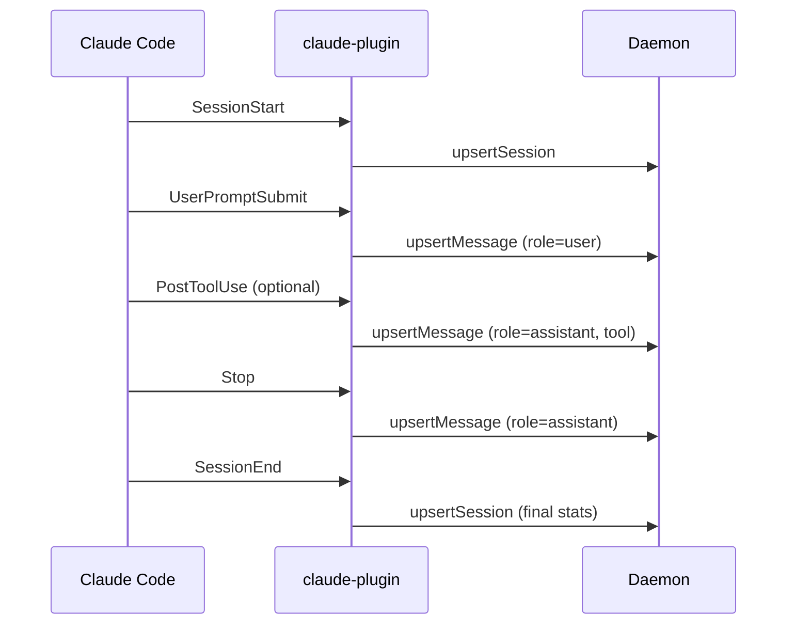

# Claude Code Plugin Plan

## Overview

Implement a Claude Code plugin that captures session events via Claude Code's hook system and persists them to the clankers-daemon via the shared `@dxta-dev/clankers-core` RPC client.

## Architecture

Claude Code uses a **programmatic plugin pattern** where the plugin exports a `createPlugin()` function that returns hook handlers. This differs from OpenCode's event-based plugin architecture.

```mermaid
flowchart LR
    subgraph "Claude Code"
        Hooks[Hook Events] --> Plugin[claude-plugin]
    end
    
    subgraph "Clankers Core"
        Plugin --> Zod[Zod Validation]
        Zod --> Rpc[RPC Client]
    end
    
    subgraph "Daemon"
        Rpc --> Daemon[clankers-daemon]
        Daemon --> SQLite[(SQLite)]
    end
```

## Hook Events Available

Based on Claude Code documentation, these hooks are relevant for data capture:

| Hook | When It Fires | Data Available | Priority |
|------|---------------|----------------|----------|
| `SessionStart` | Session begins/resumes | session_id, cwd, model, permission_mode, source | **Required** |
| `UserPromptSubmit` | User submits prompt | session_id, prompt | **Required** |
| `Stop` | Claude finishes responding | session_id, response, tokenUsage, durationMs, model | **Required** |
| `PostToolUse` | After tool executes | session_id, tool_name, tool_input, tool_response, durationMs | Optional |
| `SessionEnd` | Session terminates | session_id, reason, cwd, messageCount, toolCallCount, totalTokenUsage, costEstimate | **Required** |

## Session Lifecycle



## Data Mapping

### SessionStart Event

| Claude Code Field | Session Payload Field | Notes |
|-------------------|----------------------|-------|
| `session_id` | `id` | Session identifier |
| `cwd` | `projectPath` | Working directory |
| - | `projectName` | Derived from cwd basename |
| `model` | `model` | Model identifier |
| `source` | `startType` | startup/resume/clear/compact |
| - | `provider` | "anthropic" (Claude is Anthropic-native) |

### UserPromptSubmit Event

| Claude Code Field | Message Payload Field | Notes |
|-------------------|----------------------|-------|
| `session_id` | `sessionId` | Session reference |
| - | `messageId` | Auto-generated |
| - | `role` | "user" |
| `prompt` | `textContent` | User's input |
| - | `createdAt` | Timestamp from event |

### Stop Event

| Claude Code Field | Message Payload Field | Notes |
|-------------------|----------------------|-------|
| `session_id` | `sessionId` | Session reference |
| - | `messageId` | Auto-generated |
| - | `role` | "assistant" |
| `response` | `textContent` | Claude's response |
| `model` | `model` | Model used |
| `tokenUsage.input` | `promptTokens` | Input tokens |
| `tokenUsage.output` | `completionTokens` | Output tokens |
| `durationMs` | `durationMs` | Response time |

### SessionEnd Event

| Claude Code Field | Session Payload Field | Notes |
|-------------------|----------------------|-------|
| `session_id` | `id` | Session identifier |
| `reason` | `endReason` | clear/logout/prompt_input_exit/other |
| `messageCount` | `messageCount` | Total messages |
| `toolCallCount` | `toolCallCount` | Total tool calls |
| `totalTokenUsage.input` | `promptTokens` | Final input count |
| `totalTokenUsage.output` | `completionTokens` | Final output count |
| `costEstimate` | `cost` | Estimated cost |

## File Structure

```
apps/claude-plugin/
├── .claude-plugin/
│   └── plugin.json          # Plugin manifest
├── src/
│   ├── index.ts             # createPlugin() entry point
│   ├── hooks.ts             # Hook handler implementations
│   ├── schemas.ts           # Claude-specific Zod schemas
│   └── types.ts             # TypeScript interfaces
├── package.json
└── tsconfig.json
```

## Plugin Manifest

```json
{
  "name": "clankers",
  "description": "Sync Claude Code sessions to clankers-daemon for analytics",
  "version": "0.1.0",
  "author": {
    "name": "dxta-dev"
  }
}
```

## Schemas Required

Need to add Claude Code-specific schemas to validate hook input:

```typescript
// SessionStart schema
export const ClaudeSessionStartSchema = z.object({
  session_id: z.string(),
  transcript_path: z.string(),
  cwd: z.string(),
  permission_mode: z.string(),
  source: z.enum(["startup", "resume", "clear", "compact"]),
  model: z.string().optional(),
});

// UserPromptSubmit schema  
export const ClaudeUserPromptSchema = z.object({
  session_id: z.string(),
  prompt: z.string(),
});

// Stop schema
export const ClaudeStopSchema = z.object({
  session_id: z.string(),
  response: z.string().optional(),
  tokenUsage: z.object({
    input: z.number(),
    output: z.number(),
  }).optional(),
  durationMs: z.number().optional(),
  model: z.string().optional(),
});

// SessionEnd schema
export const ClaudeSessionEndSchema = z.object({
  session_id: z.string(),
  reason: z.enum(["clear", "logout", "prompt_input_exit", "other"]),
  messageCount: z.number().optional(),
  toolCallCount: z.number().optional(),
  totalTokenUsage: z.object({
    input: z.number(),
    output: z.number(),
  }).optional(),
  costEstimate: z.number().optional(),
});
```

## Implementation Approach

### Option A: Pure Hook-Based (JSON Config)
Configure `hooks/hooks.json` with commands that call a CLI tool:
```json
{
  "hooks": {
    "SessionStart": [{ "hooks": [{ "type": "command", "command": "clankers-cli session-start" }] }],
    "SessionEnd": [{ "hooks": [{ "type": "command", "command": "clankers-cli session-end" }] }]
  }
}
```

**Cons**: Requires separate CLI tool, complex stdin handling, slower execution.

### Option B: Programmatic Plugin (Recommended)
Export a `createPlugin()` function that returns hook handlers directly:
```typescript
export function createPlugin(): ClaudeCodeHooks {
  const rpc = createRpcClient({ clientName: "claude-plugin", clientVersion: "0.1.0" });
  
  return {
    SessionStart: async (event) => { /* handle session start */ },
    UserPromptSubmit: async (event) => { /* handle user prompt */ },
    Stop: async (event) => { /* handle stop */ },
    SessionEnd: async (event) => { /* handle session end */ },
  };
}
```

**Pros**: Direct TypeScript integration, uses shared core package, consistent with OpenCode plugin patterns, faster execution.

**Decision**: Use Option B (programmatic plugin) for consistency with existing codebase.

## Key Implementation Details

### Session State Management
Unlike OpenCode which has `session.created`/`session.updated` events, Claude Code's `SessionStart` fires once at the beginning. We need to:
1. Store session state in memory during the session
2. Update session stats at `SessionEnd` with final counts

### Message ID Generation
Claude Code doesn't provide message IDs. We should generate them as:
- User messages: `{session_id}-user-{timestamp}`
- Assistant messages: `{session_id}-assistant-{timestamp}`

### Duplicate Prevention
The `Stop` hook may fire multiple times (e.g., if Claude continues after a stop hook). Track processed message IDs to avoid duplicates.

### Tool Call Handling
`PostToolUse` fires for every tool use. Optional to capture - can be stored as separate messages with role="assistant" and tool metadata.

### Token Aggregation
Token usage comes from the `Stop` event and cumulative stats from `SessionEnd`. Use:
- Per-message tokens from `Stop` for individual messages
- Final totals from `SessionEnd` for session validation

## Testing Strategy

1. **Local Testing**: Use `claude --plugin-dir ./apps/claude-plugin` to test locally
2. **Event Validation**: Log all events to verify schema matches
3. **Daemon Connection**: Verify RPC client connects to daemon
4. **Data Integrity**: Compare stored data with actual Claude Code sessions

## Open Questions

1. Should we capture `PostToolUse` events as separate tool messages or skip them?
2. Should we attempt to parse the transcript file for additional metadata?
3. How should we handle `SubagentStart`/`SubagentStop` - as separate sessions or child messages?

## Additional Data to Consider

Based on Wayne's reference implementation and Claude Code docs, these additional fields could be valuable:

| Field | Source | Value |
|-------|--------|-------|
| `thinkingEnabled` | SessionStart model info | Whether extended thinking is enabled |
| `permissionMode` | SessionStart | Current permission mode |
| `gitBranch` | Derived from cwd | Current git branch |
| `endReason` | SessionEnd | Why session ended |
| `toolCallCount` | SessionEnd | Total tool invocations |
| `mcpServers` | SessionStart | List of active MCP servers |

The core implementation should focus on the essential fields first. These can be added as enhancements after initial release.

## Dependencies

The plugin will depend on:
- `@dxta-dev/clankers-core` - Shared schemas and RPC client
- `zod` - Schema validation (via core package)

## Build Output

The plugin should output:
- `dist/index.js` - Main entry point with `createPlugin` export
- `dist/index.d.ts` - TypeScript declarations

Claude Code loads the plugin directly - no separate installation step needed when using `--plugin-dir`.

## Next Steps

1. Create the plugin package structure
2. Define Zod schemas for Claude Code events
3. Implement `createPlugin()` with all hook handlers
4. Add health check and connection logging (similar to OpenCode plugin)
5. Test locally with `claude --plugin-dir`
6. Document installation via plugin marketplace
