# Data Gaps Implementation Plan

Complete roadmap for capturing tool usage, file operations, errors, and enhanced metadata across both Claude Code and OpenCode plugins.

**Last Updated:** 2026-01-31 (Sprint 5A Complete - OpenCode Enhanced Metadata)

**Current Status:** 
- Phase 1 (Tool Tracking) ✅ COMPLETE. Both OpenCode and Claude Code tool tracking implemented.
- Phase 2 (OpenCode-Specific Events) ✅ COMPLETE. File operations, session errors, and compaction events implemented.
- Phase 3 (Enhanced Metadata) ✅ COMPLETE. Sprint 5A (OpenCode) ✅ COMPLETE. Sprint 5B (Claude Code) ✅ COMPLETE.

**Decisions Made:**
1. **Migration Framework**: Deferred to future date ([migration framework plan](./migration-framework.md))
2. **Priority**: OpenCode enhancements before Claude Code
3. **Schema Changes**: Direct `CREATE TABLE` modification (database not in production, can be dropped)

## Overview

This plan addresses the major data gaps identified in the current plugin implementations:

| Gap | Claude Code | OpenCode | Value |
|-----|-------------|----------|-------|
| Tool usage tracking | ✅ **IMPLEMENTED** `PreToolUse`/`PostToolUse`/`PostToolUseFailure` | ✅ **IMPLEMENTED** `tool.execute.*` | **Critical** - Understand what AI actually does |
| File operations | ⏳ Pending (via PostToolUse) | ✅ **IMPLEMENTED** `file.edited` | **High** - Track code churn |
| Error tracking | ✅ **IMPLEMENTED** `PostToolUseFailure` | ✅ **IMPLEMENTED** `session.error` | **Medium** - Debugging/quality metrics |
| Compaction events | ❌ Not available | ✅ **IMPLEMENTED** `session.compacted` | **Medium** - Context window analytics |
| Enhanced metadata | ✅ **IMPLEMENTED** SessionEnd totals, permission_mode | ✅ **IMPLEMENTED** `session.status` tracking | **Medium** - Complete session picture |

## Phase 1: Tool Usage Tracking (Priority: Critical)

### Goal
Capture all tool invocations across both platforms: Bash, Read, Edit, Write, WebFetch, WebSearch, Glob, Grep, Task, and MCP tools.

### Schema Changes

New `tools` table:
```sql
CREATE TABLE tools (
  id TEXT PRIMARY KEY,
  session_id TEXT NOT NULL,
  message_id TEXT,  -- optional: link to assistant message that triggered tool
  tool_name TEXT NOT NULL,  -- Bash, Edit, Write, Read, WebFetch, etc.
  tool_input TEXT,  -- JSON string of tool arguments
  tool_output TEXT, -- JSON string of tool response (truncated for large outputs)
  file_path TEXT,   -- extracted for file operations
  success BOOLEAN,  -- did tool succeed?
  error_message TEXT, -- if failed, what was the error?
  duration_ms INTEGER, -- execution time
  created_at INTEGER NOT NULL,
  FOREIGN KEY (session_id) REFERENCES sessions(id) ON DELETE CASCADE
);

-- Indexes for analytics queries
CREATE INDEX idx_tools_session ON tools(session_id);
CREATE INDEX idx_tools_name ON tools(tool_name);
CREATE INDEX idx_tools_file ON tools(file_path);
```

### Claude Code Implementation

Add hooks to `apps/claude-code-plugin/hooks/hooks.json`:
```json
{
  "hooks": {
    "PreToolUse": [
      {
        "matcher": "*",
        "hooks": [
          {
            "type": "command",
            "command": "node ${CLAUDE_PLUGIN_ROOT}/hooks/runner.mjs PreToolUse"
          }
        ]
      }
    ],
    "PostToolUse": [
      {
        "matcher": "*",
        "hooks": [
          {
            "type": "command",
            "command": "node ${CLAUDE_PLUGIN_ROOT}/hooks/runner.mjs PostToolUse"
          }
        ]
      }
    ],
    "PostToolUseFailure": [
      {
        "matcher": "*",
        "hooks": [
          {
            "type": "command",
            "command": "node ${CLAUDE_PLUGIN_ROOT}/hooks/runner.mjs PostToolUseFailure"
          }
        ]
      }
    ]
  }
}
```

Add schemas to `apps/claude-code-plugin/src/schemas.ts`:
```typescript
export const PreToolUseSchema = z.object({
  session_id: z.string(),
  transcript_path: z.string(),
  cwd: z.string(),
  permission_mode: z.string().optional(),
  hook_event_name: z.literal("PreToolUse"),
  tool_name: z.string(),
  tool_input: z.record(z.unknown()),
  tool_use_id: z.string(),
});

export const PostToolUseSchema = z.object({
  session_id: z.string(),
  transcript_path: z.string(),
  cwd: z.string(),
  permission_mode: z.string().optional(),
  hook_event_name: z.literal("PostToolUse"),
  tool_name: z.string(),
  tool_input: z.record(z.unknown()),
  tool_response: z.record(z.unknown()),
  tool_use_id: z.string(),
});

export const PostToolUseFailureSchema = z.object({
  session_id: z.string(),
  transcript_path: z.string(),
  cwd: z.string(),
  permission_mode: z.string().optional(),
  hook_event_name: z.literal("PostToolUseFailure"),
  tool_name: z.string(),
  tool_input: z.record(z.unknown()),
  tool_use_id: z.string(),
  error: z.string(),
  is_interrupt: z.boolean().optional(),
});
```

Add RPC method to `packages/core/src/rpc-client.ts`:
```typescript
async upsertTool(tool: ToolPayload): Promise<void> {
  return this.request("upsertTool", tool);
}
```

Add handler to `packages/cli/internal/rpc/rpc.go`:
```go
case "upsertTool":
  return s.handleUpsertTool(ctx, params)
```

Add storage method to `packages/cli/internal/storage/storage.go`:
```go
const upsertToolSQL = `
INSERT INTO tools (
  id, session_id, message_id, tool_name, tool_input, tool_output,
  file_path, success, error_message, duration_ms, created_at
) VALUES (?, ?, ?, ?, ?, ?, ?, ?, ?, ?, ?)
ON CONFLICT(id) DO UPDATE SET
  tool_output = excluded.tool_output,
  success = excluded.success,
  error_message = excluded.error_message,
  duration_ms = excluded.duration_ms;
`
```

### OpenCode Implementation

Add to `apps/opencode-plugin/src/index.ts`:
```typescript
if (event.type === "tool.execute.before") {
  const parsed = ToolExecuteBeforeSchema.safeParse(props);
  if (!parsed.success) return;
  
  // Stage tool execution start
  stageToolExecution({
    id: generateToolId(),
    sessionId: parsed.data.sessionId,
    toolName: parsed.data.tool,
    toolInput: parsed.data.input,
    startedAt: Date.now(),
  });
}

if (event.type === "tool.execute.after") {
  const parsed = ToolExecuteAfterSchema.safeParse(props);
  if (!parsed.success) return;
  
  // Complete tool execution
  const tool = completeToolExecution(parsed.data.id, {
    toolOutput: parsed.data.output,
    success: parsed.data.success,
    error: parsed.data.error,
    durationMs: parsed.data.durationMs,
  });
  
  await rpc.upsertTool(tool);
}
```

### Key Technical Decisions

1. **Tool ID Generation**: Use `{sessionId}-{toolUseId}` for Claude, `{sessionId}-{timestamp}-{counter}` for OpenCode
2. **Output Truncation**: Store only first 10KB of tool output to prevent DB bloat
3. **File Path Extraction**: Parse `file_path` from tool_input for Read/Write/Edit operations
4. **Linking to Messages**: Where possible, associate tools with the assistant message that triggered them

### Success Metrics
- All Bash commands captured with exit status
- All file operations (Read/Write/Edit) captured with paths
- Tool execution duration tracked
- Error rate by tool type visible

---

## Phase 2: OpenCode-Specific Events (Priority: High)

### 2.1 File Operations Tracking

OpenCode provides `file.edited` events that Claude Code hooks cannot access.

Schema addition:
```sql
CREATE TABLE file_operations (
  id TEXT PRIMARY KEY,
  session_id TEXT NOT NULL,
  file_path TEXT NOT NULL,
  operation_type TEXT NOT NULL,  -- edited, created, deleted
  created_at INTEGER NOT NULL,
  FOREIGN KEY (session_id) REFERENCES sessions(id) ON DELETE CASCADE
);

CREATE INDEX idx_file_ops_session ON file_operations(session_id);
CREATE INDEX idx_file_ops_path ON file_operations(file_path);
```

Implementation:
```typescript
if (event.type === "file.edited") {
  const parsed = FileEditedSchema.safeParse(props);
  if (!parsed.success) return;
  
  await rpc.upsertFileOperation({
    id: generateId(),
    sessionId: parsed.data.sessionId,
    filePath: parsed.data.path,
    operationType: "edited",
    createdAt: Date.now(),
  });
}
```

Value: Track "hot files" - which files are being edited most frequently across sessions.

### 2.2 Error Tracking

Capture `session.error` events for debugging and quality metrics.

Schema addition:
```sql
CREATE TABLE session_errors (
  id TEXT PRIMARY KEY,
  session_id TEXT NOT NULL,
  error_type TEXT,  -- api_error, tool_error, context_error, etc.
  error_message TEXT,
  created_at INTEGER NOT NULL,
  FOREIGN KEY (session_id) REFERENCES sessions(id) ON DELETE CASCADE
);
```

Implementation:
```typescript
if (event.type === "session.error") {
  const parsed = SessionErrorSchema.safeParse(props);
  if (!parsed.success) return;
  
  await rpc.upsertSessionError({
    id: generateId(),
    sessionId: parsed.data.sessionId,
    errorType: parsed.data.errorType,
    errorMessage: parsed.data.message,
    createdAt: Date.now(),
  });
}
```

Value: Identify problematic sessions, API error rates, common failure modes.

### 2.3 Compaction Events

OpenCode's `session.compacted` provides context window management insights.

Schema addition:
```sql
CREATE TABLE compaction_events (
  id TEXT PRIMARY KEY,
  session_id TEXT NOT NULL,
  tokens_before INTEGER,
  tokens_after INTEGER,
  messages_before INTEGER,
  messages_after INTEGER,
  created_at INTEGER NOT NULL,
  FOREIGN KEY (session_id) REFERENCES sessions(id) ON DELETE CASCADE
);
```

Value: Understand how often context window fills up, effectiveness of compaction.

---

## Phase 3: Enhanced Session Metadata (Priority: Medium)

### 3.1 Claude Code Enhancements ✅ COMPLETE

**Status:** ✅ Implemented (Sprint 5B)

**Schema Changes Applied** (direct CREATE TABLE modification - no migrations):

```sql
-- sessions table now includes enhanced metadata fields
CREATE TABLE sessions (
  id TEXT PRIMARY KEY,
  title TEXT,
  project_path TEXT,
  project_name TEXT,
  model TEXT,
  provider TEXT,
  source TEXT,
  status TEXT,              -- ✅ set to "ended" on SessionEnd
  prompt_tokens INTEGER,
  completion_tokens INTEGER,
  cost REAL,
  message_count INTEGER,    -- ✅ from SessionEnd hook
  tool_call_count INTEGER,  -- ✅ from SessionEnd hook
  permission_mode TEXT,     -- ✅ from SessionStart/SessionEnd hooks
  created_at INTEGER,
  updated_at INTEGER,
  ended_at INTEGER          -- ✅ set on SessionEnd
);
```

**Implementation Complete:**
1. ✅ Modified `sessions` table schema in `packages/cli/internal/storage/storage.go`
2. ✅ Added `permissionMode` field to `SessionPayload` schema in `packages/core/src/schemas.ts`
3. ✅ Added `permissionMode` to `SessionPayload` interface in `packages/core/src/rpc-client.ts`
4. ✅ Updated `SessionStart` handler to capture `permission_mode` from hook
5. ✅ Updated `SessionEnd` handler to capture `messageCount`, `toolCallCount`, set `status="ended"`, and `endedAt`
6. ✅ Updated `upsertSession` SQL and Go structs to handle all new fields
7. ✅ Updated all query methods (`GetSessions`, `GetSessionByID`) to return new fields

**Field Mapping (Claude Code):**
| Field | Source Event | Property Path | Status |
|-------|--------------|---------------|--------|
| `permission_mode` | `SessionStart`, `SessionEnd` | `permission_mode` | ✅ Implemented |
| `message_count` | `SessionEnd` | `messageCount` | ✅ Implemented |
| `tool_call_count` | `SessionEnd` | `toolCallCount` | ✅ Implemented |
| `status` | Set to `"ended"` on SessionEnd | - | ✅ Implemented |
| `ended_at` | Set on SessionEnd | `Date.now()` | ✅ Implemented |

### 3.2 OpenCode Enhancements ✅ COMPLETE

**Status:** ✅ Implemented (Sprint 5A)

**Schema Changes Applied** (direct CREATE TABLE modification - no migrations):

```sql
-- sessions table now includes enhanced metadata fields
CREATE TABLE sessions (
  id TEXT PRIMARY KEY,
  title TEXT,
  project_path TEXT,
  project_name TEXT,
  model TEXT,
  provider TEXT,
  source TEXT,
  status TEXT,              -- ✅ from session.status events
  prompt_tokens INTEGER,
  completion_tokens INTEGER,
  cost REAL,
  message_count INTEGER,    -- ✅ for analytics
  tool_call_count INTEGER,  -- ✅ for analytics
  created_at INTEGER,
  updated_at INTEGER,
  ended_at INTEGER          -- ✅ set when status = "ended"/"completed"
);
```

**Implementation Complete:**
1. ✅ Modified `sessions` table schema in `packages/cli/internal/storage/storage.go`
2. ✅ Added `SessionStatusSchema` and handler in `apps/opencode-plugin/src/index.ts`
3. ✅ Updated `SessionPayload` schema in `packages/core/src/schemas.ts`
4. ✅ Updated `SessionPayload` interface in `packages/core/src/rpc-client.ts`
5. ✅ Updated `upsertSession` SQL and Go structs
6. ✅ Updated all query methods (`GetSessions`, `GetSessionByID`)

**Field Mapping (OpenCode):**
| Field | Source Event | Property Path | Status |
|-------|--------------|---------------|--------|
| `status` | `session.status` | `status` | ✅ Implemented |
| `message_count` | Available in schema | - | ✅ Ready for population |
| `tool_call_count` | Available in schema | - | ✅ Ready for population |
| `ended_at` | Auto-set on "ended"/"completed" | timestamp | ✅ Implemented |

---

## Phase 4: Schema Migrations & Storage (📋 DEFERRED - NOT IN THIS PLAN)

**Status:** 📋 **DEFERRED TO FUTURE WORK**

Phase 4 is explicitly **not part of this implementation plan**. The migration framework will be addressed separately when production databases exist and migrations become necessary.

### Why Deferred?

- Current databases are development-only (can be dropped/recreated)
- No production data requiring preservation
- Migration framework adds complexity not needed yet

### Current Approach (No Migrations)

- Modify `CREATE TABLE` statements directly in `storage.go`
- Drop and recreate database when schema changes
- No `ALTER TABLE` migrations needed in development

### Future Work

See [migration-framework.md](./migration-framework.md) for the separate detailed plan on migrations.

---

## Implementation Order

### Sprint 1: Foundation ✅ COMPLETE
1. ✅ Create `tools` table with indexes (schema auto-created on daemon start)
2. ✅ Add `upsertTool` RPC method (Go handler + TypeScript client)
3. ✅ Add TypeScript `ToolPayload` schema and RPC method
4. ❌ Migration framework (explicitly deferred - Phase 4 not in this plan)

### Sprint 2: Claude Code Tool Tracking ✅ COMPLETE
1. ✅ Update `hooks.json` with PreToolUse/PostToolUse/PostToolUseFailure
2. ✅ Add Zod schemas for Claude tool events (PreToolUse, PostToolUse, PostToolUseFailure)
3. ✅ Add handlers in `index.ts` for tool events
4. ✅ Generate tool IDs and link to sessions
5. ✅ Unit tests for schema validation

### Sprint 3: OpenCode Tool Tracking ✅ COMPLETE
1. ✅ Add `tool.execute.before`/`tool.execute.after` event handling
2. ✅ Create tool staging utilities (similar to message aggregation)
3. ✅ Add Zod schemas for tool events (ToolExecuteBeforeSchema, ToolExecuteAfterSchema)
4. ⏳ Test with actual OpenCode tool usage (requires manual testing)

### Sprint 4: OpenCode-Specific Features ✅ COMPLETE
1. ✅ Implement `file.edited` tracking
2. ✅ Implement `session.error` tracking
3. ✅ Implement `session.compacted` tracking

### Sprint 5: Enhanced Metadata

**Approach:** Direct schema modification (no migrations - database can be dropped)

**Phase 5A: OpenCode First ✅ COMPLETE**
1. ✅ Modified `sessions` table CREATE statement in `storage.go`
   - Added `status TEXT`
   - Added `message_count INTEGER`
   - Added `tool_call_count INTEGER`
   - Added `ended_at INTEGER`
2. ✅ Updated `SessionPayload` schema in `packages/core/src/schemas.ts`
3. ✅ Added `session.status` event handler in OpenCode plugin
4. ✅ Updated `upsertSession` RPC handler in Go daemon
5. ✅ Updated query methods (`GetSessions`, `GetSessionByID`)
6. ✅ TypeScript and Go builds pass

**Phase 5B: Claude Code ✅ COMPLETE**
1. ✅ Update SessionEnd handler to capture totals (message_count, tool_call_count)
2. ✅ Capture permission_mode from SessionStart and SessionEnd hooks
3. ✅ Set ended_at on session end
4. ✅ Set status to "ended" on SessionEnd
5. ✅ Test with fresh database

**Note:** No backfill needed - fresh database with new schema

---

## Analytics Queries Enabled

Once implemented, these queries become possible:

```sql
-- Most frequently edited files
SELECT file_path, COUNT(*) as edits 
FROM file_operations 
WHERE operation_type = 'edited' 
GROUP BY file_path 
ORDER BY edits DESC 
LIMIT 20;

-- Tool error rate by type
SELECT tool_name, 
       COUNT(*) as total,
       SUM(CASE WHEN success = 0 THEN 1 ELSE 0 END) as failures,
       ROUND(100.0 * SUM(CASE WHEN success = 0 THEN 1 ELSE 0 END) / COUNT(*), 2) as error_rate
FROM tools
GROUP BY tool_name
ORDER BY error_rate DESC;

-- Sessions with most tool usage (high activity)
SELECT s.id, s.title, COUNT(t.id) as tool_count
FROM sessions s
JOIN tools t ON s.id = t.session_id
GROUP BY s.id
ORDER BY tool_count DESC
LIMIT 20;

-- Compaction frequency by session
SELECT session_id, COUNT(*) as compaction_count
FROM compaction_events
GROUP BY session_id
ORDER BY compaction_count DESC;
```

---

## Risks & Mitigations

| Risk | Impact | Mitigation |
|------|--------|------------|
| Performance overhead from tool tracking | High | Debounce rapid tool chains; batch writes |
| DB size growth from tool outputs | Medium | Truncate large outputs; add retention policy |
| Hook latency in Claude Code | Medium | Async hooks; don't block on RPC |
| Event ordering issues | Medium | Use monotonic IDs; handle out-of-order events |
| Migration failures | High | Test on large DBs; rollback strategy |

---

## Success Criteria

### Phase 1 (Tool Tracking) - ✅ COMPLETE
- [x] Database schema supports tool tracking (`tools` table created)
- [x] RPC API supports tool upserts (`upsertTool` method)
- [x] OpenCode plugin captures tool usage events
- [x] Tool outputs truncated at 10KB to prevent bloat
- [x] File paths extracted for file operations (Read/Write/Edit)
- [x] Claude Code plugin captures tool usage (PreToolUse/PostToolUse/PostToolUseFailure hooks)
- [x] All Bash commands captured with full text and exit status
- [x] Tool error rate measurable by tool type

### Phase 2 (OpenCode-Specific) - ✅ COMPLETE
- [x] File edit heatmap available (most edited files) - `file.edited` events implemented
- [x] Session error rate trackable over time - `session.error` events implemented
- [x] Compaction events show context window pressure - `session.compacted` events implemented
- [x] Zero performance degradation in plugins

### Phase 3: Enhanced Session Metadata (🔄 In Progress)
- [x] OpenCode: Add session.status tracking
- [x] OpenCode: Add session metadata fields (status, message_count, tool_call_count, ended_at)
- [x] Modify sessions table schema directly (no migrations)
- [ ] Claude Code: Capture SessionEnd totals (Phase 5B)

### Phase 4: Migration Framework (📋 Planned)
- [ ] Migration framework implementation ([see plan](./migration-framework.md))
- [ ] Migrations work on existing databases (future requirement)

---

Links: [data gaps](../data-model/data-gaps.md), [claude plugin](../claude/plugin-system.md), [opencode plugins](../opencode/plugins.md), [sqlite](../storage/sqlite.md)

Diagram

```mermaid
flowchart TB
    subgraph Phase1[Phase 1: Tool Tracking ✅ COMPLETE]
        P1_1[✅ Add tools table]
        P1_2[✅ Claude Code Pre/PostToolUse hooks]
        P1_3[✅ OpenCode tool.execute.* events]
    end

    subgraph Phase2[Phase 2: OpenCode Specific ✅ COMPLETE]
        P2_1[✅ file.edited tracking]
        P2_2[✅ session.error tracking]
        P2_3[✅ session.compacted tracking]
    end

    subgraph Phase3[Phase 3: Enhanced Metadata 🔄 IN PROGRESS]
        P3_1[✅ OpenCode: session.status]
        P3_2[✅ OpenCode: metadata fields]
        P3_3[📋 Claude Code: SessionEnd]
    end

    subgraph Phase4[Phase 4: Migrations 📋 DEFERRED]
        P4_1[📋 Migration framework - future work]
        P4_2[📄 Analytics queries - documented]
        P4_3[📄 Performance optimization - documented]
    end

    Phase1 --> Phase2 --> Phase3 --> Phase4

    style P1_1 fill:#90EE90
    style P1_2 fill:#90EE90
    style P1_3 fill:#90EE90
    style P2_1 fill:#90EE90
    style P2_2 fill:#90EE90
    style P2_3 fill:#90EE90
```

