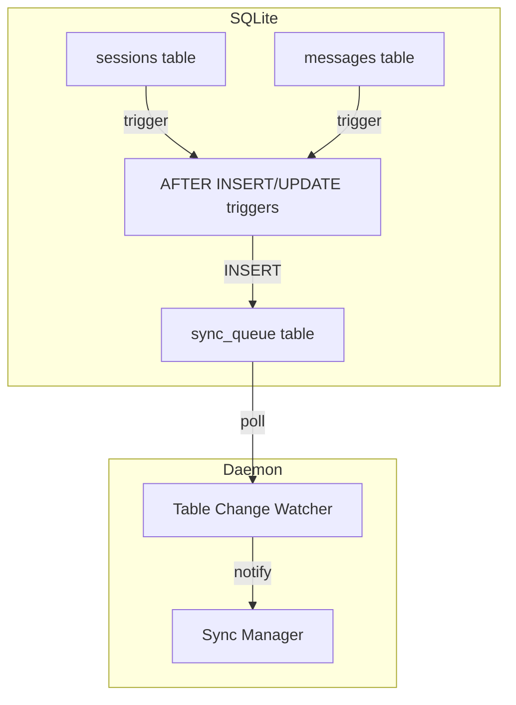

# Database Triggers for Sync

Alternative sync mechanism using SQLite triggers instead of polling.

## Overview

Current implementation uses **polling** (check every 30 seconds). This plan explores **triggers** for instant sync on data change.

## Trigger Approach



## Implementation

### Sync Queue Table

```sql
CREATE TABLE sync_queue (
    id INTEGER PRIMARY KEY AUTOINCREMENT,
    table_name TEXT NOT NULL,
    record_id TEXT NOT NULL,
    operation TEXT NOT NULL, -- INSERT, UPDATE, DELETE
    created_at TIMESTAMP DEFAULT CURRENT_TIMESTAMP
);

CREATE INDEX idx_sync_queue_created ON sync_queue(created_at);
```

### Triggers

```sql
-- For sessions
CREATE TRIGGER IF NOT EXISTS sessions_sync_trigger
AFTER INSERT ON sessions
BEGIN
    INSERT INTO sync_queue (table_name, record_id, operation)
    VALUES ('sessions', NEW.id, 'INSERT');
END;

CREATE TRIGGER IF NOT EXISTS sessions_sync_update_trigger
AFTER UPDATE ON sessions
BEGIN
    INSERT INTO sync_queue (table_name, record_id, operation)
    VALUES ('sessions', NEW.id, 'UPDATE');
END;

-- For messages (similar)
CREATE TRIGGER IF NOT EXISTS messages_sync_trigger
AFTER INSERT ON messages
BEGIN
    INSERT INTO sync_queue (table_name, record_id, operation)
    VALUES ('messages', NEW.id, 'INSERT');
END;
```

### Watcher

**File**: `packages/daemon/internal/sync/watcher.go`

```go
type TriggerWatcher struct {
    db       *sql.DB
    notifyCh chan struct{}
}

func (w *TriggerWatcher) Start() {
    // Poll sync_queue table every 1 second
    // If new rows found, drain queue and notify
    // Trigger immediate sync
}

func (w *TriggerWatcher) Stop()
```

### Comparison: Polling vs Triggers

| Aspect | Polling (Current) | Triggers |
|--------|-------------------|----------|
| Latency | 30s max | ~1s max |
| Complexity | Simple | More complex |
| Resource Usage | Query full table every 30s | Query queue every 1s |
| Race Conditions | Fewer | More (need queue cleanup) |
| Reliability | High | Medium (triggers can fail) |

## Hybrid Approach

Best of both:

```go
type HybridSync struct {
    // Fast path: triggers for immediate sync
    triggerWatcher *TriggerWatcher
    
    // Safety net: periodic polling
    periodicPoller *Poller
}

func (h *HybridSync) Start() {
    // Triggers detect changes within 1s
    h.triggerWatcher.Start()
    
    // Polling catches anything missed (every 5 min)
    h.periodicPoller.Start(5 * time.Minute)
}
```

## Decision

**Current**: Stick with polling (simpler, more reliable)

**Future**: Consider hybrid if users complain about 30s latency

## When to Consider

- Users need near real-time sync
- High-frequency writes (sync queue grows too fast)
- Battery/performance optimization (polling wastes queries when idle)

Links: [CLI Sync](../cli/sync.md), [Implementation Plan](implementation-plan.md)
