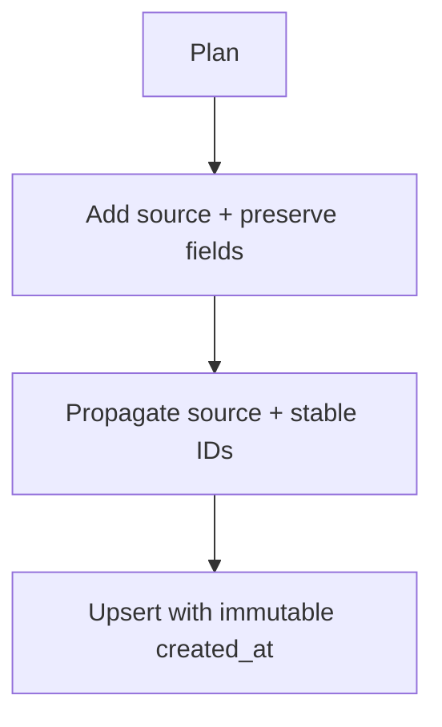

# Plan: Fix data gaps in sessions/messages

Goal: make stored session/message rows complete, stable, and attributable to their source (OpenCode vs Claude Code), without breaking existing plugins.

## Decisions to make
- Add `source` field to sessions/messages with values like `"opencode" | "claude-code"`.
- Treat `created_at` as immutable after first write; only update `updated_at` on later upserts.
- Preserve existing non-null session fields when later upserts omit them (e.g. title/model).
- Capture Claude assistant `created_at` from hook timing (set on Stop when absent).
- Reduce Claude message ID collisions (use monotonic counter or transcript hash).

## Proposed changes (ordered)

1) Extend schema
- Add `source` column to `sessions` + `messages` tables.
- Update schema docs and storage expectations.

2) Update daemon upserts to preserve stable fields
- For sessions: keep `created_at` once set; avoid overwriting `title`/`model`/`provider` with NULL.
- For messages: keep `created_at` once set; do not overwrite `text_content` with empty string if existing content is non-empty.

3) Propagate source from plugins
- OpenCode plugin: send `source: "opencode"` for session/message upserts.
- Claude Code plugin: send `source: "claude-code"` for session/message upserts.

4) Claude message timing + IDs
- Set assistant `created_at` from Stop event timestamp if missing; keep `completed_at` as-is.
- Replace `Date.now()`-based message IDs with a stable nonce (monotonic per session) or hashed transcript path + counter.

5) Backfill (optional)
- Provide a one-time CLI command or doc for users to backfill `source` using heuristics (provider/model).

## Work breakdown

- Update storage schema and migration strategy (daemon startup).
- Update RPC payload types + Zod schemas.
- Update OpenCode and Claude Code plugins to send `source` and avoid nulling stable fields.
- Update Lode docs: schemas, sqlite, plugin docs, and data-gaps.

Links: [data gaps](../data-model/data-gaps.md), [schemas](../data-model/schemas.md), [sqlite](../storage/sqlite.md), [opencode event handling](../opencode/event-handling.md), [claude plugin system](../claude/plugin-system.md)

Example
```ts
await rpc.upsertSession({
	id: sessionId,
	source: "claude-code",
	createdAt: existingCreatedAt ?? Date.now(),
	updatedAt: Date.now(),
});
```

Diagram

