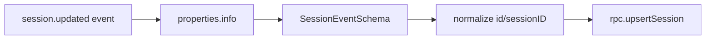

# Plan: Fix Session Creation in OpenCode Plugin

> Status: **Resolved**  
> Created: 2026-01-30  
> Resolved: 2026-01-30  
> Context: Dev environment check revealed sessions aren't being created

## Root Cause

OpenCode session events deliver data under `event.properties.info` and identify sessions with `id`, not `sessionID`. The plugin validated `event.properties` directly and required `sessionID`, so Zod validation failed and the session upsert was skipped.

## Current State

Dev environment (`nix develop .#with-daemon-and-plugin`) is fully operational and sessions are now created with title, project path/name, and timestamps. Older sessions from before the fix remain sparse.

## The Problem

The plugin captures `messages` correctly but no `sessions` are being created. This means session-level metadata (title, project, model, tokens, cost) is not being persisted.

## Hypotheses

### H1: Session Events Not Being Emitted
OpenCode may not be emitting `session.start` or `session.update` events that the plugin expects.

**Test:** Check what events are actually being received by the plugin.

### H2: Event Handler Missing/Incorrect
The plugin may not have a handler for session events, or the handler has a bug.

**Test:** Review `apps/opencode-plugin/src/index.ts` for session event handlers.

### H3: Schema Validation Failing
Session events may be failing Zod validation silently.

**Test:** Add logging or check validation errors.

### H4: Event Name Mismatch
OpenCode may use different event names than what the plugin expects.

**Test:** Compare plugin event names with OpenCode's actual event names.

## Investigation Steps

### Step 1: Verify Event Names

Check what events OpenCode actually emits:

```bash
# Look at the plugin's event handlers
grep -n "session" apps/opencode-plugin/src/index.ts

# Check core schemas for session events
grep -rn "session" packages/core/src/schemas.ts
```

### Step 2: Add Debug Logging

Temporarily add logging to see all incoming events:

```ts
// In apps/opencode-plugin/src/index.ts
event: async (event: unknown) => {
  console.log("[DEBUG] Event received:", JSON.stringify(event, null, 2));
  // ... existing code
}
```

### Step 3: Check Session Schema

Verify the session schema matches OpenCode's payload structure:

```bash
# Check what fields the plugin expects
grep -A 20 "SessionEventSchema" packages/core/src/schemas.ts
```

### Step 4: Test Session Creation Manually

Create a minimal test to verify session upsert works:

```ts
// Test via RPC directly
const rpc = createRpcClient({ clientName: "test", clientVersion: "0.1.0" });
await rpc.call("session.upsert", {
  sessionId: "test_session_001",
  title: "Test Session",
  projectPath: "/tmp/test",
  projectName: "test",
  model: "test-model",
  provider: "test-provider",
  promptTokens: 100,
  completionTokens: 50,
  cost: 0.001
});
```

## Expected Behavior

When a conversation starts in OpenCode:
1. Plugin receives `session.start` event (or equivalent)
2. Plugin validates payload with `SessionEventSchema`
3. Plugin calls `session.upsert` via RPC
4. Daemon inserts row into `sessions` table
5. Subsequent messages reference the session via `session_id`

## Implementation Path

Once root cause is identified:

1. **If event name mismatch:** Update plugin to use correct OpenCode event names
2. **If missing handler:** Add session event handler to plugin
3. **If schema issue:** Update `SessionEventSchema` to match actual payload
4. **If validation failing:** Add error logging to catch validation failures

## Success Criteria

- [x] `SELECT COUNT(*) FROM sessions` returns > 0 after a conversation
- [x] Sessions have correct metadata (title, project, model, tokens)
- [x] Messages reference sessions via `session_id` foreign key
- [x] No duplicate sessions created for same conversation

## Changes Made

### 1. Updated `SessionEventSchema` (`packages/core/src/schemas.ts`)

Accepts both `id` and `sessionID` for session identifiers:

```ts
id: z.string().optional(),
sessionID: z.string().optional(),
```

### 2. Updated Plugin Handler (`apps/opencode-plugin/src/index.ts`)

Normalize session events from `properties.info` and accept `id` or `sessionID`:

```ts
const sessionInfo = (props as { info?: unknown })?.info ?? props;
const parsed = SessionEventSchema.safeParse(sessionInfo);
const sessionId = session.sessionID ?? session.id;
```

### 3. Updated Documentation (`lode/data-model/schemas.md`)

Added invariants documenting OpenCode's session payload shape and identifier normalization.

## Related Lodes

- [opencode/plugins](opencode/plugins.md) - Plugin implementation details
- [data-model/schemas](data-model/schemas.md) - Zod schema definitions
- [daemon/architecture](daemon/architecture.md) - RPC handlers

## Diagram



## Notes

- Messages are being stored correctly; the RPC pipeline works.
- Session events require reading `properties.info` to capture metadata.
