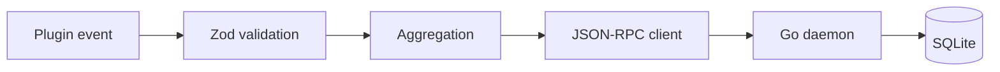

# Go daemon migration plan

Status: **Implemented**

Move all SQLite ownership to a Go daemon and have `apps/*` call it over JSON-RPC.

Goals (achieved)
- Replace all JS-side SQLite access with a Go daemon using `github.com/sourcegraph/jsonrpc2`.
- Keep the storage path rules and environment overrides unchanged.
- Preserve existing session/message schemas and idempotent upsert behavior.
- Plugins can check daemon health and skip events if unavailable.

Non-goals
- Rewriting aggregation logic in Go (message aggregation stays in JS).
- Introducing network-exposed endpoints or remote storage.

Architecture
- Plugins validate payloads (Zod) and aggregate message parts.
- Plugins talk to a local daemon over a socket using JSON-RPC 2.0.
- The daemon owns DB creation, migrations, PRAGMAs, and all writes.
- The daemon resolves DB and config paths using current rules and env overrides.

Socket location
- Linux/macOS: `~/.local/share/clankers/dxta-clankers.sock`
- Windows: `\\.\pipe\dxta-clankers`
- Override via `CLANKERS_SOCKET_PATH`

RPC contract
- `health` -> `{ ok: boolean, version: string }`
- `ensureDb` -> `{ dbPath: string, created: boolean }`
- `getDbPath` -> `{ dbPath: string }`
- `upsertSession` -> `{ ok: boolean }`
- `upsertMessage` -> `{ ok: boolean }`

All request envelopes include:
- `schemaVersion` (string)
- `client` (`{ name: string, version: string }`)

Daemon CLI
- Command: `clankers-daemon`
- Flags: `--socket`, `--data-root`, `--db-path`, `--log-level`
- Default behavior: resolve paths via current env rules, create socket, serve JSON-RPC.

Implementation
- Go module at `packages/daemon/`
- RPC client at `packages/core/src/rpc-client.ts`
- OpenCode plugin updated to use RPC client

Links: [sqlite](../storage/sqlite.md), [paths](../storage/paths.md), [plugins](../opencode/plugins.md), [daemon](../daemon/architecture.md)

Diagram

