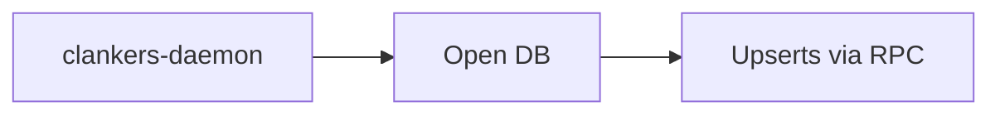

# Plan: daemon-owned local SQLite storage

Goal
- Keep local SQLite storage owned by the clankers-daemon.

Current baseline
- The daemon resolves the DB path from the data root and creates the schema.
- WAL + foreign key pragmas run on every daemon open.
- Plugins call JSON-RPC methods to upsert sessions/messages.

Future options
- If remote sync is required, evaluate embedded replicas with `syncUrl` + `authToken` in the daemon.
- Add explicit configuration fields before enabling any network traffic.

Links: [summary](../summary.md), [sqlite](../storage/sqlite.md), [paths](../storage/paths.md)

Example
```go
db, err := sql.Open("sqlite3", dbPath+"?_journal_mode=WAL&_foreign_keys=ON")
```

Diagram

