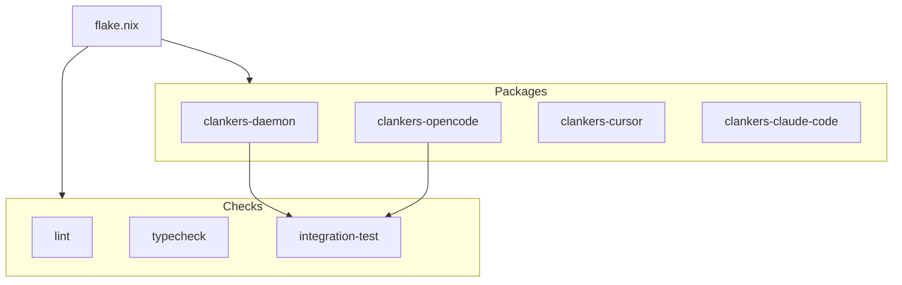

# Nix Build System Migration

Migrate from pnpm/GitHub Actions setup to a fully Nix-based build system for
reproducibility and integration testing.

## Goals

- Reproducible builds: identical results locally and in CI
- Integration testing: daemon + plugins testable together in Nix
- Single source of truth: flake.nix defines all build logic

## Architecture



## Package Definitions

### Go Daemon (`packages.clankers-daemon`)

Uses `buildGoModule` with vendored dependencies from go.sum.

```nix
clankers-daemon = pkgs.buildGoModule {
  pname = "clankers-daemon";
  version = "0.1.0";
  src = ./packages/daemon;
  vendorHash = "sha256-...";  # from go.sum
};
```

Build output: single `clankers-daemon` binary.

### TypeScript Apps

Uses `stdenv.mkDerivation` with pnpm for workspace builds. Dependencies fetched
via `pnpm.fetchDeps` for reproducibility.

```nix
clankers-opencode = pkgs.stdenv.mkDerivation {
  pname = "clankers-opencode";
  version = "0.1.0";
  src = ./.;
  
  nativeBuildInputs = [ pkgs.nodejs_24 pkgs.pnpm ];
  
  pnpmDeps = pkgs.pnpm.fetchDeps {
    inherit src;
    hash = "sha256-...";  # from pnpm-lock.yaml
  };
  
  buildPhase = ''
    pnpm install --offline
    pnpm --filter @dxta-dev/clankers-opencode build
  '';
  
  installPhase = ''
    mkdir -p $out
    cp -r apps/opencode-plugin/dist $out/
  '';
};
```

Build output: bundled JS in `dist/`.

## Checks

### Lint Check

```nix
checks.lint = pkgs.runCommand "lint" {
  nativeBuildInputs = [ pkgs.biome ];
} ''
  cd ${./.}
  biome lint .
  touch $out
'';
```

### Typecheck

```nix
checks.typecheck = pkgs.runCommand "typecheck" {
  nativeBuildInputs = [ pkgs.nodejs_24 pkgs.pnpm ];
} ''
  # setup pnpm deps
  pnpm check
  touch $out
'';
```

### Integration Test (Future)

```nix
checks.integration = pkgs.runCommand "integration" {
  nativeBuildInputs = [ clankers-daemon nodejs_24 ];
} ''
  # Start daemon
  clankers-daemon &
  DAEMON_PID=$!
  
  # Run RPC health check
  node -e "const rpc = ...; await rpc.health();"
  
  kill $DAEMON_PID
  touch $out
'';
```

## CI Migration

Replace GitHub Actions setup with Nix:

```yaml
# Before
- uses: actions/setup-node@v4
- uses: pnpm/action-setup@v4
- run: pnpm install
- run: pnpm lint
- run: pnpm check
- run: pnpm build

# After
- uses: cachix/install-nix-action@v27
- run: nix flake check
- run: nix build
```

Benefits:
- CI uses exact same environment as local dev
- Nix binary cache speeds up builds
- No version drift between local and CI

## Implementation Phases

### Phase 1: Go Daemon Package ✓
- Added `buildGoModule` derivation
- Calculated `vendorHash`: `sha256-L8CHwPOjwE+DOJ1OWi0/V+tYrB2ev3iN9VU7i8WmCN0=`
- Verified `nix build .#clankers-daemon` works
- Uses `CGO_ENABLED=0` with `modernc.org/sqlite`

### Phase 2: TypeScript Packages
- Add `pnpm.fetchDeps` for node_modules
- Add derivations for each app
- Verify `nix build .#clankers-opencode` works

### Phase 3: Checks
- Add lint check
- Add typecheck
- Update CI workflow to use `nix flake check`

### Phase 4: Integration Testing
- Add check that starts daemon and validates RPC
- Ensure daemon binary is available in test environment

## File Changes

| File | Change |
|------|--------|
| `flake.nix` | Add packages and checks outputs |
| `.github/workflows/ci.yml` | Replace setup-node with nix |
| `lode/dev-environment.md` | Update with build commands |
| `lode/ci/overview.md` | Document nix-based CI |

## Commands

```bash
# Build daemon
nix build .#clankers-daemon

# Build TypeScript app
nix build .#clankers-opencode

# Run all checks (lint, typecheck, integration)
nix flake check

# Enter dev shell (unchanged)
nix develop
```

Links: [dev-environment](../dev-environment.md), [ci/overview](../ci/overview.md), [daemon](../daemon/architecture.md)
