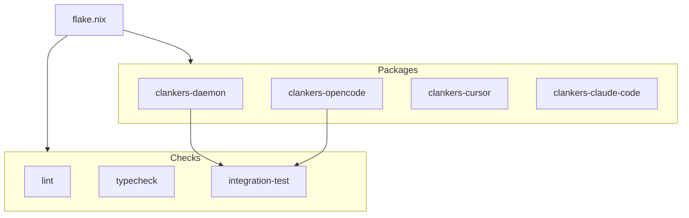

# Nix Build System Migration

Migrate from pnpm/GitHub Actions setup to a fully Nix-based build system for
reproducibility and integration testing.

## Goals

- Reproducible builds: identical results locally and in CI
- Integration testing: daemon + plugins testable together in Nix
- Single source of truth: flake.nix defines all build logic

## Architecture



## Package Definitions

### Go Daemon (`packages.clankers-daemon`)

Uses `buildGoModule` with vendored dependencies from go.sum.

```nix
clankers-daemon = pkgs.buildGoModule {
  pname = "clankers-daemon";
  version = "0.1.0";
  src = ./packages/daemon;
  vendorHash = "sha256-...";  # from go.sum
};
```

Build output: single `clankers-daemon` binary.

### TypeScript Apps

Uses `stdenv.mkDerivation` with pnpm for workspace builds. Dependencies fetched
via `fetchPnpmDeps` for reproducibility. A shared `mkTsApp` helper creates
consistent derivations for all three plugins.

```nix
# Shared pnpm dependencies
pnpmDeps = pkgs.fetchPnpmDeps {
  pname = "clankers-workspace";
  version = "0.1.0";
  src = ./.;
  hash = "sha256-szJy9JkSlOYT7aCa3mfrXajbHDWpTZcQkzQdj7eiW8Q=";
  fetcherVersion = 3;
};

# Helper for TS apps
mkTsApp = { pname, appDir, filterName }:
  pkgs.stdenv.mkDerivation {
    inherit pname pnpmDeps;
    version = "0.1.0";
    src = ./.;
    
    nativeBuildInputs = [ pkgs.nodejs_24 pkgs.pnpm pkgs.pnpmConfigHook ];
    
    buildPhase = ''
      pnpm --filter ${filterName} build
    '';
    
    installPhase = ''
      mkdir -p $out
      cp -r ${appDir}/dist $out/
      cp -r ${appDir}/src $out/
      cp ${appDir}/package.json $out/
    '';
  };

# Usage
clankers-opencode = mkTsApp {
  pname = "clankers-opencode";
  appDir = "apps/opencode-plugin";
  filterName = "@dxta-dev/clankers-opencode";
};
```

Build output: bundled JS in `dist/`, plus `src/` and `package.json` for npm publishing.

## Checks

### Lint Check

```nix
checks.lint = pkgs.runCommand "lint" {
  nativeBuildInputs = [ pkgs.biome ];
} ''
  cd ${./.}
  biome lint .
  touch $out
'';
```

### Typecheck

```nix
checks.typecheck = pkgs.runCommand "typecheck" {
  nativeBuildInputs = [ pkgs.nodejs_24 pkgs.pnpm ];
} ''
  # setup pnpm deps
  pnpm check
  touch $out
'';
```

### Integration Test

Starts daemon in isolated environment, runs health check and full round-trip test
(upsertSession + upsertMessage), then cleans up.

```nix
checks.integration = pkgs.stdenvNoCC.mkDerivation {
  name = "clankers-integration";
  nativeBuildInputs = [ pkgs.nodejs_24 pkgs.pnpm pkgs.pnpmConfigHook daemon ];
  inherit pnpmDeps;
  
  buildPhase = ''
    TEST_DIR=$(mktemp -d)
    export CLANKERS_SOCKET_PATH="$TEST_DIR/clankers.sock"
    export CLANKERS_DB_PATH="$TEST_DIR/clankers.db"
    
    clankers-daemon &
    DAEMON_PID=$!
    # wait for socket...
    
    pnpm exec tsx tests/integration.ts
    
    kill $DAEMON_PID
  '';
};
```

Test file: `tests/integration.ts` - validates health, ensureDb, and round-trip
session/message creation using the existing RPC client.

## CI Migration

Replace GitHub Actions setup with Nix:

```yaml
# Before
- uses: actions/setup-node@v4
- uses: pnpm/action-setup@v4
- run: pnpm install
- run: pnpm lint
- run: pnpm check
- run: pnpm build

# After
- uses: cachix/install-nix-action@v27
- run: nix flake check
- run: nix build .#clankers-daemon
- run: nix build .#clankers-opencode  # etc.
```

Note: Cachix integration not yet added. Currently builds from scratch each CI run.

Benefits:
- CI uses exact same environment as local dev
- Nix binary cache speeds up builds
- No version drift between local and CI

## Implementation Phases

### Phase 1: Go Daemon Package ✓
- Added `buildGoModule` derivation
- Calculated `vendorHash`: `sha256-L8CHwPOjwE+DOJ1OWi0/V+tYrB2ev3iN9VU7i8WmCN0=`
- Verified `nix build .#clankers-daemon` works
- Uses `CGO_ENABLED=0` with `modernc.org/sqlite`

### Phase 2: TypeScript Packages ✓
- Added `fetchPnpmDeps` with `fetcherVersion = 3`
- Calculated `pnpmDeps` hash: `sha256-szJy9JkSlOYT7aCa3mfrXajbHDWpTZcQkzQdj7eiW8Q=`
- Added `mkTsApp` helper for consistent derivations
- Added derivations for all three apps: opencode, cursor, claude-code
- Uses `pnpmConfigHook` for reproducible node_modules
- Verified all builds work: `nix build .#clankers-opencode`, `.#clankers-cursor`, `.#clankers-claude-code`

### Phase 3: Checks ✓
- Added `checks.lint` using Biome directly (no pnpm deps needed)
- Added `checks.typecheck` using pnpmDeps + `pnpm check`
- Replaced CI workflow with Nix-based approach


### Phase 4: Integration Testing ✓
- Added `checks.integration` that starts daemon with isolated socket/db
- Test validates: health check, ensureDb, upsertSession, upsertMessage
- Uses `tsx` to run TypeScript test directly (added as dev dependency)
- Test file: `tests/integration.ts` with relative import to core RPC client
- Updated pnpmDeps hash to include tsx

### Phase 5: Cross-Compilation ✓
- Added `mkDaemonCross` helper for cross-compiled daemon packages
- Targets: linux-amd64, linux-arm64, darwin-amd64, darwin-arm64, windows-amd64
- Uses `GOOS`/`GOARCH` environment variables in preBuild phase
- Disables strip/patchELF fixup phases for foreign binaries
- Handles Go's `GOOS_GOARCH` subdirectory output and Windows `.exe` suffix

## File Changes

| File | Change |
|------|--------|
| `flake.nix` | Add packages and checks outputs |
| `.github/workflows/ci.yml` | Replace setup-node with nix |
| `lode/dev-environment.md` | Update with build commands |
| `lode/ci/overview.md` | Document nix-based CI |
| `tests/integration.ts` | Integration test script |
| `tests/run-integration.sh` | Local test runner |
| `package.json` | Added tsx dev dependency |

## Commands

```bash
# Build daemon for current system
nix build .#clankers-daemon

# Build cross-compiled daemon
nix build .#clankers-daemon-darwin-arm64
nix build .#clankers-daemon-windows-amd64

# Build TypeScript app
nix build .#clankers-opencode

# Run all checks (lint, typecheck, integration)
nix flake check

# Enter dev shell (unchanged)
nix develop
```

Links: [dev-environment](../dev-environment.md), [ci/overview](../ci/overview.md), [daemon](../daemon/architecture.md)
