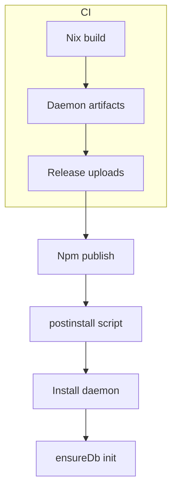

# Npm Packaging Plan

Goal: publish OpenCode plugin to npm while ensuring the Go daemon is installed
automatically on macOS, Linux, and Windows, with the database initialized on
postinstall. Nix builds remain the source of truth for reproducible binaries.

## Status

Phase 1 complete: Cross-compilation targets added to flake.nix.

## Invariants

- Nix builds the daemon binaries for each supported OS/arch.
- npm packages remain TypeScript-source releases (no prebuild bundling).
- Postinstall never requires Nix on the user machine.
- The daemon owns DB creation/migrations; plugins only call `ensureDb`.
- Installer must support macOS, Linux, and Windows.

## Available Build Targets

| Nix Package | Platform | Architecture |
|-------------|----------|--------------|
| `clankers-daemon-linux-amd64` | Linux | x86_64 |
| `clankers-daemon-linux-arm64` | Linux | ARM64 |
| `clankers-daemon-darwin-amd64` | macOS | x86_64 |
| `clankers-daemon-darwin-arm64` | macOS | ARM64 (Apple Silicon) |
| `clankers-daemon-windows-amd64` | Windows | x86_64 |

All targets can be built from any host system (cross-compilation via Go).

## Plan

1. ~~Build daemon binaries via Nix in CI for each target platform/arch.~~ DONE
2. Publish binaries + checksums as release artifacts (GitHub Release or a
   dedicated npm package).
3. Add a `postinstall` script in the OpenCode plugin that:
   - Detects OS/arch and selects the correct binary.
   - Downloads the binary, verifies checksum, and installs it.
   - Runs a one-shot init to create/migrate the database.
4. Runtime lookup for daemon:
   - Prefer `CLANKERS_DAEMON_PATH` if set.
   - Else use the installed binary path from postinstall.
5. Update release workflow to publish npm and upload daemon artifacts together.

## Target Matrix

- macOS: amd64, arm64
- Linux: amd64, arm64
- Windows: amd64 (exe)

Postinstall behavior (documented)
- Install location: under the Clankers data root or package-local bin dir.
- Init step: call `clankers-daemon --ensure-db` (preferred) or start daemon
  and call `ensureDb` via RPC, then exit.
- If download fails, log a clear manual install path (e.g. `nix profile install`).

Example: package.json hooks
```json
{
  "scripts": {
    "postinstall": "node ./scripts/install-daemon.mjs"
  }
}
```

Example: binary selection (pseudo)
```ts
const target = `${process.platform}-${process.arch}`;
const filename = target === "win32-x64" ? "clankers-daemon.exe" : "clankers-daemon";
const url = `https://github.com/dxta-dev/clankers/releases/download/v${version}/${target}/${filename}`;
```

Links: [build/overview](../build/overview.md), [release/npm-release](../release/npm-release.md), [daemon](../daemon/architecture.md), [storage/paths](../storage/paths.md), [config/overview](../config/overview.md)

Diagram

