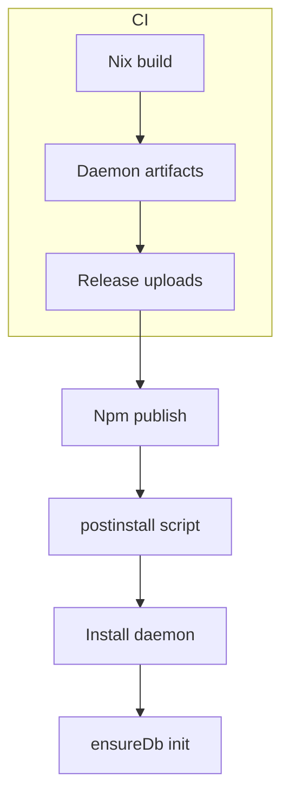

# Npm Packaging Plan

Goal: publish OpenCode plugin to npm while ensuring the Go daemon is installed
automatically on macOS, Linux, and Windows, with the database initialized on
postinstall. Nix builds remain the source of truth for reproducible binaries.

## Status

Phase 2 complete: Daemon binaries published to GitHub Releases on tag push.
Phase 3a complete: Standalone install scripts (`scripts/install-daemon.sh`, `scripts/install-daemon.ps1`).

## Invariants

- Nix builds the daemon binaries for each supported OS/arch.
- npm packages remain TypeScript-source releases (no prebuild bundling).
- Postinstall never requires Nix on the user machine.
- The daemon owns DB creation/migrations; plugins only call `ensureDb`.
- Installer must support macOS, Linux, and Windows.

## Available Build Targets

| Nix Package | Platform | Architecture |
|-------------|----------|--------------|
| `clankers-linux-amd64` | Linux | x86_64 |
| `clankers-linux-arm64` | Linux | ARM64 |
| `clankers-darwin-amd64` | macOS | x86_64 |
| `clankers-darwin-arm64` | macOS | ARM64 (Apple Silicon) |
| `clankers-windows-amd64` | Windows | x86_64 |

All targets can be built from any host system (cross-compilation via Go).

## Plan

1. ~~Build daemon binaries via Nix in CI for each target platform/arch.~~ DONE
2. ~~Publish binaries + checksums as release artifacts.~~ DONE (GitHub Release via `release-daemon.yml`)
3. Daemon install scripts:
   - ~~a) Standalone shell scripts for manual install.~~ DONE (`scripts/install-daemon.sh`, `scripts/install-daemon.ps1`)
   - b) Wire up postinstall hook in plugin packages (pending - revisit after testing standalone scripts).
4. Runtime lookup for daemon:
   - Prefer `CLANKERS_DAEMON_PATH` if set.
   - Else use the installed binary path from postinstall.
5. Update release workflow to publish npm and upload daemon artifacts together.

## Target Matrix

- macOS: amd64, arm64
- Linux: amd64, arm64
- Windows: amd64 (exe)

Postinstall behavior (documented)
- Install location: under the Clankers data root or package-local bin dir.
- Init step: call `clankers daemon --ensure-db` (preferred) or start daemon
  and call `ensureDb` via RPC, then exit.
- If download fails, log a clear manual install path (e.g. `nix profile install`).

## Standalone Install Scripts

Users can install the daemon manually without npm:

```bash
# Linux/macOS
./scripts/install-daemon.sh            # latest
./scripts/install-daemon.sh v0.1.0     # specific version

# Windows PowerShell
.\scripts\install-daemon.ps1
.\scripts\install-daemon.ps1 -Version v0.1.0
```

Scripts handle: OS/arch detection, download, checksum verification, PATH hints.

## Postinstall Hook (Pending)

Once standalone scripts are tested, wire them into npm packages:

```json
{
  "scripts": {
    "postinstall": "sh ../../../scripts/install-daemon.sh || powershell -File ../../../scripts/install-daemon.ps1"
  }
}
```

Alternative: lazy download on first RPC connection failure.

Links: [build/overview](../build/overview.md), [release/npm-release](../release/npm-release.md), [daemon](../daemon/architecture.md), [storage/paths](../storage/paths.md), [config/overview](../config/overview.md)

Diagram

