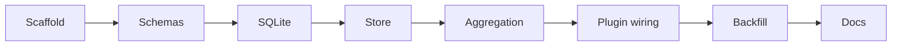

# Plan: Local SQLite sync plugin

Goals
- Build @dxta-dev/clankers as a Bun-based OpenCode plugin.
- Persist session and message sync data locally in SQLite.
- Replace cloud sync calls with local upserts.
- Validate payloads with Zod.
- Run a one-time backfill limited to the last 30 days.

Scope
- Runtime: Bun, bun:sqlite.
- DB path default: ~/.local/share/opencode/clankers.db (override via CLANKERS_DB_PATH).

Implementation steps
1) Scaffold package metadata and TypeScript config.
2) Define Zod schemas for session and message payloads.
3) Add SQLite open, WAL/foreign key setup, and migrations.
4) Implement store upserts for sessions and messages.
5) Add aggregation and debounce for message parts.
6) Wire plugin entry events to store and aggregation.
7) Add one-time backfill with meta marker.
8) Document install and backfill behavior.

Links: [summary](../summary.md), [practices](../practices.md)

Example
```ts
const BACKFILL_DAYS = 30;
const cutoff = Date.now() - BACKFILL_DAYS * 24 * 60 * 60 * 1000;
```

Diagram

