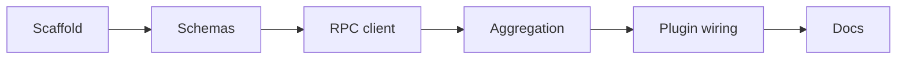

# Plan: Local SQLite sync plugin

Goals
- Build @dxta-dev/clankers as a Node/Bun-compatible OpenCode plugin.
- Support Windows, macOS, and Linux installations.
- Store database and config in a harness-neutral app data location (not Opencode-specific).
- Persist session and message sync data locally in SQLite.
- Replace cloud sync calls with local upserts.
- Validate payloads with Zod.

Scope
- Runtime: Node or Bun with JSON-RPC to the daemon.
- DB path default: OS-specific app data root shared across harnesses.

Implementation steps
1) Scaffold package metadata and TypeScript config.
2) Define Zod schemas for session and message payloads.
3) Implement JSON-RPC client integration.
4) Add aggregation and debounce for message parts.
5) Wire plugin entry events to RPC and aggregation.
6) Document install and runtime behavior.

Links: [summary](../summary.md), [practices](../practices.md), [daemon](../daemon/architecture.md)

Example
```ts
const rpc = createRpcClient({ clientName: "opencode", clientVersion: "0.1.0" });
```

Diagram

